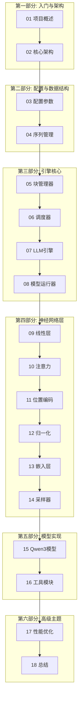

# Nano-vLLM 源码分析课程大纲

> 🚀 一个轻量级 vLLM 实现的深度源码解析

## 课程简介

Nano-vLLM 是一个仅用约 **1200 行 Python 代码**实现的轻量级 LLM 推理引擎，却能达到与 vLLM 相当的推理性能。本课程将带你深入分析每一行代码，理解现代 LLM 推理引擎的核心设计。

### 🎯 学习目标

通过本课程，你将掌握：

1. **LLM 推理引擎架构**：理解 Prefill/Decode 两阶段推理
2. **KV Cache 管理**：掌握分块存储与 Prefix Caching
3. **高效调度算法**：理解 Continuous Batching 与抢占机制
4. **张量并行技术**：掌握多 GPU 并行推理实现
5. **性能优化技巧**：CUDA Graph、Torch Compile、Flash Attention

### 📋 先修知识

- Python 编程基础
- PyTorch 深度学习框架
- Transformer 模型架构基础
- 基本的 CUDA 编程概念（可选）

---

## 课程架构



---

## 章节目录

### 第一部分：入门与架构

| 章节 | 标题 | 核心内容 | 源文件 |
|:---:|:---|:---|:---|
| 01 | [项目概述与快速上手](01_project_overview.md) | 项目介绍、安装使用、与 vLLM 对比 | `README.md`, `example.py` |
| 02 | [核心架构总览](02_core_architecture.md) | 整体架构、数据流、核心概念 | 全局 |

### 第二部分：配置与数据结构

| 章节 | 标题 | 核心内容 | 源文件 |
|:---:|:---|:---|:---|
| 03 | [配置与采样参数](03_config_and_params.md) | Config 类、SamplingParams | `config.py`, `sampling_params.py` |
| 04 | [序列与状态管理](04_sequence.md) | Sequence 类、状态机、序列化 | `sequence.py` |

### 第三部分：引擎核心组件

| 章节 | 标题 | 核心内容 | 源文件 |
|:---:|:---|:---|:---|
| 05 | [KV Cache 块管理器](05_block_manager.md) | 分块管理、Prefix Caching | `block_manager.py` |
| 06 | [调度器原理](06_scheduler.md) | 调度算法、抢占机制 | `scheduler.py` |
| 07 | [LLM 引擎详解](07_llm_engine.md) | 引擎入口、generate 循环 | `llm_engine.py` |
| 08 | [模型运行器](08_model_runner.md) | 分布式、CUDA Graph | `model_runner.py` |

### 第四部分：神经网络层

| 章节 | 标题 | 核心内容 | 源文件 |
|:---:|:---|:---|:---|
| 09 | [线性层与张量并行](09_linear_layers.md) | 列并行、行并行、QKV 投影 | `linear.py` |
| 10 | [注意力机制](10_attention.md) | Flash Attention、KV Cache | `attention.py` |
| 11 | [RoPE 位置编码](11_rotary_embedding.md) | 旋转位置编码实现 | `rotary_embedding.py` |
| 12 | [归一化与激活函数](12_normalization.md) | RMSNorm、SiLU | `layernorm.py`, `activation.py` |
| 13 | [词嵌入与输出头](13_embedding_head.md) | 并行嵌入、LM Head | `embed_head.py` |
| 14 | [采样器](14_sampler.md) | 温度采样、Gumbel-Max | `sampler.py` |

### 第五部分：模型与工具

| 章节 | 标题 | 核心内容 | 源文件 |
|:---:|:---|:---|:---|
| 15 | [Qwen3 模型实现](15_qwen3_model.md) | 完整模型架构 | `qwen3.py` |
| 16 | [工具模块](16_utils.md) | Context、模型加载 | `context.py`, `loader.py` |

### 第六部分：高级主题

| 章节 | 标题 | 核心内容 | 源文件 |
|:---:|:---|:---|:---|
| 17 | [性能优化技术](17_performance_optimization.md) | CUDA Graph、Compile | `model_runner.py`, `bench.py` |
| 18 | [课程总结与扩展](18_summary.md) | 知识回顾、扩展阅读 | - |

---

## 项目文件结构

```
nano-vllm/
├── nanovllm/
│   ├── __init__.py          # 包入口，导出 LLM 和 SamplingParams
│   ├── llm.py                # LLM 类（继承自 LLMEngine）
│   ├── config.py             # 配置类
│   ├── sampling_params.py    # 采样参数
│   ├── engine/
│   │   ├── llm_engine.py     # 推理引擎核心
│   │   ├── scheduler.py      # 调度器
│   │   ├── block_manager.py  # KV Cache 块管理
│   │   ├── sequence.py       # 序列数据结构
│   │   └── model_runner.py   # 模型运行器
│   ├── layers/
│   │   ├── linear.py         # 并行线性层
│   │   ├── attention.py      # 注意力机制
│   │   ├── rotary_embedding.py  # RoPE
│   │   ├── layernorm.py      # RMSNorm
│   │   ├── activation.py     # 激活函数
│   │   ├── embed_head.py     # 嵌入层和输出头
│   │   └── sampler.py        # 采样器
│   ├── models/
│   │   └── qwen3.py          # Qwen3 模型实现
│   └── utils/
│       ├── context.py        # 上下文管理
│       └── loader.py         # 模型加载
├── example.py                # 使用示例
├── bench.py                  # 性能基准测试
└── README.md                 # 项目说明
```

---

## 学习建议

### 📖 推荐学习顺序

1. **基础阶段**（第 1-4 章）：理解项目结构和基础数据结构
2. **核心阶段**（第 5-8 章）：深入引擎核心组件
3. **实现阶段**（第 9-16 章）：逐层分析神经网络实现
4. **进阶阶段**（第 17-18 章）：性能优化与总结

### 💡 学习技巧

- 建议边读边运行代码，加深理解
- 每章结束后尝试修改代码验证理解
- 结合 vLLM 官方文档对比学习

---

## 参考资源

- [vLLM 官方文档](https://docs.vllm.ai/)
- [Flash Attention 论文](https://arxiv.org/abs/2205.14135)
- [Qwen3 模型文档](https://huggingface.co/Qwen/Qwen3-0.6B)
- [PyTorch 分布式训练指南](https://pytorch.org/tutorials/intermediate/ddp_tutorial.html)

---

**开始学习** → [01 项目概述与快速上手](01_project_overview.md)
