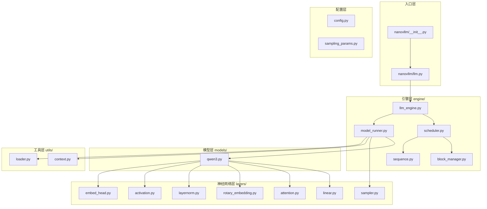

# 第一章：项目概述与快速上手

> 本章将介绍 Nano-vLLM 项目的背景、设计目标，并通过快速上手示例让你了解基本使用方法。

## 1.1 项目简介

### 什么是 Nano-vLLM？

Nano-vLLM 是一个**轻量级的 vLLM 实现**，仅用约 1200 行 Python 代码实现了与 vLLM 相当的推理性能。它的设计目标是：

- 🚀 **高性能**：与 vLLM 相当的推理速度
- 📖 **可读性**：简洁清晰的代码实现
- ⚡ **优化丰富**：Prefix Caching、张量并行、CUDA Graph 等

### 性能对比

| 推理引擎 | 输出 Token 数 | 耗时 (s) | 吞吐量 (tokens/s) |
|:---------|:-------------|:---------|:------------------|
| vLLM     | 133,966      | 98.37    | 1361.84           |
| Nano-vLLM| 133,966      | 93.41    | **1434.13**       |

> 测试环境：RTX 4070 Laptop (8GB)，Qwen3-0.6B 模型

---

## 1.2 项目结构



---

## 1.3 源码分析：包入口

### `nanovllm/__init__.py` 源码

```python
from nanovllm.llm import LLM
from nanovllm.sampling_params import SamplingParams
```

**逐行解析**：

| 行号 | 代码 | 说明 |
|:---:|:---|:---|
| 1 | `from nanovllm.llm import LLM` | 导入 LLM 类，这是用户使用的主要接口 |
| 2 | `from nanovllm.sampling_params import SamplingParams` | 导入采样参数类，用于控制生成行为 |

> 💡 **设计思想**：遵循「最小暴露原则」，`__init__.py` 只导出用户真正需要的两个类，隐藏内部实现细节。这种设计让 API 保持简洁，用户无需了解底层的 `LLMEngine`、`Scheduler` 等复杂组件。

### `nanovllm/llm.py` 源码

```python
from nanovllm.engine.llm_engine import LLMEngine


class LLM(LLMEngine):
    pass
```

**逐行解析**：

| 行号 | 代码 | 说明 |
|:---:|:---|:---|
| 1 | `from nanovllm.engine.llm_engine import LLMEngine` | 导入推理引擎基类 |
| 4-5 | `class LLM(LLMEngine): pass` | LLM 类直接继承 LLMEngine，不添加额外功能 |

**设计思考**：

为什么要创建一个空的 `LLM` 类继承 `LLMEngine`？

1. **API 兼容性**：与 vLLM 保持相同的类名 `LLM`
2. **扩展预留**：未来可以在 `LLM` 类中添加高级功能
3. **职责分离**：`LLMEngine` 专注底层实现，`LLM` 提供用户接口

---

## 1.4 源码分析：使用示例

### `example.py` 完整源码

```python
import os
from nanovllm import LLM, SamplingParams
from transformers import AutoTokenizer


def main():
    path = os.path.expanduser("~/huggingface/Qwen3-0.6B/")
    tokenizer = AutoTokenizer.from_pretrained(path)
    llm = LLM(path, enforce_eager=True, tensor_parallel_size=1)

    sampling_params = SamplingParams(temperature=0.6, max_tokens=256)
    prompts = [
        "introduce yourself",
        "list all prime numbers within 100",
    ]
    prompts = [
        tokenizer.apply_chat_template(
            [{"role": "user", "content": prompt}],
            tokenize=False,
            add_generation_prompt=True,
        )
        for prompt in prompts
    ]
    outputs = llm.generate(prompts, sampling_params)

    for prompt, output in zip(prompts, outputs):
        print("\n")
        print(f"Prompt: {prompt!r}")
        print(f"Completion: {output['text']!r}")


if __name__ == "__main__":
    main()
```

### 逐行详解

#### 第 1-3 行：导入依赖

```python
import os
from nanovllm import LLM, SamplingParams
from transformers import AutoTokenizer
```

| 模块 | 用途 |
|:---|:---|
| `os` | 处理文件路径（展开 `~`） |
| `LLM` | 推理引擎主类 |
| `SamplingParams` | 采样参数控制 |
| `AutoTokenizer` | HuggingFace 分词器 |

> 💡 **设计思想**：Nano-vLLM 选择复用 HuggingFace 的 `AutoTokenizer` 而非自己实现分词器，这体现了「不重复造轮子」的工程理念——专注于推理引擎核心逻辑，其他成熟组件直接复用。

#### 第 7-9 行：初始化

```python
path = os.path.expanduser("~/huggingface/Qwen3-0.6B/")
tokenizer = AutoTokenizer.from_pretrained(path)
llm = LLM(path, enforce_eager=True, tensor_parallel_size=1)
```

**关键参数说明**：

| 参数 | 值 | 说明 |
|:---|:---|:---|
| `path` | 模型目录 | 包含模型权重和配置的目录 |
| `enforce_eager` | `True` | 禁用 CUDA Graph，使用即时执行模式 |
| `tensor_parallel_size` | `1` | 单 GPU 运行，不使用张量并行 |

> 💡 `enforce_eager=True` 适合调试，生产环境建议设为 `False` 以启用 CUDA Graph 优化

#### 第 11-22 行：准备输入

```python
sampling_params = SamplingParams(temperature=0.6, max_tokens=256)
prompts = [
    "introduce yourself",
    "list all prime numbers within 100",
]
prompts = [
    tokenizer.apply_chat_template(
        [{"role": "user", "content": prompt}],
        tokenize=False,
        add_generation_prompt=True,
    )
    for prompt in prompts
]
```

**采样参数**：

| 参数 | 值 | 说明 |
|:---|:---|:---|
| `temperature` | `0.6` | 温度系数，越低越确定性 |
| `max_tokens` | `256` | 最大生成 token 数 |

**apply_chat_template 处理**：

将用户输入转换为模型期望的对话格式，例如：
```
<|im_start|>user
introduce yourself<|im_end|>
<|im_start|>assistant
```

#### 第 23 行：执行推理

```python
outputs = llm.generate(prompts, sampling_params)
```

`generate` 方法执行完整的推理流程：
1. 将 prompt 添加到请求队列
2. 调度器分配资源
3. 模型运行器执行推理
4. 返回生成结果

**返回格式**：
```python
outputs[0] = {
    "text": "生成的文本内容",
    "token_ids": [12, 345, 67, ...]  # token ID 列表
}
```

> 💡 **设计思想**：返回结构同时包含解码后的文本和原始 token IDs，满足不同场景需求——文本用于直接展示，token IDs 用于后续处理（如计算困惑度、token 级别分析等）。

#### 第 25-29 行：输出结果

```python
for prompt, output in zip(prompts, outputs):
    print("\n")
    print(f"Prompt: {prompt!r}")
    print(f"Completion: {output['text']!r}")
```

遍历输入和输出，打印结果。`!r` 使用 `repr()` 格式化，显示转义字符。

---

## 1.5 快速上手

### 安装方法

```bash
pip install git+https://github.com/GeeeekExplorer/nano-vllm.git
```

### 下载模型

```bash
huggingface-cli download --resume-download Qwen/Qwen3-0.6B \
  --local-dir ~/huggingface/Qwen3-0.6B/ \
  --local-dir-use-symlinks False
```

### 最简示例

```python
from nanovllm import LLM, SamplingParams

# 初始化
llm = LLM("/path/to/Qwen3-0.6B", enforce_eager=True)

# 配置采样参数
params = SamplingParams(temperature=0.6, max_tokens=256)

# 生成
outputs = llm.generate(["Hello, Nano-vLLM."], params)
print(outputs[0]["text"])
```

---

## 1.6 本章小结

本章我们学习了：

1. **项目定位**：Nano-vLLM 是轻量级、高性能的 vLLM 实现
2. **项目结构**：入口层、配置层、引擎层、神经网络层、模型层、工具层
3. **包入口设计**：简洁的 `__init__.py` 和继承设计
4. **使用方法**：通过 `example.py` 了解基本使用流程

---

**下一章** → [02 核心架构总览](02_core_architecture.md)
