# 第二章：核心架构总览

> 本章将从整体视角分析 Nano-vLLM 的架构设计，理解各模块之间的关系和数据流向。

## 2.1 整体架构图

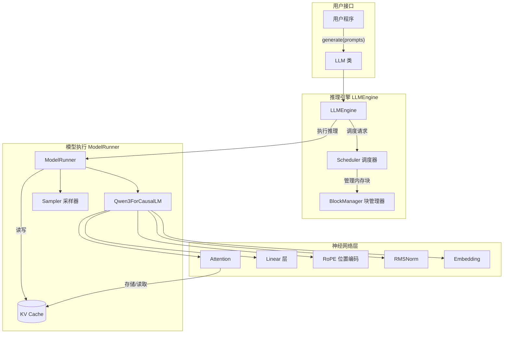

---

## 2.2 核心概念解释

### 2.2.1 Prefill 与 Decode 两阶段

LLM 推理分为两个阶段：

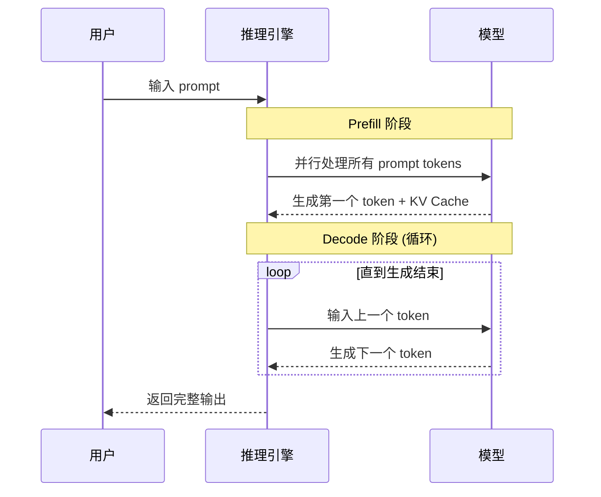

| 阶段 | 输入 | 计算特点 | 主要瓶颈 |
|:---|:---|:---|:---|
| **Prefill** | 完整 prompt | 并行计算，计算密集 | 计算量 |
| **Decode** | 单个 token | 顺序执行，访存密集 | 内存带宽 |

### 2.2.2 KV Cache

KV Cache 是加速 LLM 推理的关键技术：

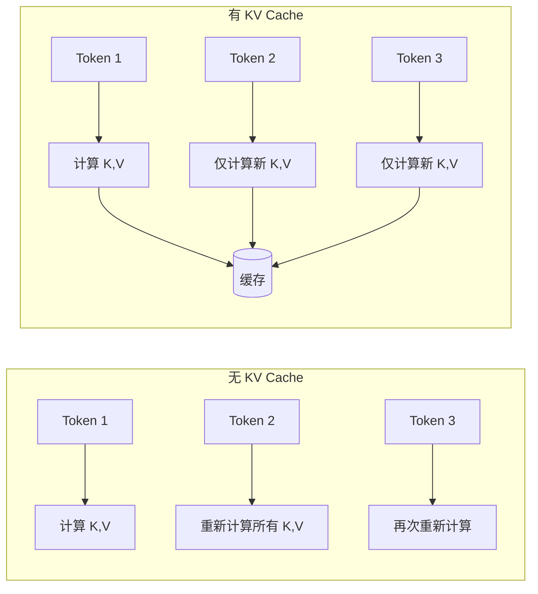

**核心思想**：缓存已计算的 Key 和 Value，避免重复计算。

> 💡 **设计思想**：KV Cache 是典型的「空间换时间」策略。Decode 阶段的计算复杂度从 O(n²) 降低到 O(n)，代价是需要额外的显存存储历史 KV。

### 2.2.3 Continuous Batching

传统批处理 vs Continuous Batching：

```mermaid
gantt
    title 传统批处理
    dateFormat X
    axisFormat %s
    
    section 请求1
    ████████████████    :0, 16
    section 请求2 (短)
    ████    等待    :0, 16
    section 请求3
    ████████████        等待 :0, 16
```

```mermaid
gantt
    title Continuous Batching
    dateFormat X
    axisFormat %s
    
    section 请求1
    ████████████████    :0, 16
    section 请求2 (短)
    ████    :0, 4
    section 请求3
    ████████████ :0, 12
    section 请求4 (新加入)
        ████████████ :4, 16
```

**优势**：请求完成后立即释放资源，新请求可以立即加入。

> 💡 **设计思想**：Continuous Batching 将 GPU 资源的分配单位从「批次」细化到「token」，大幅提升了 GPU 利用率。这是 LLM 推理引擎的核心创新之一。

### 2.2.4 Prefix Caching

相同前缀的请求可以共享 KV Cache：

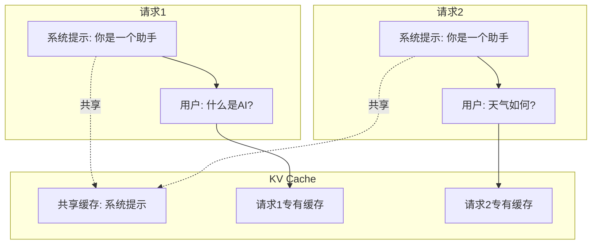

---

## 2.3 模块职责

### 2.3.1 各模块职责表

| 模块 | 文件 | 核心职责 |
|:---|:---|:---|
| **LLM** | `llm.py` | 用户接口，继承 LLMEngine |
| **LLMEngine** | `llm_engine.py` | 推理引擎入口，协调调度和执行 |
| **Scheduler** | `scheduler.py` | 请求调度，决定哪些序列参与推理 |
| **BlockManager** | `block_manager.py` | KV Cache 内存管理，Prefix Caching |
| **Sequence** | `sequence.py` | 序列数据结构，状态管理 |
| **ModelRunner** | `model_runner.py` | 模型执行，CUDA Graph，张量并行 |
| **Qwen3ForCausalLM** | `qwen3.py` | Transformer 模型实现 |
| **Attention** | `attention.py` | 注意力计算，Flash Attention |
| **Linear** | `linear.py` | 并行线性层 |
| **RMSNorm** | `layernorm.py` | 归一化层 |
| **Sampler** | `sampler.py` | Token 采样 |

> 💡 **设计思想**：Nano-vLLM 的模块划分遵循「单一职责原则」——Scheduler 只负责调度，BlockManager 只负责内存，ModelRunner 只负责执行。这种分离让代码更易理解和维护。

### 2.3.2 模块依赖关系

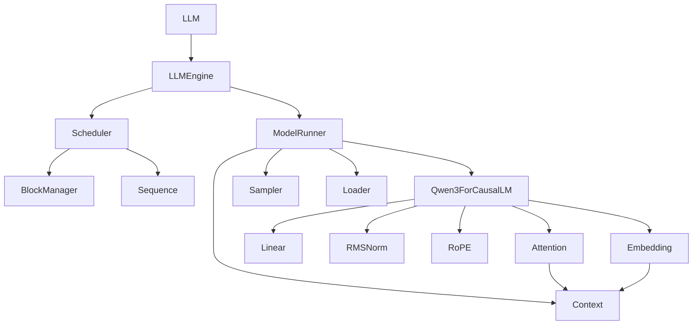

---

## 2.4 数据流分析

### 2.4.1 完整推理流程

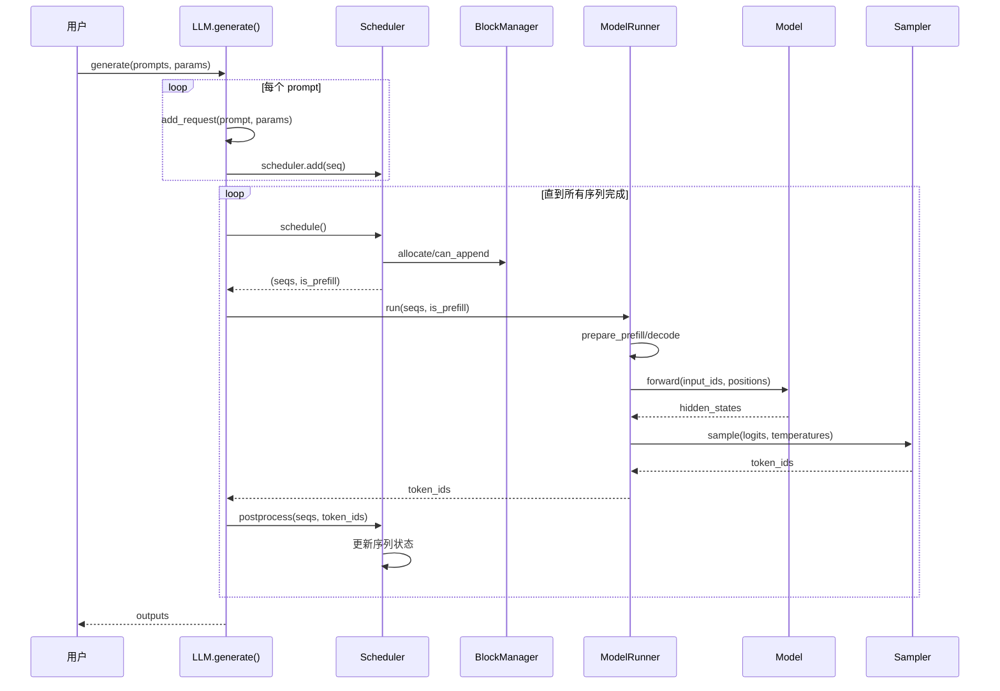

### 2.4.2 单步推理详解

每次 `step()` 调用的内部流程：

```python
def step(self):
    # 1. 调度：决定本轮处理哪些序列
    seqs, is_prefill = self.scheduler.schedule()
    
    # 2. 执行：运行模型生成 token
    token_ids = self.model_runner.call("run", seqs, is_prefill)
    
    # 3. 后处理：更新序列状态
    self.scheduler.postprocess(seqs, token_ids)
    
    # 4. 收集完成的序列
    outputs = [(seq.seq_id, seq.completion_token_ids) 
               for seq in seqs if seq.is_finished]
    
    return outputs, num_tokens
```

> 💡 **设计思想**：`step()` 方法将一次推理循环分为三步：调度→执行→后处理。这种流水线式设计让各阶段职责清晰，也便于单独优化每个阶段。

---

## 2.5 内存布局

### 2.5.1 KV Cache 内存结构

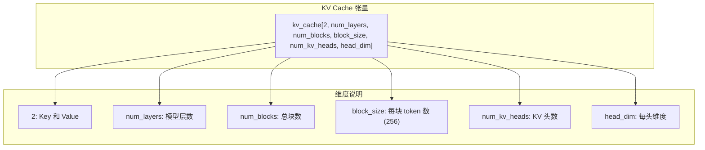

### 2.5.2 Block 分配示例

假设 `block_size=256`，一个 512 token 的序列：

```
序列 tokens: [t0, t1, t2, ..., t511]
            |-------- Block 0 --------|-------- Block 1 --------|
            [t0 ... t255]              [t256 ... t511]
            
Block Table: [block_id_0, block_id_1]
```

---

## 2.6 张量并行

### 2.6.1 并行策略

Nano-vLLM 使用 **张量并行（Tensor Parallelism）**：

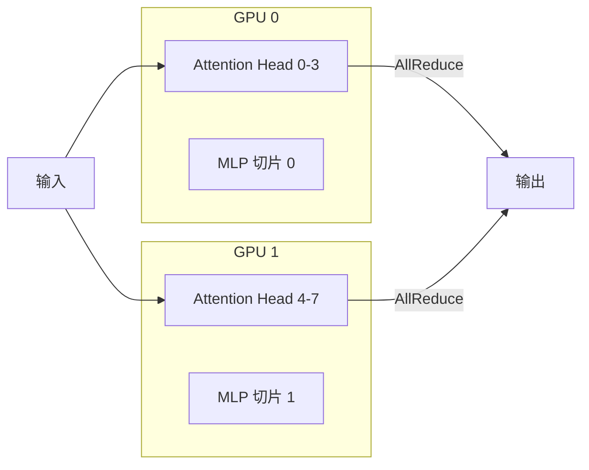

### 2.6.2 进程通信

多 GPU 通过共享内存进行通信：

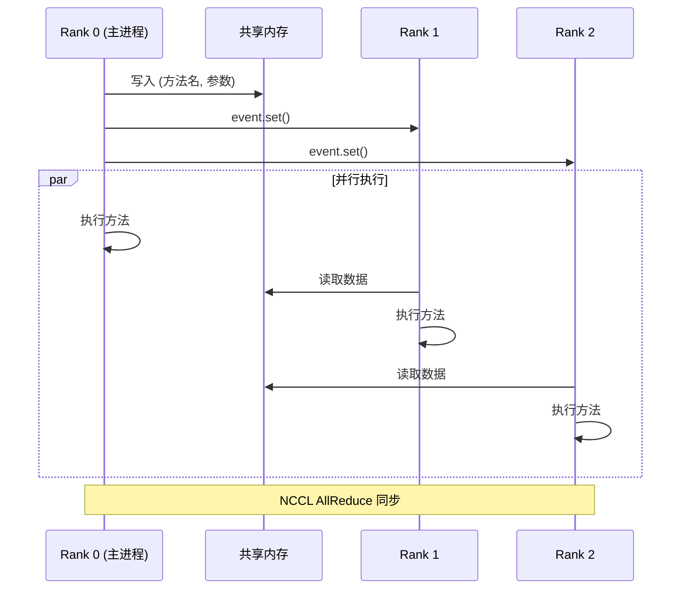

---

## 2.7 本章小结

本章我们学习了：

1. **整体架构**：从用户接口到底层模型的完整调用链
2. **核心概念**：
   - Prefill/Decode 两阶段推理
   - KV Cache 缓存机制
   - Continuous Batching 动态批处理
   - Prefix Caching 前缀共享
3. **模块职责**：各模块的核心功能和依赖关系
4. **数据流**：一次推理请求的完整处理流程
5. **内存布局**：KV Cache 的存储结构
6. **张量并行**：多 GPU 协同工作方式

---

**下一章** → [03 配置与采样参数](03_config_and_params.md)
