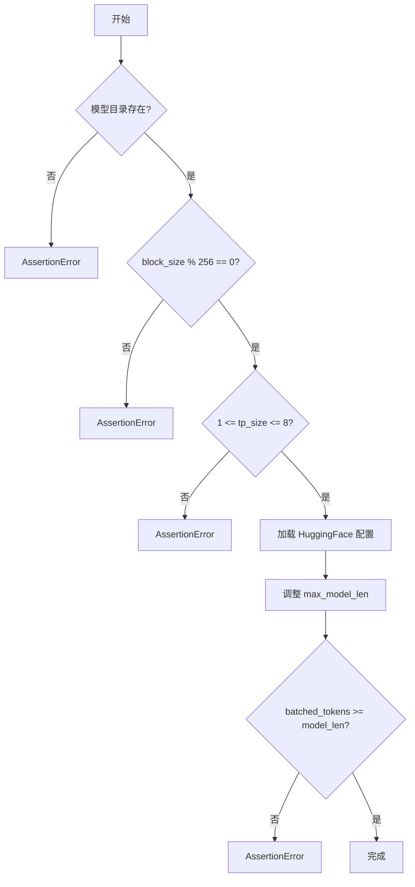
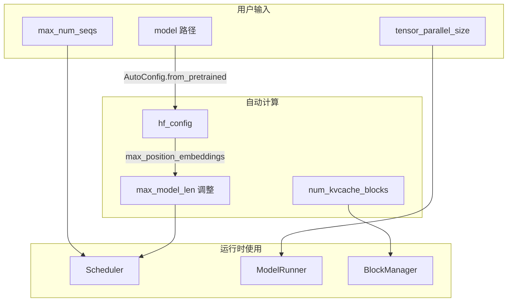
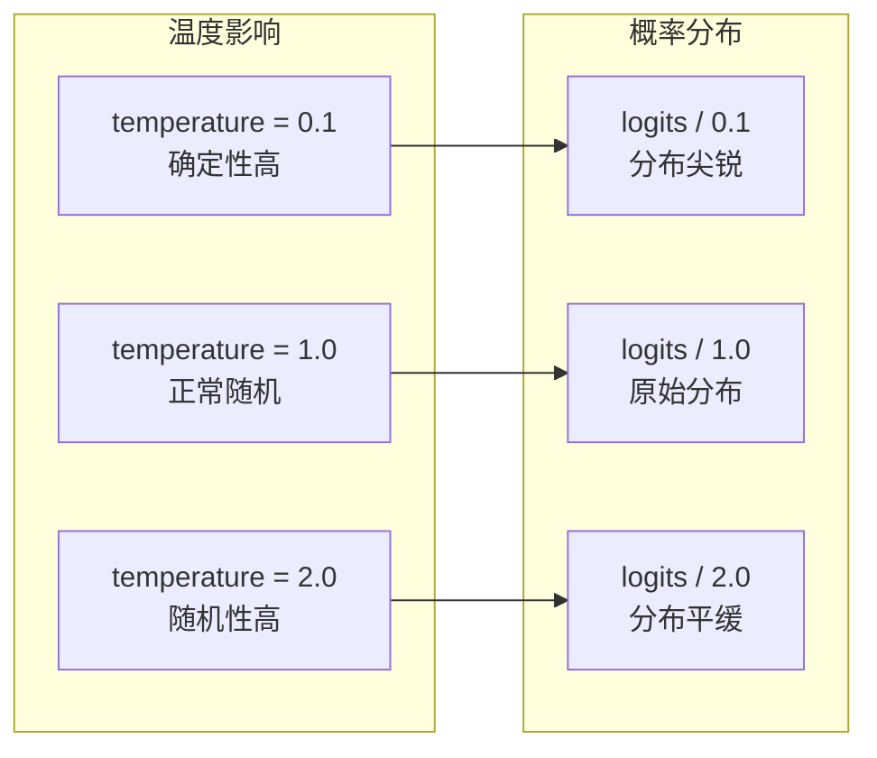
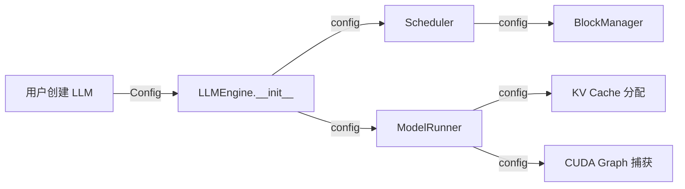
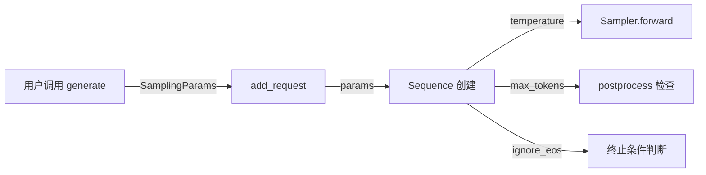

# 第三章：配置与采样参数

> 本章将逐行分析 `config.py` 和 `sampling_params.py`，理解 Nano-vLLM 的配置系统。

## 3.1 Config 配置类

### 3.1.1 完整源码

```python
import os
from dataclasses import dataclass
from transformers import AutoConfig


@dataclass
class Config:
    model: str
    max_num_batched_tokens: int = 16384
    max_num_seqs: int = 512
    max_model_len: int = 4096
    gpu_memory_utilization: float = 0.9
    tensor_parallel_size: int = 1
    enforce_eager: bool = False
    hf_config: AutoConfig | None = None
    eos: int = -1
    kvcache_block_size: int = 256
    num_kvcache_blocks: int = -1

    def __post_init__(self):
        assert os.path.isdir(self.model)
        assert self.kvcache_block_size % 256 == 0
        assert 1 <= self.tensor_parallel_size <= 8
        self.hf_config = AutoConfig.from_pretrained(self.model)
        self.max_model_len = min(self.max_model_len, self.hf_config.max_position_embeddings)
        assert self.max_num_batched_tokens >= self.max_model_len
```

### 3.1.2 逐行分析

#### 导入部分（第 1-3 行）

```python
import os
from dataclasses import dataclass
from transformers import AutoConfig
```

| 导入 | 用途 |
|:---|:---|
| `os` | 检查模型目录是否存在 |
| `dataclass` | 数据类装饰器，自动生成 `__init__` 等方法 |
| `AutoConfig` | 加载 HuggingFace 模型配置 |

> 💡 **设计思想**：使用 `dataclass` 而非普通类，可以自动生成 `__init__`、`__repr__` 等方法，减少样板代码，同时保持代码简洁可读。

#### 类定义与字段（第 6-18 行）

```python
@dataclass
class Config:
    model: str
    max_num_batched_tokens: int = 16384
    max_num_seqs: int = 512
    max_model_len: int = 4096
    gpu_memory_utilization: float = 0.9
    tensor_parallel_size: int = 1
    enforce_eager: bool = False
    hf_config: AutoConfig | None = None
    eos: int = -1
    kvcache_block_size: int = 256
    num_kvcache_blocks: int = -1
```

**字段详解**：

| 字段 | 类型 | 默认值 | 说明 |
|:---|:---|:---|:---|
| `model` | `str` | 必填 | 模型路径 |
| `max_num_batched_tokens` | `int` | 16384 | 单批次最大 token 数 |
| `max_num_seqs` | `int` | 512 | 最大并发序列数 |
| `max_model_len` | `int` | 4096 | 单序列最大长度 |
| `gpu_memory_utilization` | `float` | 0.9 | GPU 显存利用率 |
| `tensor_parallel_size` | `int` | 1 | 张量并行大小（GPU 数） |
| `enforce_eager` | `bool` | False | 是否禁用 CUDA Graph |
| `hf_config` | `AutoConfig` | None | HuggingFace 模型配置 |
| `eos` | `int` | -1 | 结束 token ID |
| `kvcache_block_size` | `int` | 256 | KV Cache 块大小 |
| `num_kvcache_blocks` | `int` | -1 | KV Cache 总块数（自动计算） |

> 💡 **设计思想**：配置字段分为两类——用户可控（如 `max_num_seqs`）和自动计算（如 `num_kvcache_blocks`）。自动计算的字段用 `-1` 作为哨兵值，表示「待运行时确定」，避免用户需要手动计算复杂的内存布局。

#### 后初始化验证（第 20-26 行）

```python
def __post_init__(self):
    assert os.path.isdir(self.model)
    assert self.kvcache_block_size % 256 == 0
    assert 1 <= self.tensor_parallel_size <= 8
    self.hf_config = AutoConfig.from_pretrained(self.model)
    self.max_model_len = min(self.max_model_len, self.hf_config.max_position_embeddings)
    assert self.max_num_batched_tokens >= self.max_model_len
```

**`__post_init__` 执行流程**：



**关键验证逻辑**：

| 行号 | 验证 | 原因 |
|:---:|:---|:---|
| 21 | 模型目录必须存在 | 确保能加载模型权重 |
| 22 | block_size 必须是 256 的倍数 | Flash Attention 的对齐要求 |
| 23 | 张量并行大小在 1-8 之间 | 实际硬件限制 |
| 25 | 取 max_model_len 和模型限制的较小值 | 不能超过模型支持的最大位置 |
| 26 | 批次 token 数 >= 序列长度 | 至少能处理一个完整序列 |

> 💡 **设计思想**：`__post_init__` 实现了「Fail-Fast」原则——在对象创建时就验证所有约束，而非等到运行时才发现错误。这样可以给出清晰的错误信息，帮助用户快速定位配置问题。

### 3.1.3 配置关系图



---

## 3.2 SamplingParams 采样参数

### 3.2.1 完整源码

```python
from dataclasses import dataclass


@dataclass
class SamplingParams:
    temperature: float = 1.0
    max_tokens: int = 64
    ignore_eos: bool = False

    def __post_init__(self):
        assert self.temperature > 1e-10, "greedy sampling is not permitted"
```

### 3.2.2 逐行分析

#### 导入部分（第 1 行）

```python
from dataclasses import dataclass
```

使用 dataclass 简化参数类的定义。

#### 类定义（第 4-8 行）

```python
@dataclass
class SamplingParams:
    temperature: float = 1.0
    max_tokens: int = 64
    ignore_eos: bool = False
```

**字段详解**：

| 字段 | 类型 | 默认值 | 说明 |
|:---|:---|:---|:---|
| `temperature` | `float` | 1.0 | 采样温度，控制随机性 |
| `max_tokens` | `int` | 64 | 最大生成 token 数 |
| `ignore_eos` | `bool` | False | 是否忽略 EOS token |

> 💡 **设计思想**：只保留 3 个核心参数，体现了「少即是多」的设计哲学。相比 vLLM 支持的 `top_k`、`top_p`、`frequency_penalty` 等十几个参数，Nano-vLLM 只保留最常用的，降低用户学习成本，同时保持代码简洁。

#### 温度采样原理



**数学公式**：

$$p_i = \frac{e^{logit_i / T}}{\sum_j e^{logit_j / T}}$$

其中 $T$ 是温度参数：
- $T \to 0$：趋近 argmax（贪婪采样）
- $T = 1$：标准 softmax
- $T > 1$：更均匀的分布

#### 后初始化验证（第 10-11 行）

```python
def __post_init__(self):
    assert self.temperature > 1e-10, "greedy sampling is not permitted"
```

**为什么禁止贪婪采样（temperature ≈ 0）？**

1. **数值稳定性**：温度接近 0 会导致 softmax 数值溢出
2. **设计选择**：Nano-vLLM 专注于随机采样场景
3. **简化实现**：避免处理 argmax 的特殊情况

> 💡 如果需要贪婪采样，可以设置一个很小的温度值（如 0.01）

---

## 3.3 配置在系统中的流动

### 3.3.1 Config 的传递路径



### 3.3.2 SamplingParams 的传递路径



---

## 3.4 配置示例

### 3.4.1 基础配置

```python
from nanovllm import LLM, SamplingParams

# 最简配置
llm = LLM("/path/to/model")
params = SamplingParams()
```

### 3.4.2 高性能配置

```python
# 启用 CUDA Graph 优化
llm = LLM(
    "/path/to/model",
    enforce_eager=False,  # 启用 CUDA Graph
    tensor_parallel_size=2,  # 双 GPU
    gpu_memory_utilization=0.95,  # 更高显存利用率
    max_num_seqs=1024,  # 更大批次
)

# 低温度采样（更确定性）
params = SamplingParams(
    temperature=0.3,
    max_tokens=512,
)
```

### 3.4.3 调试配置

```python
# 禁用优化，便于调试
llm = LLM(
    "/path/to/model",
    enforce_eager=True,  # 禁用 CUDA Graph
    tensor_parallel_size=1,  # 单 GPU
)

# 高温度采样（更多样性）
params = SamplingParams(
    temperature=1.5,
    max_tokens=128,
)
```

---

## 3.5 本章小结

本章我们学习了：

1. **Config 类**：
   - 12 个配置字段的含义和默认值
   - `__post_init__` 验证逻辑
   - 配置字段之间的约束关系

2. **SamplingParams 类**：
   - 3 个采样参数的作用
   - 温度采样的数学原理
   - 禁止贪婪采样的设计原因

3. **配置流动**：
   - Config 从用户到各组件的传递路径
   - SamplingParams 如何影响推理过程

---

**下一章** → [04 序列与状态管理](04_sequence.md)
