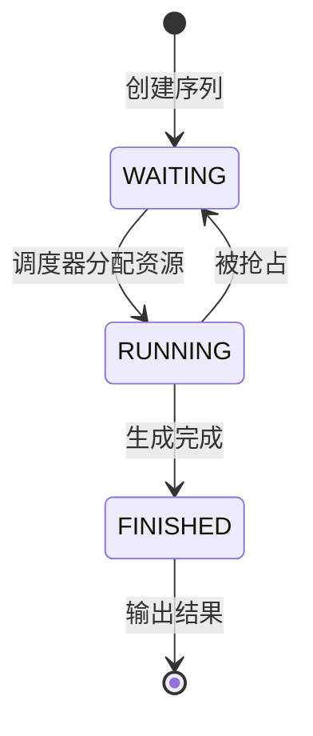
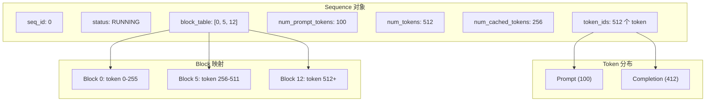
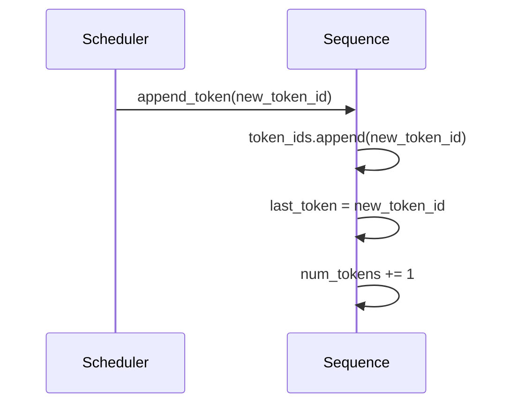
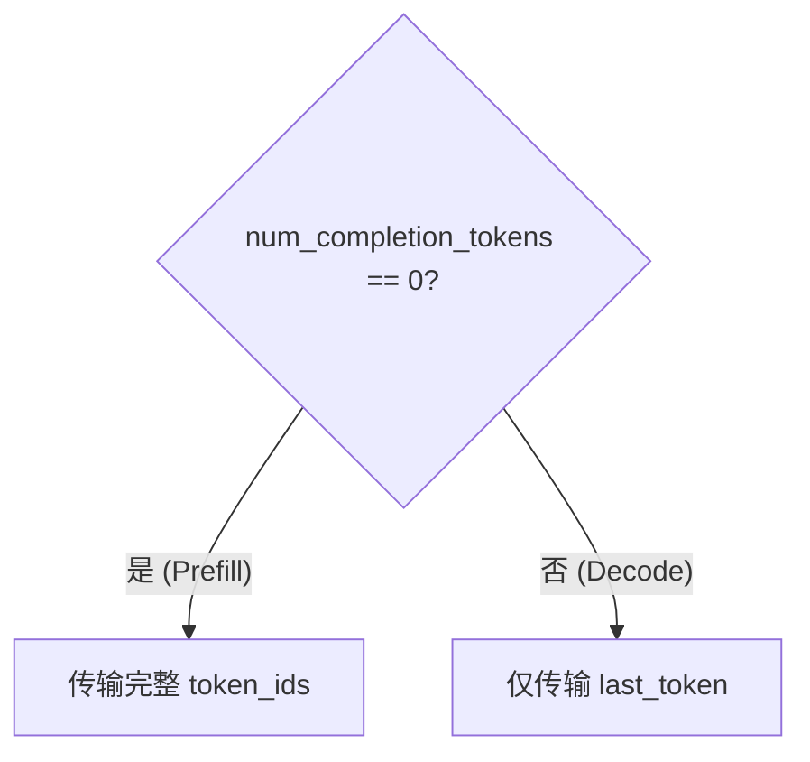
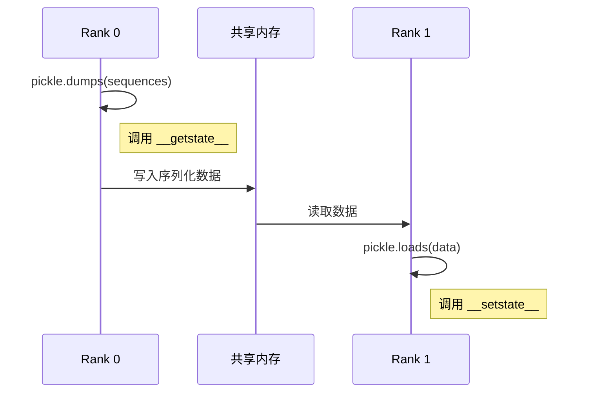

# 第四章：序列与状态管理

> 本章将逐行分析 `sequence.py`，理解序列（Sequence）的数据结构和状态管理机制。

## 4.1 完整源码

```python
from copy import copy
from enum import Enum, auto
from itertools import count

from nanovllm.sampling_params import SamplingParams


class SequenceStatus(Enum):
    WAITING = auto()
    RUNNING = auto()
    FINISHED = auto()


class Sequence:
    block_size = 256
    counter = count()

    def __init__(self, token_ids: list[int], sampling_params = SamplingParams()):
        self.seq_id = next(Sequence.counter)
        self.status = SequenceStatus.WAITING
        self.token_ids = copy(token_ids)
        self.last_token = token_ids[-1]
        self.num_tokens = len(self.token_ids)
        self.num_prompt_tokens = len(token_ids)
        self.num_cached_tokens = 0
        self.block_table = []
        self.temperature = sampling_params.temperature
        self.max_tokens = sampling_params.max_tokens
        self.ignore_eos = sampling_params.ignore_eos

    def __len__(self):
        return self.num_tokens

    def __getitem__(self, key):
        return self.token_ids[key]

    @property
    def is_finished(self):
        return self.status == SequenceStatus.FINISHED

    @property
    def num_completion_tokens(self):
        return self.num_tokens - self.num_prompt_tokens

    @property
    def prompt_token_ids(self):
        return self.token_ids[:self.num_prompt_tokens]

    @property
    def completion_token_ids(self):
        return self.token_ids[self.num_prompt_tokens:]

    @property
    def num_cached_blocks(self):
        return self.num_cached_tokens // self.block_size

    @property
    def num_blocks(self):
        return (self.num_tokens + self.block_size - 1) // self.block_size

    @property
    def last_block_num_tokens(self):
        return self.num_tokens - (self.num_blocks - 1) * self.block_size

    def block(self, i):
        assert 0 <= i < self.num_blocks
        return self.token_ids[i*self.block_size: (i+1)*self.block_size]

    def append_token(self, token_id: int):
        self.token_ids.append(token_id)
        self.last_token = token_id
        self.num_tokens += 1

    def __getstate__(self):
        return (self.num_tokens, self.num_prompt_tokens, self.num_cached_tokens, self.block_table,
                self.token_ids if self.num_completion_tokens == 0 else self.last_token)

    def __setstate__(self, state):
        self.num_tokens, self.num_prompt_tokens, self.num_cached_tokens, self.block_table = state[:-1]
        if self.num_completion_tokens == 0:
            self.token_ids = state[-1]
        else:
            self.last_token = state[-1]
```

---

## 4.2 SequenceStatus 枚举

### 4.2.1 源码分析

```python
class SequenceStatus(Enum):
    WAITING = auto()
    RUNNING = auto()
    FINISHED = auto()
```

### 4.2.2 状态说明

| 状态 | 值 | 说明 |
|:---|:---:|:---|
| `WAITING` | 1 | 等待调度，在等待队列中 |
| `RUNNING` | 2 | 正在运行，分配了 GPU 资源 |
| `FINISHED` | 3 | 已完成，生成了 EOS 或达到最大长度 |

### 4.2.3 状态转换图



**状态转换触发条件**：

| 转换 | 触发位置 | 条件 |
|:---|:---|:---|
| WAITING → RUNNING | `Scheduler.schedule()` | 序列被调度执行 |
| RUNNING → WAITING | `Scheduler.preempt()` | 内存不足，被抢占 |
| RUNNING → FINISHED | `Scheduler.postprocess()` | 生成 EOS 或达到 max_tokens |

> 💡 **设计思想**：三状态机的设计简洁而完备，`RUNNING → WAITING` 的转换支持抢占机制，这是 Continuous Batching 的关键——当内存紧张时可以临时释放某些序列的资源，而不是完全丢弃已计算的结果。

---

## 4.3 Sequence 类详解

### 4.3.1 类变量

```python
class Sequence:
    block_size = 256
    counter = count()
```

| 变量 | 类型 | 说明 |
|:---|:---|:---|
| `block_size` | `int` | KV Cache 块大小，共享于所有实例 |
| `counter` | `count` | 全局计数器，生成唯一 seq_id |

**`count()` 的作用**：

```python
from itertools import count

counter = count()
print(next(counter))  # 0
print(next(counter))  # 1
print(next(counter))  # 2
```

确保每个序列获得唯一的 ID。

> 💡 **设计思想**：使用类变量 `counter` 而非实例变量，确保全局唯一性。`itertools.count()` 是无限迭代器，线程安全且永不重复，非常适合生成 ID。

### 4.3.2 构造函数

```python
def __init__(self, token_ids: list[int], sampling_params = SamplingParams()):
    self.seq_id = next(Sequence.counter)        # 唯一序列 ID
    self.status = SequenceStatus.WAITING        # 初始状态为等待
    self.token_ids = copy(token_ids)            # 复制 token 列表
    self.last_token = token_ids[-1]             # 最后一个 token
    self.num_tokens = len(self.token_ids)       # 当前总 token 数
    self.num_prompt_tokens = len(token_ids)     # prompt 长度（固定）
    self.num_cached_tokens = 0                  # 已缓存的 token 数
    self.block_table = []                       # 块表
    self.temperature = sampling_params.temperature
    self.max_tokens = sampling_params.max_tokens
    self.ignore_eos = sampling_params.ignore_eos
```

**逐行解析**：

| 行号 | 属性 | 说明 |
|:---:|:---|:---|
| 1 | `seq_id` | 全局唯一 ID，用于识别序列 |
| 2 | `status` | 初始状态为 WAITING |
| 3 | `token_ids` | 使用 `copy()` 避免修改原始列表 |
| 4 | `last_token` | Decode 阶段只需要最后一个 token |
| 5 | `num_tokens` | 动态更新，包含已生成的 token |
| 6 | `num_prompt_tokens` | 固定不变，区分 prompt 和 completion |
| 7 | `num_cached_tokens` | Prefix Caching 使用 |
| 8 | `block_table` | 存储分配的块 ID 列表 |
| 9-11 | 采样参数 | 从 SamplingParams 复制 |

> 💡 **设计思想**：使用 `copy(token_ids)` 而非直接引用，避免外部修改影响序列内部状态，体现了「防御性复制」的编程实践。将采样参数展开存储而非保留对象引用，被免对象图复杂化。

### 4.3.3 内存布局示意



---

## 4.4 魔术方法

### 4.4.1 `__len__` 和 `__getitem__`

```python
def __len__(self):
    return self.num_tokens

def __getitem__(self, key):
    return self.token_ids[key]
```

**作用**：

```python
seq = Sequence([1, 2, 3, 4, 5])
print(len(seq))     # 5
print(seq[0])       # 1
print(seq[1:3])     # [2, 3]
print(seq[-1])      # 5
```

使 `Sequence` 可以像列表一样使用。

> 💡 **设计思想**：实现 `__len__` 和 `__getitem__` 让 `Sequence` 遵循 Python 的序列协议，可以直接用于 `len()`、切片、迭代等操作，让代码更符合 Python 习惯。

---

## 4.5 属性方法

### 4.5.1 状态属性

```python
@property
def is_finished(self):
    return self.status == SequenceStatus.FINISHED
```

简洁地判断序列是否完成。

### 4.5.2 Token 计数属性

```python
@property
def num_completion_tokens(self):
    return self.num_tokens - self.num_prompt_tokens
```

**计算逻辑**：

```
总 token 数 - prompt token 数 = 已生成的 token 数
```

**示例**：

```python
seq = Sequence([1, 2, 3])  # 3 个 prompt tokens
seq.append_token(4)
seq.append_token(5)
print(seq.num_prompt_tokens)      # 3
print(seq.num_tokens)             # 5
print(seq.num_completion_tokens)  # 2
```

### 4.5.3 Token ID 切片属性

```python
@property
def prompt_token_ids(self):
    return self.token_ids[:self.num_prompt_tokens]

@property
def completion_token_ids(self):
    return self.token_ids[self.num_prompt_tokens:]
```

**可视化**：

```
token_ids: [p1, p2, p3, c1, c2, c3, c4]
            |---------|  |------------|
         prompt_token_ids  completion_token_ids
```

---

## 4.6 块管理相关

### 4.6.1 块计算属性

```python
@property
def num_cached_blocks(self):
    return self.num_cached_tokens // self.block_size

@property
def num_blocks(self):
    return (self.num_tokens + self.block_size - 1) // self.block_size

@property
def last_block_num_tokens(self):
    return self.num_tokens - (self.num_blocks - 1) * self.block_size
```

**计算示例**（假设 `block_size=256`）：

| 属性 | 公式 | 示例 (num_tokens=600) |
|:---|:---|:---|
| `num_blocks` | `⌈num_tokens / block_size⌉` | `⌈600/256⌉ = 3` |
| `last_block_num_tokens` | `num_tokens - (num_blocks-1) * block_size` | `600 - 2*256 = 88` |

**可视化**：

```
tokens (600个):
|-------- Block 0 --------|-------- Block 1 --------|-- Block 2 --|
[     256 tokens          ][     256 tokens          ][  88 tokens ]
                                                       ↑
                                           last_block_num_tokens = 88
```

### 4.6.2 获取特定块

```python
def block(self, i):
    assert 0 <= i < self.num_blocks
    return self.token_ids[i*self.block_size: (i+1)*self.block_size]
```

**作用**：获取第 i 个块中的 token IDs，用于计算 Prefix Caching 的哈希值。

---

## 4.7 Token 追加

```python
def append_token(self, token_id: int):
    self.token_ids.append(token_id)
    self.last_token = token_id
    self.num_tokens += 1
```

**调用时机**：`Scheduler.postprocess()` 在每次 decode 步骤后调用。

**流程**：



---

## 4.8 序列化方法

### 4.8.1 `__getstate__`

```python
def __getstate__(self):
    return (self.num_tokens, self.num_prompt_tokens, self.num_cached_tokens, self.block_table,
            self.token_ids if self.num_completion_tokens == 0 else self.last_token)
```

**设计亮点**：

- **Prefill 阶段**：传输完整 `token_ids`（需要计算所有 token）
- **Decode 阶段**：只传输 `last_token`（只需要最后一个 token）



**优化效果**：

| 阶段 | 传输数据量 | 说明 |
|:---|:---|:---|
| Prefill | O(n) | 完整 prompt tokens |
| Decode | O(1) | 仅 1 个 token |

> 💡 **设计思想**：序列化优化是张量并行的关键——Decode 阶段只传输 1 个 token 而非全量 token_ids，大幅减少进程间通信开销。这是典型的「增量传输」思想，只传递必要的信息。

### 4.8.2 `__setstate__`

```python
def __setstate__(self, state):
    self.num_tokens, self.num_prompt_tokens, self.num_cached_tokens, self.block_table = state[:-1]
    if self.num_completion_tokens == 0:
        self.token_ids = state[-1]
    else:
        self.last_token = state[-1]
```

反序列化时根据 `num_completion_tokens` 判断状态的最后一个元素是 `token_ids` 还是 `last_token`。

### 4.8.3 序列化用途



在多 GPU 张量并行中，主进程需要将序列信息传递给其他进程。

---

## 4.9 完整示例

```python
from nanovllm.engine.sequence import Sequence, SequenceStatus
from nanovllm.sampling_params import SamplingParams

# 创建序列
params = SamplingParams(temperature=0.6, max_tokens=100)
seq = Sequence([101, 102, 103, 104, 105], params)

# 基本信息
print(f"seq_id: {seq.seq_id}")           # 0
print(f"status: {seq.status}")           # WAITING
print(f"len: {len(seq)}")                # 5
print(f"prompt_tokens: {seq.prompt_token_ids}")  # [101, 102, 103, 104, 105]

# 模拟调度
seq.status = SequenceStatus.RUNNING

# 模拟生成
seq.append_token(201)
seq.append_token(202)

print(f"completion_tokens: {seq.completion_token_ids}")  # [201, 202]
print(f"num_completion: {seq.num_completion_tokens}")    # 2

# 块计算
print(f"num_blocks: {seq.num_blocks}")   # 1 (7 tokens / 256 = 1 block)
```

---

## 4.10 本章小结

本章我们学习了：

1. **SequenceStatus**：三种状态（WAITING、RUNNING、FINISHED）及转换条件
2. **Sequence 类变量**：`block_size` 和 `counter` 的设计
3. **实例属性**：token_ids、状态、块表等核心属性
4. **属性方法**：便捷访问 completion tokens、块数等
5. **块管理**：`num_blocks`、`last_block_num_tokens`、`block()` 方法
6. **序列化优化**：Decode 阶段只传输 `last_token`

---

**下一章** → [05 KV Cache 块管理器](05_block_manager.md)
