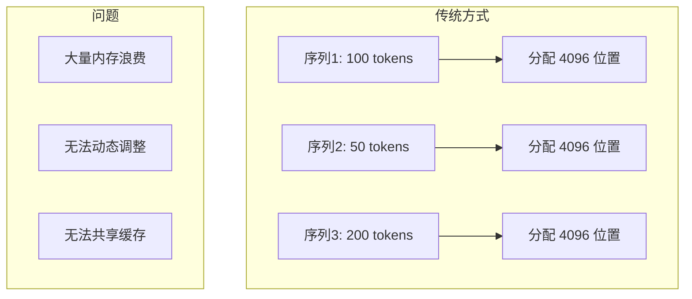
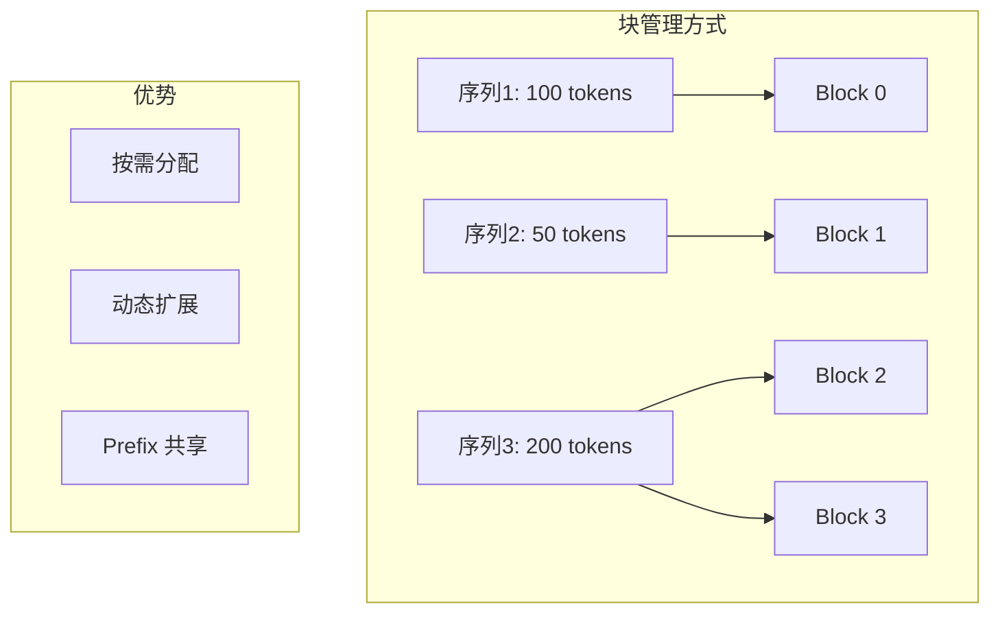
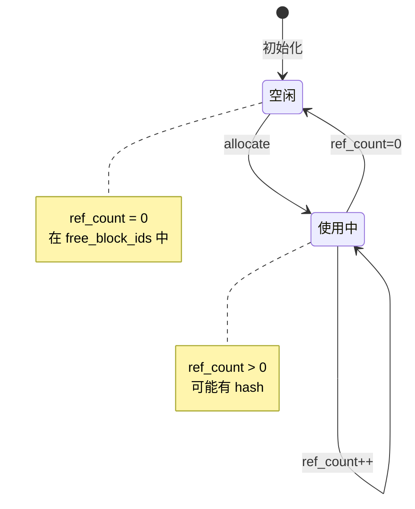
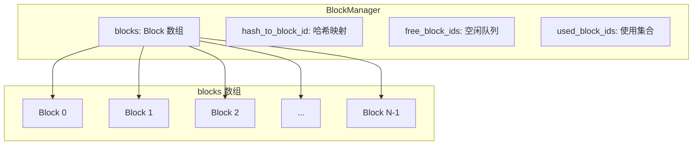
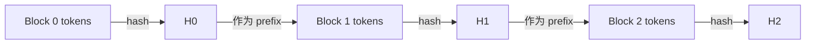
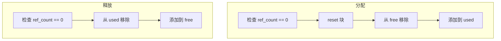
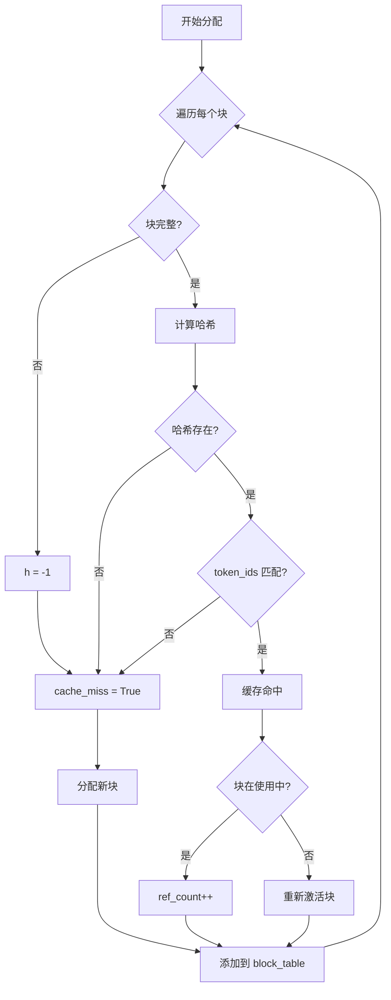
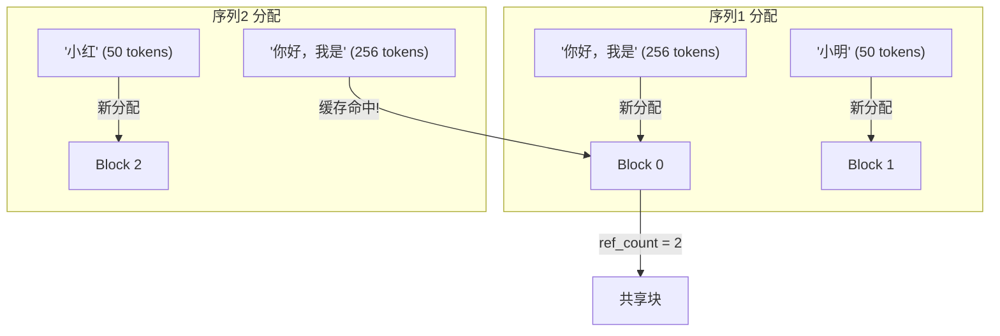
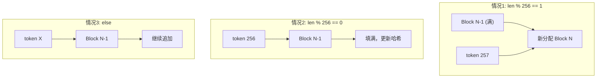

# 第五章：KV Cache 块管理器

> 本章将逐行分析 `block_manager.py`，理解 KV Cache 的分块管理和 Prefix Caching 机制。

## 5.1 块管理概述

### 5.1.1 为什么需要块管理？

传统 KV Cache 为每个序列分配连续内存，存在问题：



**块管理解决方案**：



---

## 5.2 Block 类

### 5.2.1 源码

```python
class Block:

    def __init__(self, block_id):
        self.block_id = block_id
        self.ref_count = 0
        self.hash = -1
        self.token_ids = []

    def update(self, hash: int, token_ids: list[int]):
        self.hash = hash
        self.token_ids = token_ids

    def reset(self):
        self.ref_count = 1
        self.hash = -1
        self.token_ids = []
```

### 5.2.2 逐行分析

#### 构造函数

```python
def __init__(self, block_id):
    self.block_id = block_id    # 块的唯一标识符
    self.ref_count = 0          # 引用计数，被多少序列使用
    self.hash = -1              # 块内容的哈希值，用于 Prefix Caching
    self.token_ids = []         # 块中存储的 token IDs
```

| 属性 | 类型 | 说明 |
|:---|:---|:---|
| `block_id` | `int` | 块在 KV Cache 中的索引 |
| `ref_count` | `int` | 引用计数，0 表示空闲 |
| `hash` | `int` | 内容哈希，-1 表示不完整块 |
| `token_ids` | `list` | 存储的 token，用于哈希验证 |

> 💡 **设计思想**：`ref_count` 引用计数是 Prefix Caching 的核心——多个序列共享同一个块时，只有所有序列都释放后块才能被回收。这借鉴了内存管理中的引用计数 GC 思想。

#### update 方法

```python
def update(self, hash: int, token_ids: list[int]):
    self.hash = hash
    self.token_ids = token_ids
```

当块被填满时，计算哈希值并存储 token_ids，用于后续的 Prefix Caching 匹配。

#### reset 方法

```python
def reset(self):
    self.ref_count = 1      # 重置为被使用状态
    self.hash = -1          # 清除哈希（新分配的块不完整）
    self.token_ids = []     # 清空 token
```

分配新块时调用，初始化块状态。

### 5.2.3 Block 生命周期



---

## 5.3 BlockManager 类

### 5.3.1 完整源码

```python
class BlockManager:

    def __init__(self, num_blocks: int, block_size: int):
        self.block_size = block_size
        self.blocks: list[Block] = [Block(i) for i in range(num_blocks)]
        self.hash_to_block_id: dict[int, int] = dict()
        self.free_block_ids: deque[int] = deque(range(num_blocks))
        self.used_block_ids: set[int] = set()

    @classmethod
    def compute_hash(cls, token_ids: list[int], prefix: int = -1):
        h = xxhash.xxh64()
        if prefix != -1:
            h.update(prefix.to_bytes(8, "little"))
        h.update(np.array(token_ids).tobytes())
        return h.intdigest()

    def _allocate_block(self, block_id: int) -> Block:
        block = self.blocks[block_id]
        assert block.ref_count == 0
        block.reset()
        self.free_block_ids.remove(block_id)
        self.used_block_ids.add(block_id)
        return self.blocks[block_id]

    def _deallocate_block(self, block_id: int) -> Block:
        assert self.blocks[block_id].ref_count == 0
        self.used_block_ids.remove(block_id)
        self.free_block_ids.append(block_id)

    def can_allocate(self, seq: Sequence) -> bool:
        return len(self.free_block_ids) >= seq.num_blocks

    def allocate(self, seq: Sequence):
        assert not seq.block_table
        h = -1
        cache_miss = False
        for i in range(seq.num_blocks):
            token_ids = seq.block(i)
            h = self.compute_hash(token_ids, h) if len(token_ids) == self.block_size else -1
            block_id = self.hash_to_block_id.get(h, -1)
            if block_id == -1 or self.blocks[block_id].token_ids != token_ids:
                cache_miss = True
            if cache_miss:
                block_id = self.free_block_ids[0]
                block = self._allocate_block(block_id)
            else:
                seq.num_cached_tokens += self.block_size
                if block_id in self.used_block_ids:
                    block = self.blocks[block_id]
                    block.ref_count += 1
                else:
                    block = self._allocate_block(block_id)
            if h != -1:
                block.update(h, token_ids)
                self.hash_to_block_id[h] = block_id
            seq.block_table.append(block_id)

    def deallocate(self, seq: Sequence):
        for block_id in reversed(seq.block_table):
            block = self.blocks[block_id]
            block.ref_count -= 1
            if block.ref_count == 0:
                self._deallocate_block(block_id)
        seq.num_cached_tokens = 0
        seq.block_table.clear()

    def can_append(self, seq: Sequence) -> bool:
        return len(self.free_block_ids) >= (len(seq) % self.block_size == 1)

    def may_append(self, seq: Sequence):
        block_table = seq.block_table
        last_block = self.blocks[block_table[-1]]
        if len(seq) % self.block_size == 1:
            assert last_block.hash != -1
            block_id = self.free_block_ids[0]
            self._allocate_block(block_id)
            block_table.append(block_id)
        elif len(seq) % self.block_size == 0:
            assert last_block.hash == -1
            token_ids = seq.block(seq.num_blocks-1)
            prefix = self.blocks[block_table[-2]].hash if len(block_table) > 1 else -1
            h = self.compute_hash(token_ids, prefix)
            last_block.update(h, token_ids)
            self.hash_to_block_id[h] = last_block.block_id
        else:
            assert last_block.hash == -1
```

---

## 5.4 构造函数分析

```python
def __init__(self, num_blocks: int, block_size: int):
    self.block_size = block_size
    self.blocks: list[Block] = [Block(i) for i in range(num_blocks)]
    self.hash_to_block_id: dict[int, int] = dict()
    self.free_block_ids: deque[int] = deque(range(num_blocks))
    self.used_block_ids: set[int] = set()
```

### 数据结构说明

| 属性 | 类型 | 说明 |
|:---|:---|:---|
| `block_size` | `int` | 每块存储的 token 数 (256) |
| `blocks` | `list[Block]` | 所有块对象列表 |
| `hash_to_block_id` | `dict` | 哈希值到块 ID 的映射 |
| `free_block_ids` | `deque` | 空闲块 ID 队列 |
| `used_block_ids` | `set` | 已使用块 ID 集合 |

> 💡 **设计思想**：预分配所有 Block 对象而非动态创建，避免运行时的对象分配开销。`deque` 用于空闲队列支持 O(1) 的头尾操作，`set` 用于已使用集合支持 O(1) 的成员检查。

### 内存结构可视化



---

## 5.5 哈希计算

```python
@classmethod
def compute_hash(cls, token_ids: list[int], prefix: int = -1):
    h = xxhash.xxh64()
    if prefix != -1:
        h.update(prefix.to_bytes(8, "little"))
    h.update(np.array(token_ids).tobytes())
    return h.intdigest()
```

### 逐行解析

| 行号 | 代码 | 说明 |
|:---:|:---|:---|
| 1 | `h = xxhash.xxh64()` | 创建 64 位 xxHash 哈希器（高性能） |
| 2-3 | `if prefix != -1: h.update(...)` | 链式哈希：包含前一个块的哈希 |
| 4 | `h.update(np.array(...).tobytes())` | 将 token IDs 转为字节并更新哈希 |
| 5 | `return h.intdigest()` | 返回 64 位整数哈希值 |

### 链式哈希原理



**优势**：相同 token 序列产生相同哈希，但只有**完全相同的前缀**才能匹配。

> 💡 **设计思想**：链式哈希确保了前缀的完整性——即使两个块的 token_ids 完全相同，但如果前面的块不同，哈希也不同。这避免了错误的缓存复用。

---

## 5.6 块分配与释放

### 5.6.1 内部分配方法

```python
def _allocate_block(self, block_id: int) -> Block:
    block = self.blocks[block_id]
    assert block.ref_count == 0        # 确保块是空闲的
    block.reset()                      # 重置块状态
    self.free_block_ids.remove(block_id)   # 从空闲队列移除
    self.used_block_ids.add(block_id)      # 添加到使用集合
    return self.blocks[block_id]
```

### 5.6.2 内部释放方法

```python
def _deallocate_block(self, block_id: int) -> Block:
    assert self.blocks[block_id].ref_count == 0  # 确保无引用
    self.used_block_ids.remove(block_id)         # 从使用集合移除
    self.free_block_ids.append(block_id)         # 添回空闲队列
```

### 5.6.3 操作流程图



---

## 5.7 序列分配

### 5.7.1 can_allocate 方法

```python
def can_allocate(self, seq: Sequence) -> bool:
    return len(self.free_block_ids) >= seq.num_blocks
```

检查是否有足够的空闲块来容纳整个序列。

### 5.7.2 allocate 方法（核心）

```python
def allocate(self, seq: Sequence):
    assert not seq.block_table          # 确保序列还未分配
    h = -1                              # 前一个块的哈希
    cache_miss = False                  # 是否发生缓存未命中
    
    for i in range(seq.num_blocks):
        token_ids = seq.block(i)
        # 只有完整块才计算哈希
        h = self.compute_hash(token_ids, h) if len(token_ids) == self.block_size else -1
        
        # 查找缓存
        block_id = self.hash_to_block_id.get(h, -1)
        if block_id == -1 or self.blocks[block_id].token_ids != token_ids:
            cache_miss = True           # 未找到或内容不匹配
        
        if cache_miss:
            # 分配新块
            block_id = self.free_block_ids[0]
            block = self._allocate_block(block_id)
        else:
            # 缓存命中
            seq.num_cached_tokens += self.block_size
            if block_id in self.used_block_ids:
                # 块正在使用，增加引用计数
                block = self.blocks[block_id]
                block.ref_count += 1
            else:
                # 块空闲但有缓存，重新激活
                block = self._allocate_block(block_id)
        
        # 更新完整块的哈希
        if h != -1:
            block.update(h, token_ids)
            self.hash_to_block_id[h] = block_id
        
        seq.block_table.append(block_id)
```

### 5.7.3 Prefix Caching 流程



### 5.7.4 示例：Prefix Caching

假设有两个序列共享前缀：

```
序列1: "你好，我是" + "小明"
序列2: "你好，我是" + "小红"
```



---

## 5.8 序列释放

```python
def deallocate(self, seq: Sequence):
    for block_id in reversed(seq.block_table):      # 逆序遍历
        block = self.blocks[block_id]
        block.ref_count -= 1                         # 减少引用
        if block.ref_count == 0:
            self._deallocate_block(block_id)         # 真正释放
    seq.num_cached_tokens = 0
    seq.block_table.clear()
```

**逆序释放的原因**：保持哈希链的完整性，便于后续的 Prefix Caching。

> 💡 **设计思想**：`ref_count` 递减而非直接置 0，因为同一个块可能被多个序列共享。只有当 `ref_count` 减到 0 时才真正释放，这是「延迟释放」的典型应用。

---

## 5.9 追加 Token

### 5.9.1 can_append 方法

```python
def can_append(self, seq: Sequence) -> bool:
    return len(self.free_block_ids) >= (len(seq) % self.block_size == 1)
```

**逻辑解释**：

- `len(seq) % self.block_size == 1`：当前块刚好满了，需要新块
- 此时需要 1 个空闲块
- 否则不需要新块（在当前块追加）

### 5.9.2 may_append 方法

```python
def may_append(self, seq: Sequence):
    block_table = seq.block_table
    last_block = self.blocks[block_table[-1]]
    
    if len(seq) % self.block_size == 1:
        # 情况1: 当前块刚满，需要新块
        assert last_block.hash != -1        # 上一块应该完整
        block_id = self.free_block_ids[0]
        self._allocate_block(block_id)
        block_table.append(block_id)
        
    elif len(seq) % self.block_size == 0:
        # 情况2: 当前块刚好填满，更新哈希
        assert last_block.hash == -1        # 应该是不完整块
        token_ids = seq.block(seq.num_blocks-1)
        prefix = self.blocks[block_table[-2]].hash if len(block_table) > 1 else -1
        h = self.compute_hash(token_ids, prefix)
        last_block.update(h, token_ids)
        self.hash_to_block_id[h] = last_block.block_id
        
    else:
        # 情况3: 当前块还有空间，无需操作
        assert last_block.hash == -1
```

### 5.9.3 三种情况图解



---

## 5.10 本章小结

本章我们学习了：

1. **Block 类**：
   - 块的属性：block_id、ref_count、hash、token_ids
   - 引用计数机制
   
2. **BlockManager 初始化**：
   - 预分配所有块对象
   - 维护空闲/使用集合

3. **哈希计算**：
   - xxHash 高性能哈希
   - 链式哈希保证前缀完整性

4. **Prefix Caching**：
   - 相同前缀共享 KV Cache
   - 引用计数管理共享

5. **动态追加**：
   - 三种情况的处理
   - 块满时更新哈希

---

**下一章** → [06 调度器原理](06_scheduler.md)
