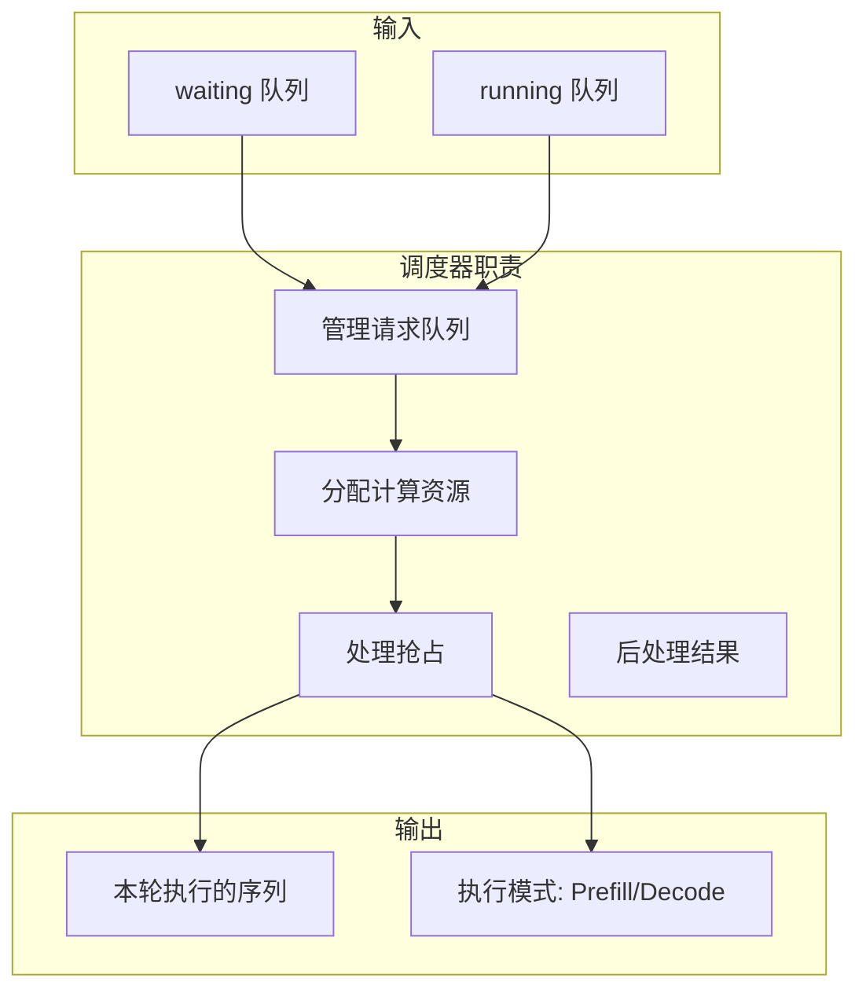
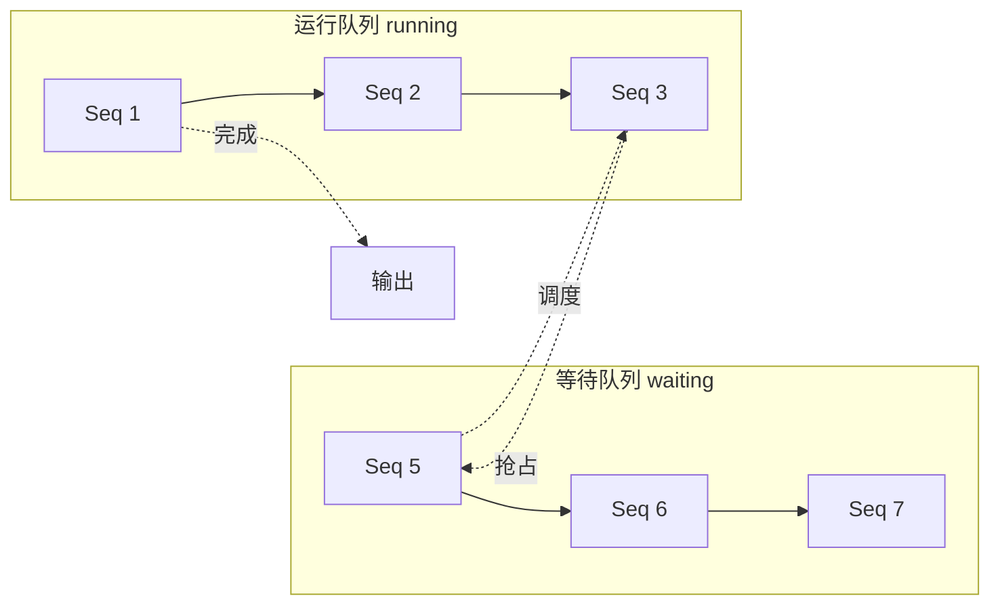
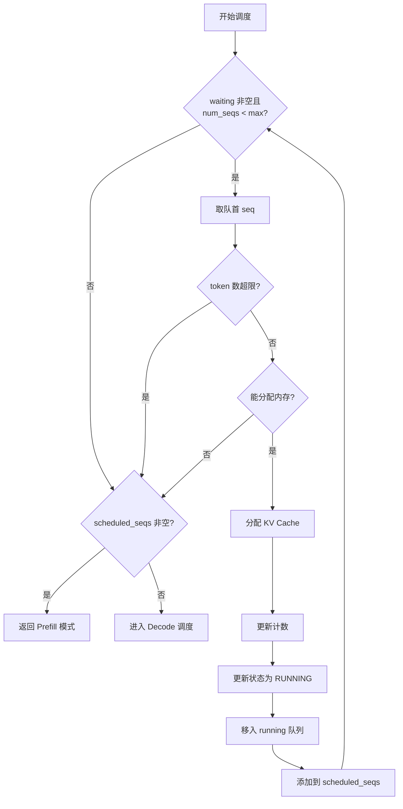
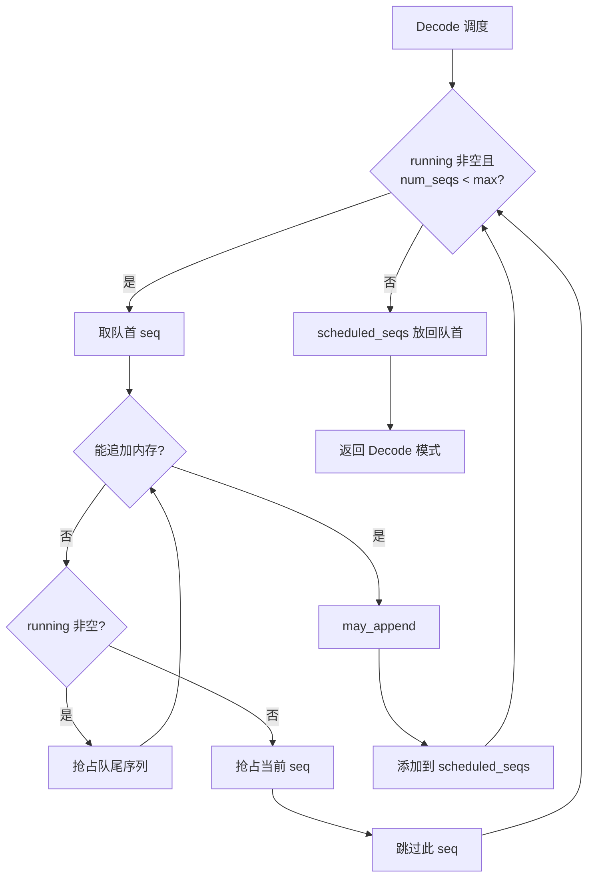
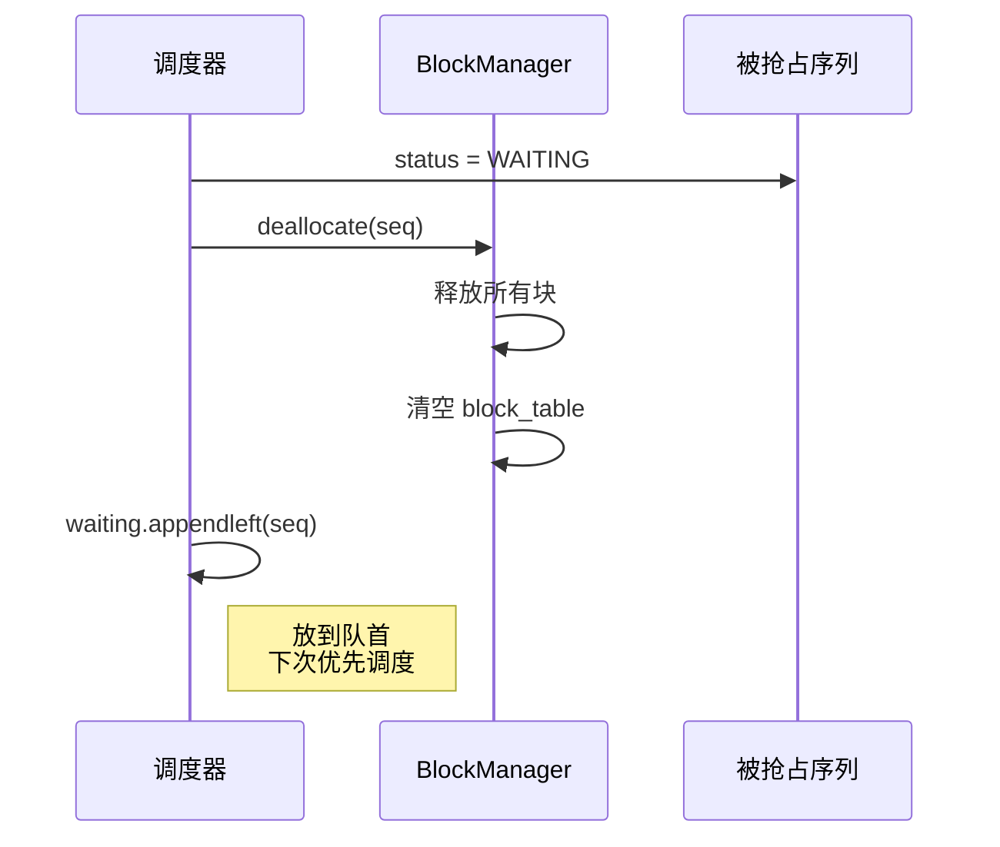
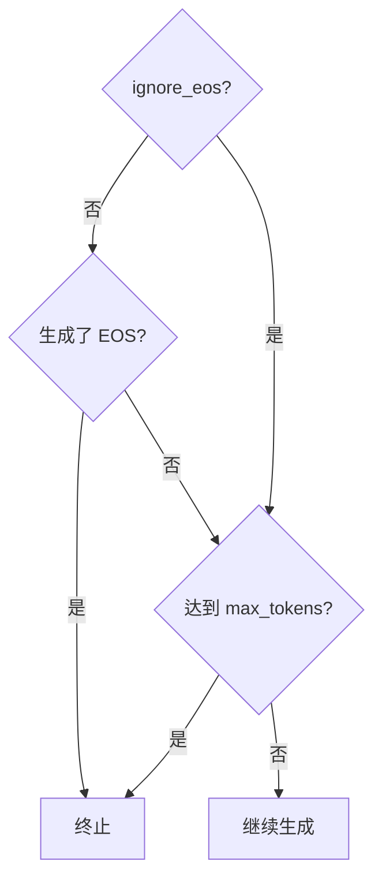
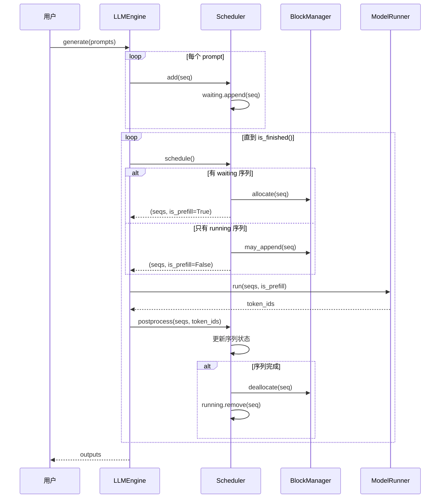

# 第六章：调度器原理

> 本章将逐行分析 `scheduler.py`，理解 Nano-vLLM 的调度算法和抢占机制。

## 6.1 调度器概述

### 6.1.1 调度器的职责



---

## 6.2 完整源码

```python
from collections import deque

from nanovllm.config import Config
from nanovllm.engine.sequence import Sequence, SequenceStatus
from nanovllm.engine.block_manager import BlockManager


class Scheduler:

    def __init__(self, config: Config):
        self.max_num_seqs = config.max_num_seqs
        self.max_num_batched_tokens = config.max_num_batched_tokens
        self.eos = config.eos
        self.block_manager = BlockManager(config.num_kvcache_blocks, config.kvcache_block_size)
        self.waiting: deque[Sequence] = deque()
        self.running: deque[Sequence] = deque()

    def is_finished(self):
        return not self.waiting and not self.running

    def add(self, seq: Sequence):
        self.waiting.append(seq)

    def schedule(self) -> tuple[list[Sequence], bool]:
        # prefill
        scheduled_seqs = []
        num_seqs = 0
        num_batched_tokens = 0
        while self.waiting and num_seqs < self.max_num_seqs:
            seq = self.waiting[0]
            if num_batched_tokens + len(seq) > self.max_num_batched_tokens or not self.block_manager.can_allocate(seq):
                break
            num_seqs += 1
            self.block_manager.allocate(seq)
            num_batched_tokens += len(seq) - seq.num_cached_tokens
            seq.status = SequenceStatus.RUNNING
            self.waiting.popleft()
            self.running.append(seq)
            scheduled_seqs.append(seq)
        if scheduled_seqs:
            return scheduled_seqs, True

        # decode
        while self.running and num_seqs < self.max_num_seqs:
            seq = self.running.popleft()
            while not self.block_manager.can_append(seq):
                if self.running:
                    self.preempt(self.running.pop())
                else:
                    self.preempt(seq)
                    break
            else:
                num_seqs += 1
                self.block_manager.may_append(seq)
                scheduled_seqs.append(seq)
        assert scheduled_seqs
        self.running.extendleft(reversed(scheduled_seqs))
        return scheduled_seqs, False

    def preempt(self, seq: Sequence):
        seq.status = SequenceStatus.WAITING
        self.block_manager.deallocate(seq)
        self.waiting.appendleft(seq)

    def postprocess(self, seqs: list[Sequence], token_ids: list[int]) -> list[bool]:
        for seq, token_id in zip(seqs, token_ids):
            seq.append_token(token_id)
            if (not seq.ignore_eos and token_id == self.eos) or seq.num_completion_tokens == seq.max_tokens:
                seq.status = SequenceStatus.FINISHED
                self.block_manager.deallocate(seq)
                self.running.remove(seq)
```

---

## 6.3 构造函数

```python
def __init__(self, config: Config):
    self.max_num_seqs = config.max_num_seqs
    self.max_num_batched_tokens = config.max_num_batched_tokens
    self.eos = config.eos
    self.block_manager = BlockManager(config.num_kvcache_blocks, config.kvcache_block_size)
    self.waiting: deque[Sequence] = deque()
    self.running: deque[Sequence] = deque()
```

### 逐行解析

| 行号 | 属性 | 说明 |
|:---:|:---|:---|
| 1 | `max_num_seqs` | 最大并发序列数（默认 512） |
| 2 | `max_num_batched_tokens` | 单批次最大 token 数（默认 16384） |
| 3 | `eos` | 结束 token ID |
| 4 | `block_manager` | KV Cache 块管理器 |
| 5 | `waiting` | 等待队列（FIFO） |
| 6 | `running` | 运行队列 |

> 💡 **设计思想**：使用 `deque` 而非 `list` 实现队列，因为 `deque` 的头尾操作都是 O(1)。将 `BlockManager` 内嵌在调度器中，体现了「组合优于继承」的设计原则。

### 队列管理图



---

## 6.4 辅助方法

### 6.4.1 is_finished

```python
def is_finished(self):
    return not self.waiting and not self.running
```

当两个队列都为空时，所有请求处理完成。

### 6.4.2 add

```python
def add(self, seq: Sequence):
    self.waiting.append(seq)
```

新请求加入等待队列尾部。

---

## 6.5 调度算法（核心）

### 6.5.1 Prefill 调度

```python
def schedule(self) -> tuple[list[Sequence], bool]:
    # prefill
    scheduled_seqs = []
    num_seqs = 0
    num_batched_tokens = 0
    
    while self.waiting and num_seqs < self.max_num_seqs:
        seq = self.waiting[0]                           # 查看队首
        
        # 检查约束
        if num_batched_tokens + len(seq) > self.max_num_batched_tokens or \
           not self.block_manager.can_allocate(seq):
            break
        
        # 调度此序列
        num_seqs += 1
        self.block_manager.allocate(seq)                # 分配 KV Cache
        num_batched_tokens += len(seq) - seq.num_cached_tokens  # 实际需计算的 token
        seq.status = SequenceStatus.RUNNING             # 更新状态
        self.waiting.popleft()                          # 从等待队列移除
        self.running.append(seq)                        # 加入运行队列
        scheduled_seqs.append(seq)                      # 加入本轮调度
    
    if scheduled_seqs:
        return scheduled_seqs, True                     # True = Prefill 模式
```

### Prefill 调度流程图



### 6.5.2 Decode 调度

```python
    # decode
    while self.running and num_seqs < self.max_num_seqs:
        seq = self.running.popleft()                    # 取出队首
        
        while not self.block_manager.can_append(seq):   # 内存不足
            if self.running:
                self.preempt(self.running.pop())        # 抢占队尾序列
            else:
                self.preempt(seq)                       # 抢占自己
                break
        else:
            # 成功分配
            num_seqs += 1
            self.block_manager.may_append(seq)
            scheduled_seqs.append(seq)
    
    assert scheduled_seqs                               # 至少有一个序列
    self.running.extendleft(reversed(scheduled_seqs))   # 放回队首
    return scheduled_seqs, False                        # False = Decode 模式
```

### Decode 调度流程图



### 6.5.3 关键设计

**为什么 Prefill 优先于 Decode？**

1. **避免饥饿**：新请求不会永远等待
2. **批处理效率**：Prefill 可以并行处理多个序列
3. **资源利用**：先填满 GPU 计算能力

**`running.extendleft(reversed(scheduled_seqs))` 的作用**：

```python
# 假设 running = [A, B, C], scheduled_seqs = [A, B]
# 调度后 A, B 被取出
# running = [C]
# 需要把 A, B 放回队首

# reversed([A, B]) = [B, A]
# extendleft([B, A]) => running = [A, B, C]
```

保持序列的优先级顺序。

> 💡 **设计思想**：Prefill 优先体现了「新请求优先」策略，避免饪饿问题。这种设计让新用户不必等待旧请求完成，提升了系统的响应性。

---

## 6.6 抢占机制

```python
def preempt(self, seq: Sequence):
    seq.status = SequenceStatus.WAITING     # 回到等待状态
    self.block_manager.deallocate(seq)      # 释放 KV Cache
    self.waiting.appendleft(seq)            # 加入等待队列头部
```

### 抢占示意图



### 抢占策略

| 策略 | 实现 | 说明 |
|:---|:---|:---|
| LIFO | `running.pop()` | 后进入的先被抢占 |
| 优先恢复 | `waiting.appendleft()` | 被抢占的优先重新调度 |

> 💡 **设计思想**：LIFO 抢占策略选择最近加入的序列，因为这些序列通常已缓存的 KV 数据最少，抢占成本最低。被抢占的序列加入 `waiting` 队首而非队尾，保证下次优先恢复。

---

## 6.7 后处理

```python
def postprocess(self, seqs: list[Sequence], token_ids: list[int]) -> list[bool]:
    for seq, token_id in zip(seqs, token_ids):
        seq.append_token(token_id)                      # 追加生成的 token
        
        # 检查终止条件
        if (not seq.ignore_eos and token_id == self.eos) or \
           seq.num_completion_tokens == seq.max_tokens:
            seq.status = SequenceStatus.FINISHED
            self.block_manager.deallocate(seq)
            self.running.remove(seq)
```

### 逐行解析

| 行号 | 操作 | 说明 |
|:---:|:---|:---|
| 1 | `zip(seqs, token_ids)` | 一一对应处理 |
| 2 | `seq.append_token(token_id)` | 更新序列的 token_ids |
| 3-4 | 终止条件检查 | EOS 或达到 max_tokens |
| 5 | 更新状态 | 标记为完成 |
| 6 | 释放资源 | 归还 KV Cache |
| 7 | 移出队列 | 从 running 移除 |

> 💡 **设计思想**：`postprocess` 将 token 追加和终止检查融合在同一个方法中，避免多次遍历序列列表。这是「单次遍历多操作」的性能优化模式。

### 终止条件



---

## 6.8 完整调度流程



---

## 6.9 调度示例

### 场景设置

```python
max_num_seqs = 4
max_num_batched_tokens = 1024
```

### 初始状态

```
waiting: [Seq1(500), Seq2(300), Seq3(400), Seq4(200)]
running: []
```

### 第一轮调度（Prefill）

```
1. Seq1: 500 < 1024, 分配成功
   - num_batched_tokens = 500
   
2. Seq2: 500 + 300 = 800 < 1024, 分配成功
   - num_batched_tokens = 800
   
3. Seq3: 800 + 400 = 1200 > 1024, 停止

结果:
waiting: [Seq3(400), Seq4(200)]
running: [Seq1(500), Seq2(300)]
scheduled: [Seq1, Seq2], is_prefill=True
```

### 第二轮调度（Decode）

假设 Prefill 完成，所有序列都已分配：

```
waiting: []
running: [Seq1(501), Seq2(301)]

每个序列只需处理 1 个 token
scheduled: [Seq1, Seq2], is_prefill=False
```

### 抢占场景

假设内存不足：

```
1. 取出 Seq1，检查 can_append
2. 内存不足，抢占 Seq2（LIFO）
3. 释放 Seq2 的 KV Cache
4. 重新检查，Seq1 可以追加

结果:
waiting: [Seq2(301)]  # Seq2 被抢占
running: [Seq1(502)]
scheduled: [Seq1], is_prefill=False
```

---

## 6.10 本章小结

本章我们学习了：

1. **调度器结构**：
   - waiting 和 running 两个队列
   - BlockManager 管理内存

2. **Prefill 调度**：
   - 批量处理等待队列
   - 检查 token 数和内存限制

3. **Decode 调度**：
   - 处理运行队列
   - 按需抢占释放内存

4. **抢占机制**：
   - LIFO 策略
   - 优先恢复

5. **后处理**：
   - 追加 token
   - 检查终止条件
   - 释放资源

---

**下一章** → [07 LLM 引擎详解](07_llm_engine.md)
