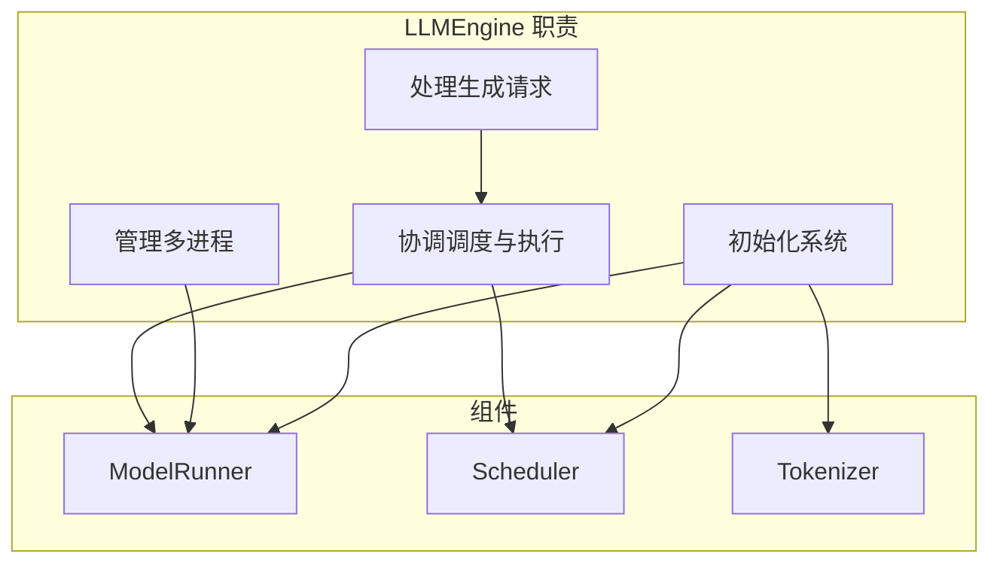
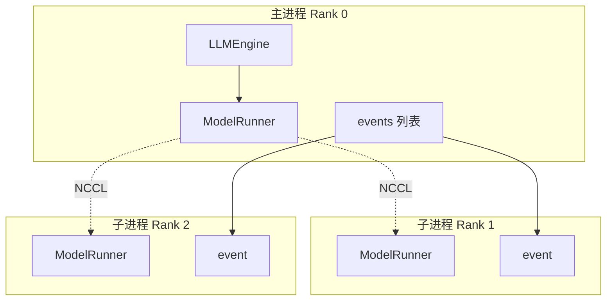
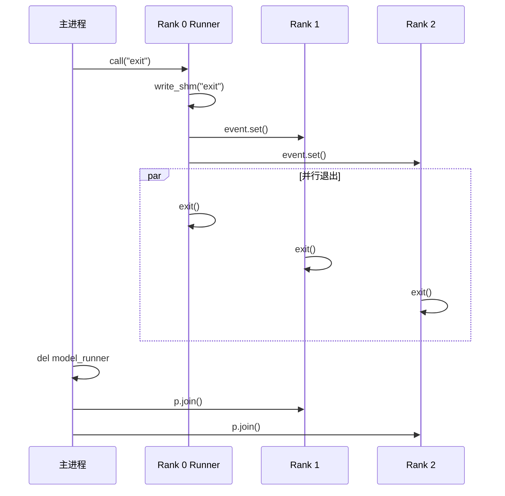
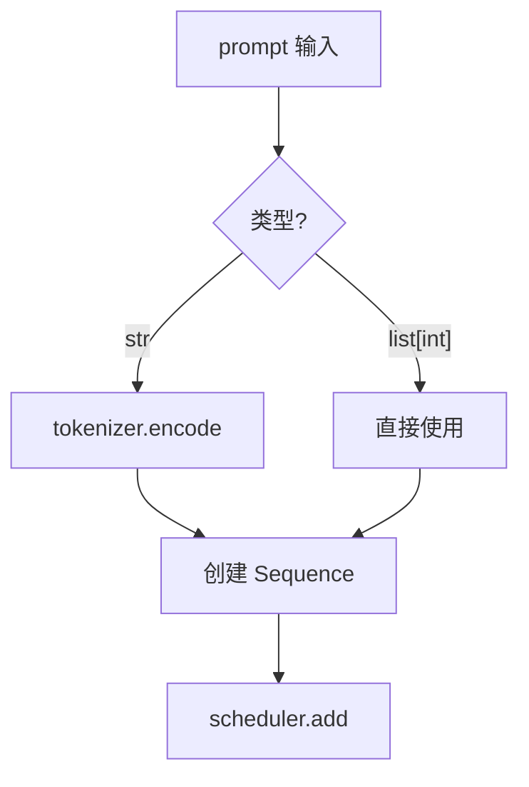
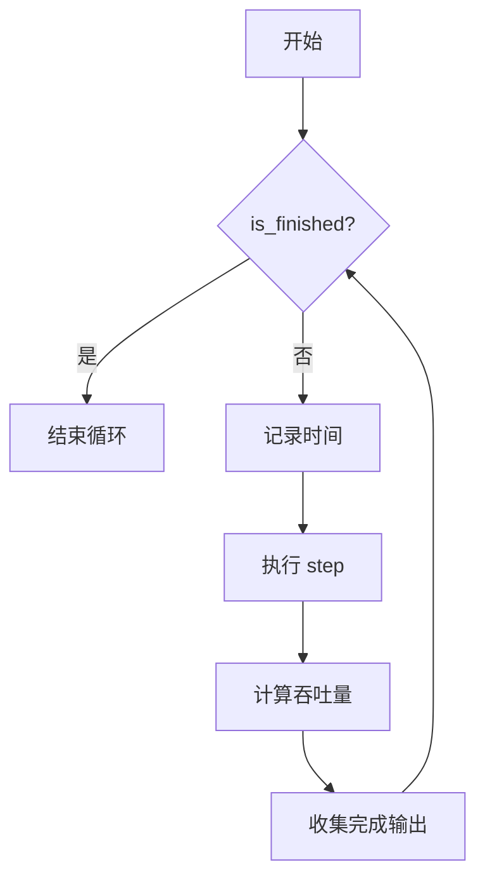
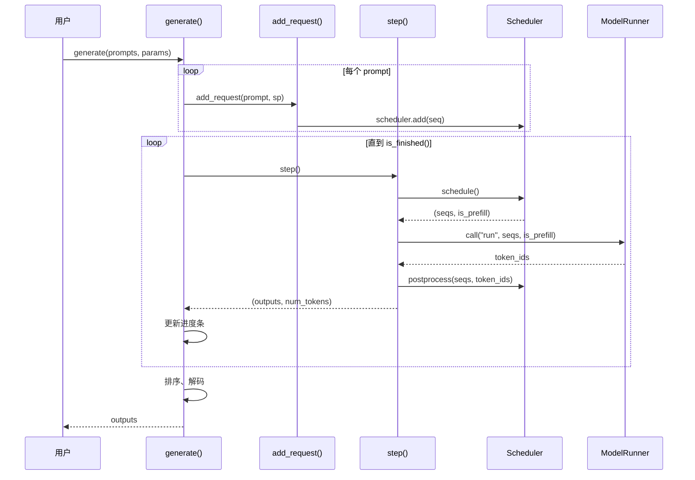

# 第七章：LLM 引擎详解

> 本章将逐行分析 `llm_engine.py`，理解推理引擎的核心入口和执行循环。

## 7.1 LLMEngine 概述

`LLMEngine` 是 Nano-vLLM 的核心类，负责：



---

## 7.2 完整源码

```python
import atexit
from dataclasses import fields
from time import perf_counter
from tqdm.auto import tqdm
from transformers import AutoTokenizer
import torch.multiprocessing as mp

from nanovllm.config import Config
from nanovllm.sampling_params import SamplingParams
from nanovllm.engine.sequence import Sequence
from nanovllm.engine.scheduler import Scheduler
from nanovllm.engine.model_runner import ModelRunner


class LLMEngine:

    def __init__(self, model, **kwargs):
        config_fields = {field.name for field in fields(Config)}
        config_kwargs = {k: v for k, v in kwargs.items() if k in config_fields}
        config = Config(model, **config_kwargs)
        self.ps = []
        self.events = []
        ctx = mp.get_context("spawn")
        for i in range(1, config.tensor_parallel_size):
            event = ctx.Event()
            process = ctx.Process(target=ModelRunner, args=(config, i, event))
            process.start()
            self.ps.append(process)
            self.events.append(event)
        self.model_runner = ModelRunner(config, 0, self.events)
        self.tokenizer = AutoTokenizer.from_pretrained(config.model, use_fast=True)
        config.eos = self.tokenizer.eos_token_id
        self.scheduler = Scheduler(config)
        atexit.register(self.exit)

    def exit(self):
        self.model_runner.call("exit")
        del self.model_runner
        for p in self.ps:
            p.join()

    def add_request(self, prompt: str | list[int], sampling_params: SamplingParams):
        if isinstance(prompt, str):
            prompt = self.tokenizer.encode(prompt)
        seq = Sequence(prompt, sampling_params)
        self.scheduler.add(seq)

    def step(self):
        seqs, is_prefill = self.scheduler.schedule()
        token_ids = self.model_runner.call("run", seqs, is_prefill)
        self.scheduler.postprocess(seqs, token_ids)
        outputs = [(seq.seq_id, seq.completion_token_ids) for seq in seqs if seq.is_finished]
        num_tokens = sum(len(seq) for seq in seqs) if is_prefill else -len(seqs)
        return outputs, num_tokens

    def is_finished(self):
        return self.scheduler.is_finished()

    def generate(
        self,
        prompts: list[str] | list[list[int]],
        sampling_params: SamplingParams | list[SamplingParams],
        use_tqdm: bool = True,
    ) -> list[str]:
        if use_tqdm:
            pbar = tqdm(total=len(prompts), desc="Generating", dynamic_ncols=True)
        if not isinstance(sampling_params, list):
            sampling_params = [sampling_params] * len(prompts)
        for prompt, sp in zip(prompts, sampling_params):
            self.add_request(prompt, sp)
        outputs = {}
        prefill_throughput = decode_throughput = 0.
        while not self.is_finished():
            t = perf_counter()
            output, num_tokens = self.step()
            if use_tqdm:
                if num_tokens > 0:
                    prefill_throughput = num_tokens / (perf_counter() - t)
                else:
                    decode_throughput = -num_tokens / (perf_counter() - t)
                pbar.set_postfix({
                    "Prefill": f"{int(prefill_throughput)}tok/s",
                    "Decode": f"{int(decode_throughput)}tok/s",
                })
            for seq_id, token_ids in output:
                outputs[seq_id] = token_ids
                if use_tqdm:
                    pbar.update(1)
        outputs = [outputs[seq_id] for seq_id in sorted(outputs.keys())]
        outputs = [{"text": self.tokenizer.decode(token_ids), "token_ids": token_ids} for token_ids in outputs]
        if use_tqdm:
            pbar.close()
        return outputs
```

---

## 7.3 构造函数详解

### 7.3.1 配置解析

```python
def __init__(self, model, **kwargs):
    config_fields = {field.name for field in fields(Config)}
    config_kwargs = {k: v for k, v in kwargs.items() if k in config_fields}
    config = Config(model, **config_kwargs)
```

**逐行解析**：

| 行号 | 代码 | 说明 |
|:---:|:---|:---|
| 1 | `fields(Config)` | 获取 Config 类的所有字段 |
| 2 | 字典推导式 | 只保留 Config 支持的参数 |
| 3 | 创建 Config | 使用有效参数初始化 |

**作用**：过滤无效参数，避免传入未知参数导致报错。

> 💡 **设计思想**：参数过滤让 API 更健壮——用户可以传递额外参数而不会出错，这对于将来添加新配置字段时的向后兼容性很重要。

### 7.3.2 多进程初始化

```python
    self.ps = []                           # 子进程列表
    self.events = []                       # 同步事件列表
    ctx = mp.get_context("spawn")          # 使用 spawn 模式
    
    for i in range(1, config.tensor_parallel_size):
        event = ctx.Event()                # 创建同步事件
        process = ctx.Process(target=ModelRunner, args=(config, i, event))
        process.start()                    # 启动子进程
        self.ps.append(process)
        self.events.append(event)
    
    self.model_runner = ModelRunner(config, 0, self.events)  # 主进程
```

**多进程架构**：



**为什么使用 `spawn`？**

| 模式 | 说明 | 原因 |
|:---|:---|:---|
| `spawn` | 启动新 Python 解释器 | CUDA 要求，避免内存共享问题 |
| `fork` | 复制父进程 | 在 CUDA 环境下不安全 |

### 7.3.3 组件初始化

```python
    self.tokenizer = AutoTokenizer.from_pretrained(config.model, use_fast=True)
    config.eos = self.tokenizer.eos_token_id   # 设置 EOS token
    self.scheduler = Scheduler(config)         # 创建调度器
    atexit.register(self.exit)                 # 注册退出处理
```

**`atexit.register`**：程序退出时自动调用 `exit()` 方法，确保资源正确释放。

> 💡 **设计思想**：使用 `atexit.register` 而非依赖用户显式调用 `close()`，体现了「资源自动管理」思想。即使程序异常退出，GPU 进程也能被正确清理。

---

## 7.4 退出处理

```python
def exit(self):
    self.model_runner.call("exit")    # 通知所有进程退出
    del self.model_runner             # 删除主进程 runner
    for p in self.ps:
        p.join()                      # 等待子进程结束
```

**退出流程**：



---

## 7.5 添加请求

```python
def add_request(self, prompt: str | list[int], sampling_params: SamplingParams):
    if isinstance(prompt, str):
        prompt = self.tokenizer.encode(prompt)   # 字符串转 token IDs
    seq = Sequence(prompt, sampling_params)      # 创建序列对象
    self.scheduler.add(seq)                      # 添加到调度器
```

**类型支持**：



---

## 7.6 单步执行

```python
def step(self):
    seqs, is_prefill = self.scheduler.schedule()     # 1. 调度
    token_ids = self.model_runner.call("run", seqs, is_prefill)  # 2. 执行
    self.scheduler.postprocess(seqs, token_ids)      # 3. 后处理
    
    # 收集完成的序列
    outputs = [(seq.seq_id, seq.completion_token_ids) for seq in seqs if seq.is_finished]
    
    # 计算 token 数（用于吞吐量统计）
    num_tokens = sum(len(seq) for seq in seqs) if is_prefill else -len(seqs)
    
    return outputs, num_tokens
```

**逐行解析**：

| 步骤 | 代码 | 输出 |
|:---:|:---|:---|
| 调度 | `scheduler.schedule()` | 本轮序列、是否 Prefill |
| 执行 | `model_runner.call("run", ...)` | 生成的 token IDs |
| 后处理 | `scheduler.postprocess(...)` | 更新序列状态 |
| 收集 | 列表推导 | 已完成的 (seq_id, tokens) |

**`num_tokens` 的含义**：

| 值 | 阶段 | 说明 |
|:---|:---|:---|
| > 0 | Prefill | 处理的总 token 数 |
| < 0 | Decode | 负的序列数（每序列 1 token） |

> 💡 **设计思想**：`step()` 方法将调度、执行、后处理三步统一，形成清晰的「单步执行」抽象。返回 `num_tokens` 使用正负号区分 Prefill/Decode 是巧妙的复用设计。

---

## 7.7 生成主循环

```python
def generate(
    self,
    prompts: list[str] | list[list[int]],
    sampling_params: SamplingParams | list[SamplingParams],
    use_tqdm: bool = True,
) -> list[str]:
```

### 7.7.1 初始化阶段

```python
    if use_tqdm:
        pbar = tqdm(total=len(prompts), desc="Generating", dynamic_ncols=True)
    
    if not isinstance(sampling_params, list):
        sampling_params = [sampling_params] * len(prompts)
    
    for prompt, sp in zip(prompts, sampling_params):
        self.add_request(prompt, sp)
    
    outputs = {}
    prefill_throughput = decode_throughput = 0.
```

**流程**：

1. 创建进度条
2. 统一 sampling_params 格式（单个 → 列表）
3. 添加所有请求到调度器
4. 初始化输出字典和吞吐量计数器

### 7.7.2 执行循环

```python
    while not self.is_finished():
        t = perf_counter()
        output, num_tokens = self.step()
        
        if use_tqdm:
            if num_tokens > 0:
                prefill_throughput = num_tokens / (perf_counter() - t)
            else:
                decode_throughput = -num_tokens / (perf_counter() - t)
            pbar.set_postfix({
                "Prefill": f"{int(prefill_throughput)}tok/s",
                "Decode": f"{int(decode_throughput)}tok/s",
            })
        
        for seq_id, token_ids in output:
            outputs[seq_id] = token_ids
            if use_tqdm:
                pbar.update(1)
```

**执行循环流程**：



### 7.7.3 结果处理

```python
    outputs = [outputs[seq_id] for seq_id in sorted(outputs.keys())]
    outputs = [{"text": self.tokenizer.decode(token_ids), "token_ids": token_ids} 
               for token_ids in outputs]
    if use_tqdm:
        pbar.close()
    return outputs
```

**处理步骤**：

1. **排序**：按 seq_id 排序，保证输出顺序与输入一致
2. **解码**：token IDs → 文本
3. **格式化**：返回包含 text 和 token_ids 的字典

> 💡 **设计思想**：使用 `seq_id` 作为排序依据而非保持插入顺序，是因为 Continuous Batching 下序列完成顺序无法预知。用字典收集结果再排序，简单且正确。

---

## 7.8 完整执行流程



---

## 7.9 吞吐量计算

### 7.9.1 计算逻辑

```python
if num_tokens > 0:
    prefill_throughput = num_tokens / (perf_counter() - t)
else:
    decode_throughput = -num_tokens / (perf_counter() - t)
```

### 7.9.2 示例

**Prefill 阶段**：

```
seqs = [Seq1(100), Seq2(200), Seq3(150)]
num_tokens = 100 + 200 + 150 = 450
时间 = 0.5s
prefill_throughput = 450 / 0.5 = 900 tok/s
```

**Decode 阶段**：

```
seqs = [Seq1, Seq2, Seq3]  # 每个生成 1 个 token
num_tokens = -3
时间 = 0.01s
decode_throughput = 3 / 0.01 = 300 tok/s
```

---

## 7.10 输出格式

```python
outputs = [
    {
        "text": "生成的文本内容...",
        "token_ids": [12, 345, 67, 89, 1234, ...]
    },
    {
        "text": "另一个输出...",
        "token_ids": [98, 76, 54, ...]
    }
]
```

**与 vLLM 的对比**：

| 框架 | 返回格式 |
|:---|:---|
| vLLM | `RequestOutput` 对象 |
| Nano-vLLM | 字典列表 |

---

## 7.11 本章小结

本章我们学习了：

1. **构造函数**：
   - 配置解析与过滤
   - 多进程初始化（spawn 模式）
   - 组件初始化顺序

2. **退出处理**：
   - `atexit.register` 确保资源释放
   - 多进程同步退出

3. **核心方法**：
   - `add_request`：添加推理请求
   - `step`：单步执行（调度→执行→后处理）
   - `generate`：完整生成循环

4. **吞吐量统计**：
   - Prefill：总 token 数 / 时间
   - Decode：序列数 / 时间

5. **输出格式**：
   - 按输入顺序排序
   - 包含 text 和 token_ids

---

**下一章** → [08 模型运行器](08_model_runner.md)
