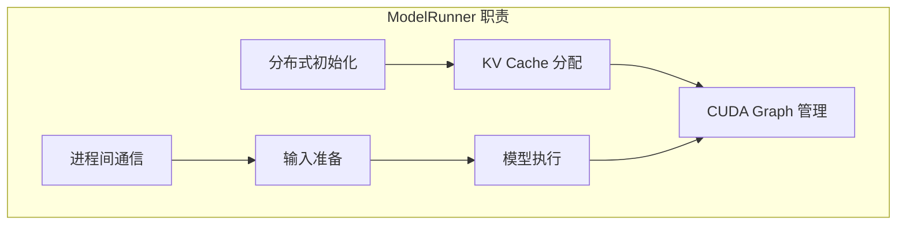
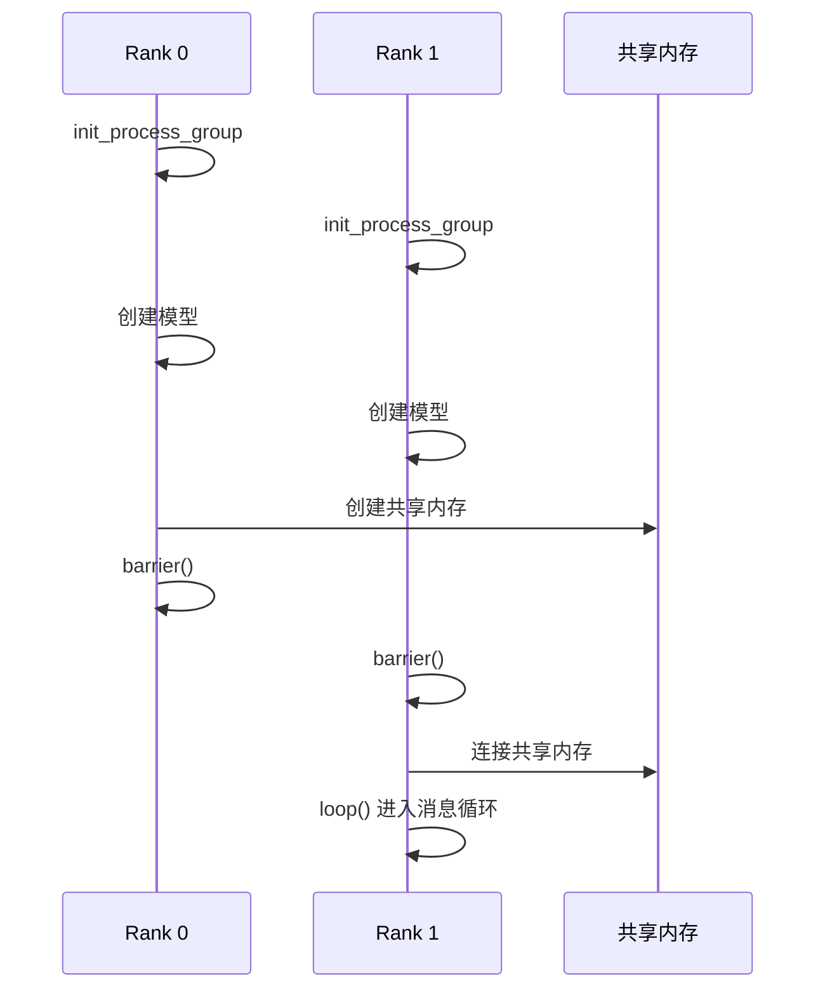
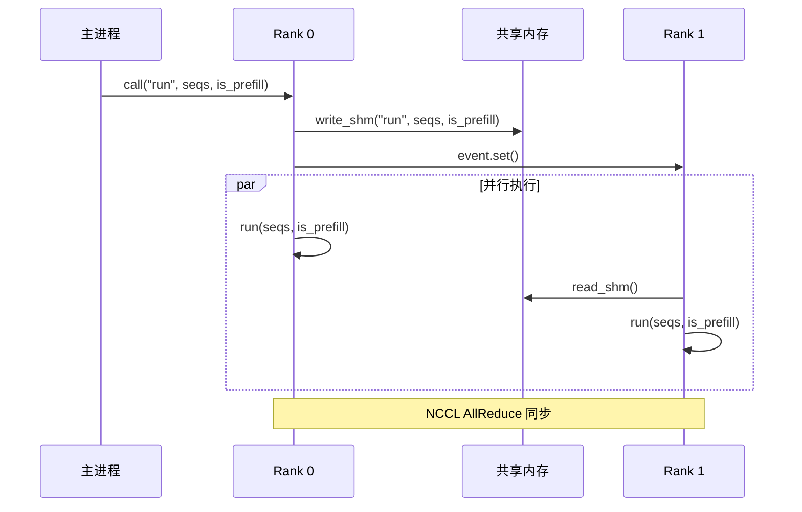
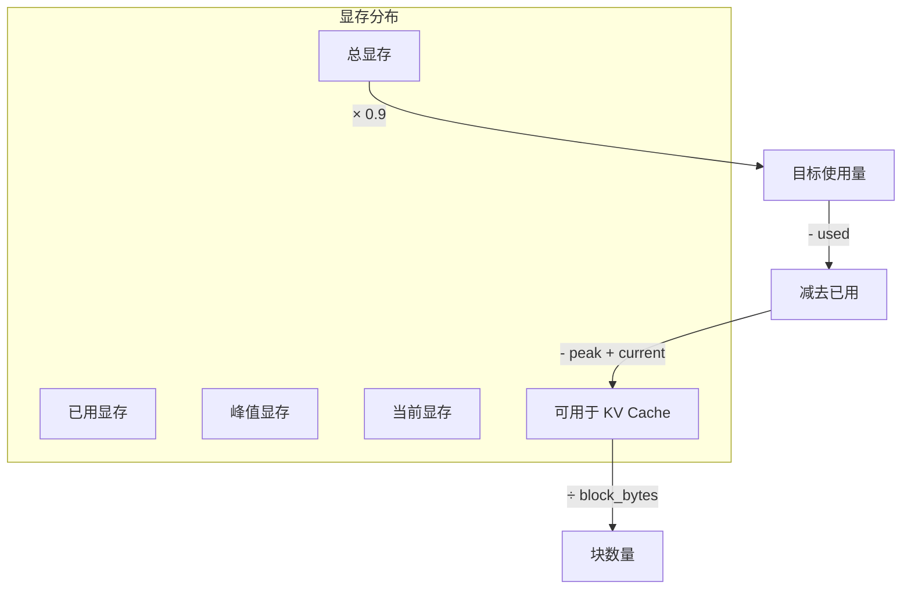
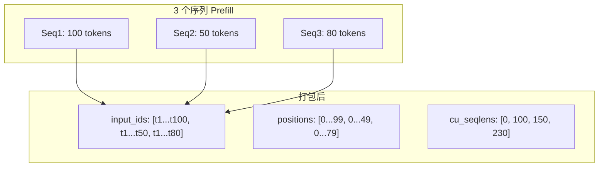
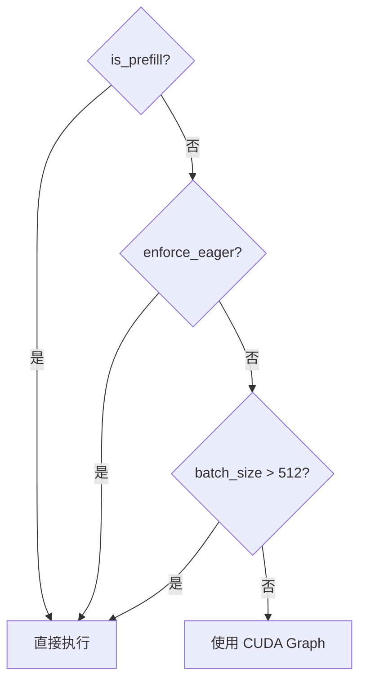
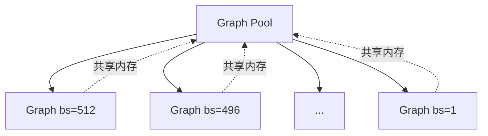

# 第八章：模型运行器

> 本章将逐行分析 `model_runner.py`，理解模型执行、CUDA Graph 和分布式通信机制。

## 8.1 ModelRunner 概述

`ModelRunner` 负责实际的模型推理执行，是 Nano-vLLM 最复杂的组件：



---

## 8.2 源码结构

由于 `model_runner.py` 较长（252 行），我们分块分析：

1. 构造函数与初始化
2. 进程通信机制
3. 输入准备方法
4. 模型执行与采样
5. CUDA Graph 捕获

---

## 8.3 构造函数

```python
class ModelRunner:

    def __init__(self, config: Config, rank: int, event: Event | list[Event]):
        self.config = config
        hf_config = config.hf_config
        self.block_size = config.kvcache_block_size
        self.enforce_eager = config.enforce_eager
        self.world_size = config.tensor_parallel_size
        self.rank = rank
        self.event = event

        dist.init_process_group("nccl", "tcp://localhost:2333", world_size=self.world_size, rank=rank)
        torch.cuda.set_device(rank)
        default_dtype = torch.get_default_dtype()
        torch.set_default_dtype(hf_config.torch_dtype)
        torch.set_default_device("cuda")
        self.model = Qwen3ForCausalLM(hf_config)
        load_model(self.model, config.model)
        self.sampler = Sampler()
        self.warmup_model()
        self.allocate_kv_cache()
        if not self.enforce_eager:
            self.capture_cudagraph()
        torch.set_default_device("cpu")
        torch.set_default_dtype(default_dtype)

        if self.world_size > 1:
            if rank == 0:
                self.shm = SharedMemory(name="nanovllm", create=True, size=2**20)
                dist.barrier()
            else:
                dist.barrier()
                self.shm = SharedMemory(name="nanovllm")
                self.loop()
```

### 8.3.1 基础配置

```python
    self.config = config
    hf_config = config.hf_config
    self.block_size = config.kvcache_block_size    # 256
    self.enforce_eager = config.enforce_eager       # 是否禁用 CUDA Graph
    self.world_size = config.tensor_parallel_size   # GPU 数量
    self.rank = rank                                # 当前进程 ID
    self.event = event                              # 同步事件
```

### 8.3.2 分布式初始化

```python
    dist.init_process_group("nccl", "tcp://localhost:2333", 
                           world_size=self.world_size, rank=rank)
    torch.cuda.set_device(rank)
```

| 参数 | 值 | 说明 |
|:---|:---|:---|
| backend | `"nccl"` | NVIDIA 集合通信库 |
| init_method | `"tcp://..."` | TCP 初始化 |
| world_size | GPU 数量 | 总进程数 |
| rank | 0, 1, 2... | 进程 ID |

> 💡 **设计思想**：使用 NCCL 而非 Gloo，因为 NCCL 是 NVIDIA 专为 GPU 优化的通信库，AllReduce 性能比 Gloo 高数倍。TCP 初始化简单直接，适合单机多卡场景。

### 8.3.3 模型创建

```python
    default_dtype = torch.get_default_dtype()
    torch.set_default_dtype(hf_config.torch_dtype)  # 使用模型精度
    torch.set_default_device("cuda")                # 默认在 GPU
    
    self.model = Qwen3ForCausalLM(hf_config)        # 创建模型
    load_model(self.model, config.model)            # 加载权重
    self.sampler = Sampler()                        # 采样器
```

### 8.3.4 初始化流程

```python
    self.warmup_model()                             # 预热模型
    self.allocate_kv_cache()                        # 分配 KV Cache
    if not self.enforce_eager:
        self.capture_cudagraph()                    # 捕获 CUDA Graph
    
    torch.set_default_device("cpu")                 # 恢复默认设备
    torch.set_default_dtype(default_dtype)          # 恢复默认精度
```

### 8.3.5 共享内存初始化

```python
    if self.world_size > 1:
        if rank == 0:
            # 主进程创建共享内存
            self.shm = SharedMemory(name="nanovllm", create=True, size=2**20)
            dist.barrier()
        else:
            # 子进程等待后连接
            dist.barrier()
            self.shm = SharedMemory(name="nanovllm")
            self.loop()  # 子进程进入消息循环
```

**初始化顺序图**：



---

## 8.4 进程通信

### 8.4.1 消息循环

```python
def loop(self):
    while True:
        method_name, args = self.read_shm()
        self.call(method_name, *args)
        if method_name == "exit":
            break
```

子进程不断读取共享内存，执行指定方法。

### 8.4.2 读取共享内存

```python
def read_shm(self):
    assert self.world_size > 1 and self.rank > 0
    self.event.wait()                              # 等待主进程信号
    n = int.from_bytes(self.shm.buf[0:4], "little")  # 读取长度
    method_name, *args = pickle.loads(self.shm.buf[4:n+4])  # 反序列化
    self.event.clear()                             # 清除信号
    return method_name, args
```

**内存布局**：

```
+-------+------------------------+
| 4字节 |      N 字节数据         |
| 长度n |  pickle(method, args)  |
+-------+------------------------+
```

### 8.4.3 写入共享内存

```python
def write_shm(self, method_name, *args):
    assert self.world_size > 1 and self.rank == 0
    data = pickle.dumps([method_name, *args])
    n = len(data)
    self.shm.buf[0:4] = n.to_bytes(4, "little")    # 写入长度
    self.shm.buf[4:n+4] = data                     # 写入数据
    for event in self.event:                       # 通知所有子进程
        event.set()
```

### 8.4.4 调用方法

```python
def call(self, method_name, *args):
    if self.world_size > 1 and self.rank == 0:
        self.write_shm(method_name, *args)         # 主进程写入共享内存
    method = getattr(self, method_name, None)
    return method(*args)                           # 执行方法
```

**通信流程**：



---

## 8.5 预热与内存分配

### 8.5.1 模型预热

```python
def warmup_model(self):
    torch.cuda.empty_cache()
    torch.cuda.reset_peak_memory_stats()
    
    max_num_batched_tokens = self.config.max_num_batched_tokens
    max_model_len = self.config.max_model_len
    num_seqs = min(max_num_batched_tokens // max_model_len, self.config.max_num_seqs)
    
    seqs = [Sequence([0] * max_model_len) for _ in range(num_seqs)]
    self.run(seqs, True)                           # 执行一次前向传播
    torch.cuda.empty_cache()
```

**目的**：

1. 触发 JIT 编译
2. 预分配 CUDA 缓冲区
3. 获取峰值内存用于计算 KV Cache 大小

> 💡 **设计思想**：预热是动态 KV Cache 分配的关键——先运行一次最大负载，获取模型的峰值内存占用，然后用剩余显存分配 KV Cache。这比静态估算更准确。

### 8.5.2 KV Cache 分配

```python
def allocate_kv_cache(self):
    config = self.config
    hf_config = config.hf_config
    
    # 获取内存信息
    free, total = torch.cuda.mem_get_info()
    used = total - free
    peak = torch.cuda.memory_stats()["allocated_bytes.all.peak"]
    current = torch.cuda.memory_stats()["allocated_bytes.all.current"]
    
    # 计算每块大小
    num_kv_heads = hf_config.num_key_value_heads // self.world_size
    head_dim = getattr(hf_config, "head_dim", 
                       hf_config.hidden_size // hf_config.num_attention_heads)
    block_bytes = 2 * hf_config.num_hidden_layers * self.block_size * \
                  num_kv_heads * head_dim * hf_config.torch_dtype.itemsize
    
    # 计算可用块数
    config.num_kvcache_blocks = int(total * config.gpu_memory_utilization - 
                                    used - peak + current) // block_bytes
    assert config.num_kvcache_blocks > 0
    
    # 分配 KV Cache
    self.kv_cache = torch.empty(2, hf_config.num_hidden_layers, 
                                config.num_kvcache_blocks, self.block_size, 
                                num_kv_heads, head_dim)
    
    # 将 KV Cache 绑定到每层 Attention
    layer_id = 0
    for module in self.model.modules():
        if hasattr(module, "k_cache") and hasattr(module, "v_cache"):
            module.k_cache = self.kv_cache[0, layer_id]
            module.v_cache = self.kv_cache[1, layer_id]
            layer_id += 1
```

**内存计算图**：



**KV Cache 张量形状**：

```
kv_cache: [2, num_layers, num_blocks, block_size, num_kv_heads, head_dim]
           │     │          │          │            │            │
           │     │          │          │            │            └─ 每头维度 (128)
           │     │          │          │            └─ KV 头数 (8)
           │     │          │          └─ 每块 token 数 (256)
           │     │          └─ 总块数 (按内存计算)
           │     └─ 模型层数 (24)
           └─ K 和 V (2)
```

---

## 8.6 输入准备

### 8.6.1 Prefill 输入准备

```python
def prepare_prefill(self, seqs: list[Sequence]):
    input_ids = []
    positions = []
    cu_seqlens_q = [0]
    cu_seqlens_k = [0]
    max_seqlen_q = 0
    max_seqlen_k = 0
    slot_mapping = []
    block_tables = None
    
    for seq in seqs:
        seqlen = len(seq)
        input_ids.extend(seq[seq.num_cached_tokens:])    # 跳过缓存的 token
        positions.extend(list(range(seq.num_cached_tokens, seqlen)))
        
        seqlen_q = seqlen - seq.num_cached_tokens        # 实际要计算的 Q 长度
        seqlen_k = seqlen                                # K 长度（包含缓存）
        cu_seqlens_q.append(cu_seqlens_q[-1] + seqlen_q)
        cu_seqlens_k.append(cu_seqlens_k[-1] + seqlen_k)
        max_seqlen_q = max(seqlen_q, max_seqlen_q)
        max_seqlen_k = max(seqlen_k, max_seqlen_k)
        
        if not seq.block_table:    # warmup 时没有 block_table
            continue
            
        # 计算 slot_mapping
        for i in range(seq.num_cached_blocks, seq.num_blocks):
            start = seq.block_table[i] * self.block_size
            if i != seq.num_blocks - 1:
                end = start + self.block_size
            else:
                end = start + seq.last_block_num_tokens 
            slot_mapping.extend(list(range(start, end)))
    
    if cu_seqlens_k[-1] > cu_seqlens_q[-1]:    # 有前缀缓存
        block_tables = self.prepare_block_tables(seqs)
    
    # 转换为张量
    input_ids = torch.tensor(input_ids, dtype=torch.int64, pin_memory=True).cuda(non_blocking=True)
    positions = torch.tensor(positions, dtype=torch.int64, pin_memory=True).cuda(non_blocking=True)
    cu_seqlens_q = torch.tensor(cu_seqlens_q, dtype=torch.int32, pin_memory=True).cuda(non_blocking=True)
    cu_seqlens_k = torch.tensor(cu_seqlens_k, dtype=torch.int32, pin_memory=True).cuda(non_blocking=True)
    slot_mapping = torch.tensor(slot_mapping, dtype=torch.int32, pin_memory=True).cuda(non_blocking=True)
    
    set_context(True, cu_seqlens_q, cu_seqlens_k, max_seqlen_q, max_seqlen_k, 
                slot_mapping, None, block_tables)
    return input_ids, positions
```

**Flash Attention 输入格式**：



### 8.6.2 Decode 输入准备

```python
def prepare_decode(self, seqs: list[Sequence]):
    input_ids = []
    positions = []
    slot_mapping = []
    context_lens = []
    
    for seq in seqs:
        input_ids.append(seq.last_token)           # 只需最后一个 token
        positions.append(len(seq) - 1)             # 最后位置
        context_lens.append(len(seq))              # 上下文长度
        slot_mapping.append(seq.block_table[-1] * self.block_size + 
                           seq.last_block_num_tokens - 1)
    
    input_ids = torch.tensor(input_ids, dtype=torch.int64, pin_memory=True).cuda(non_blocking=True)
    positions = torch.tensor(positions, dtype=torch.int64, pin_memory=True).cuda(non_blocking=True)
    slot_mapping = torch.tensor(slot_mapping, dtype=torch.int32, pin_memory=True).cuda(non_blocking=True)
    context_lens = torch.tensor(context_lens, dtype=torch.int32, pin_memory=True).cuda(non_blocking=True)
    block_tables = self.prepare_block_tables(seqs)
    
    set_context(False, slot_mapping=slot_mapping, context_lens=context_lens, 
                block_tables=block_tables)
    return input_ids, positions
```

**Prefill vs Decode 对比**：

| 特性 | Prefill | Decode |
|:---|:---|:---|
| input_ids | 完整序列 | 仅 last_token |
| positions | 0 到 seqlen-1 | 仅最后位置 |
| 注意力 | Flash Attention Varlen | Flash Attention with KV Cache |
| 计算量 | O(n²) | O(n) |

> 💡 **设计思想**：Prefill 和 Decode 的输入格式完全不同——前者是「并行计算」（处理所有 token），后者是「增量计算」（只处理新 token）。这种区分是 KV Cache 设计的核心。

---

## 8.7 模型执行

### 8.7.1 run_model 方法

```python
@torch.inference_mode()
def run_model(self, input_ids: torch.Tensor, positions: torch.Tensor, is_prefill: bool):
    if is_prefill or self.enforce_eager or input_ids.size(0) > 512:
        return self.model.compute_logits(self.model(input_ids, positions))
    else:
        bs = input_ids.size(0)
        context = get_context()
        graph = self.graphs[next(x for x in self.graph_bs if x >= bs)]
        graph_vars = self.graph_vars
        
        # 填充输入
        graph_vars["input_ids"][:bs] = input_ids
        graph_vars["positions"][:bs] = positions
        graph_vars["slot_mapping"].fill_(-1)
        graph_vars["slot_mapping"][:bs] = context.slot_mapping
        graph_vars["context_lens"].zero_()
        graph_vars["context_lens"][:bs] = context.context_lens
        graph_vars["block_tables"][:bs, :context.block_tables.size(1)] = context.block_tables
        
        graph.replay()
        return self.model.compute_logits(graph_vars["outputs"][:bs])
```

**执行分支**：



### 8.7.2 run 方法

```python
def run(self, seqs: list[Sequence], is_prefill: bool) -> list[int]:
    input_ids, positions = self.prepare_prefill(seqs) if is_prefill else self.prepare_decode(seqs)
    temperatures = self.prepare_sample(seqs) if self.rank == 0 else None
    logits = self.run_model(input_ids, positions, is_prefill)
    token_ids = self.sampler(logits, temperatures).tolist() if self.rank == 0 else None
    reset_context()
    return token_ids
```

**只有 Rank 0 执行采样**：因为采样不需要并行，只需主进程执行即可。

> 💡 **设计思想**：将采样放在 Rank 0 避免了多进程采样结果不一致的问题，也减少了通信开销。logits 通过 Gather 集中到 Rank 0，采样结果通过共享内存广播。

---

## 8.8 CUDA Graph 捕获

```python
@torch.inference_mode()
def capture_cudagraph(self):
    config = self.config
    hf_config = config.hf_config
    max_bs = min(self.config.max_num_seqs, 512)
    max_num_blocks = (config.max_model_len + self.block_size - 1) // self.block_size
    
    # 创建固定大小的输入张量
    input_ids = torch.zeros(max_bs, dtype=torch.int64)
    positions = torch.zeros(max_bs, dtype=torch.int64)
    slot_mapping = torch.zeros(max_bs, dtype=torch.int32)
    context_lens = torch.zeros(max_bs, dtype=torch.int32)
    block_tables = torch.zeros(max_bs, max_num_blocks, dtype=torch.int32)
    outputs = torch.zeros(max_bs, hf_config.hidden_size)
    
    self.graph_bs = [1, 2, 4, 8] + list(range(16, max_bs + 1, 16))
    self.graphs = {}
    self.graph_pool = None

    for bs in reversed(self.graph_bs):
        graph = torch.cuda.CUDAGraph()
        set_context(False, slot_mapping=slot_mapping[:bs], 
                   context_lens=context_lens[:bs], block_tables=block_tables[:bs])
        outputs[:bs] = self.model(input_ids[:bs], positions[:bs])    # warmup
        
        with torch.cuda.graph(graph, self.graph_pool):
            outputs[:bs] = self.model(input_ids[:bs], positions[:bs])    # capture
        
        if self.graph_pool is None:
            self.graph_pool = graph.pool()
        self.graphs[bs] = graph
        torch.cuda.synchronize()
        reset_context()

    self.graph_vars = dict(
        input_ids=input_ids,
        positions=positions,
        slot_mapping=slot_mapping,
        context_lens=context_lens,
        block_tables=block_tables,
        outputs=outputs,
    )
```

**CUDA Graph 批次大小**：

```
graph_bs = [1, 2, 4, 8, 16, 32, 48, 64, ..., 512]
```

选择 >= batch_size 的最小值：

```python
bs = 10
selected = next(x for x in graph_bs if x >= bs)  # 16
```

**Graph 共享池**：



---

## 8.9 退出处理

```python
def exit(self):
    if self.world_size > 1:
        self.shm.close()
        dist.barrier()
        if self.rank == 0:
            self.shm.unlink()
    if not self.enforce_eager:
        del self.graphs, self.graph_pool
    torch.cuda.synchronize()
    dist.destroy_process_group()
```

**清理顺序**：

1. 关闭共享内存
2. 同步进程
3. 销毁共享内存（仅主进程）
4. 删除 CUDA Graph
5. 同步 GPU
6. 销毁进程组

---

## 8.10 本章小结

本章我们学习了：

1. **初始化流程**：
   - 分布式初始化 (NCCL)
   - 模型创建与加载
   - 预热与内存分配

2. **进程通信**：
   - 共享内存 IPC
   - 主从模式消息传递

3. **输入准备**：
   - Prefill：完整序列打包
   - Decode：仅 last_token

4. **模型执行**：
   - 直接执行 vs CUDA Graph
   - 只有 Rank 0 执行采样

5. **CUDA Graph**：
   - 多批次大小捕获
   - Graph 内存池共享

---

**下一章** → [09 线性层与张量并行](09_linear_layers.md)
