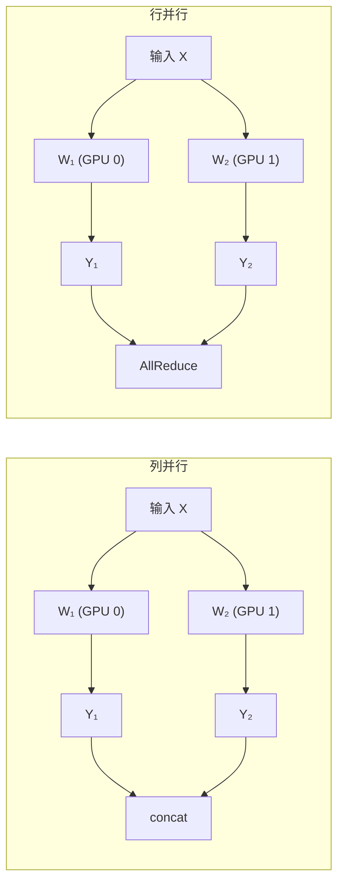
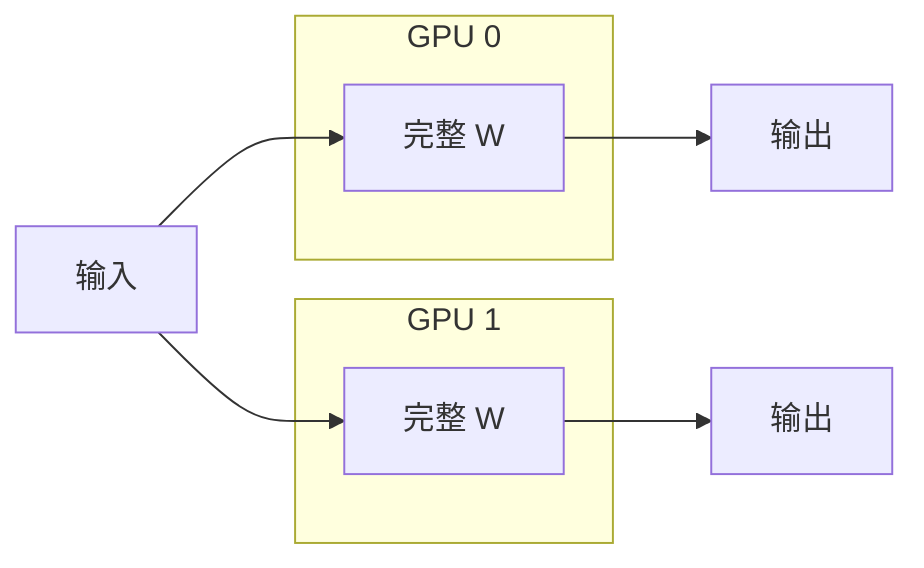
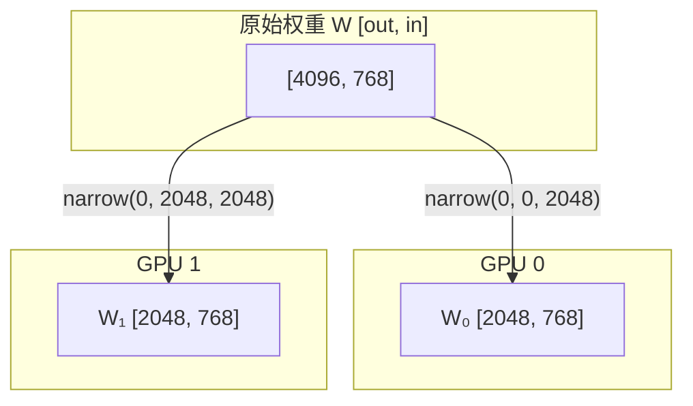
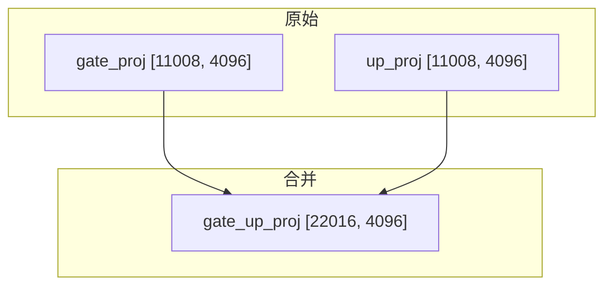
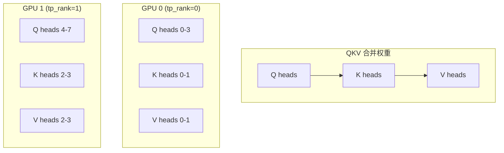
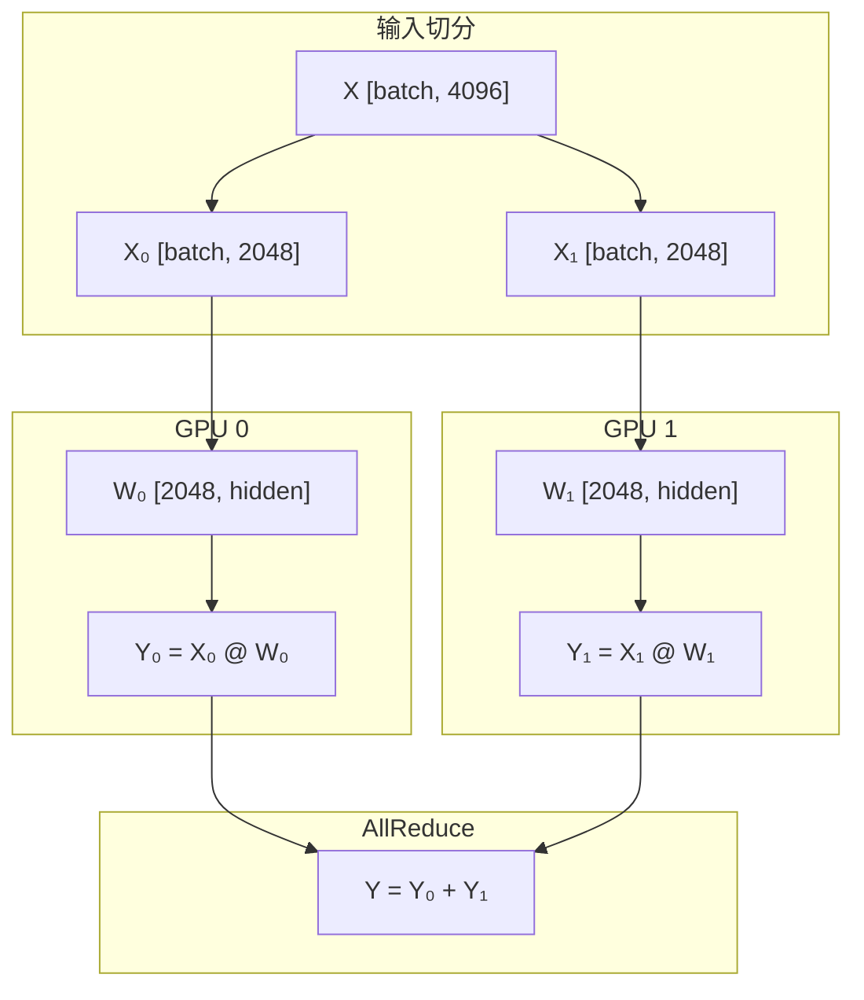
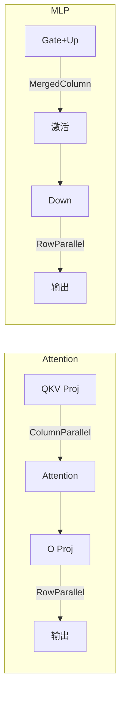

# 第九章：线性层与张量并行

> 本章将逐行分析 `linear.py`，理解并行线性层的实现和张量并行策略。

## 9.1 张量并行概述

张量并行将模型的权重矩阵切分到多个 GPU 上：



---

## 9.2 辅助函数

```python
def divide(numerator, denominator):
    assert numerator % denominator == 0
    return numerator // denominator
```

确保维度可以被均匀切分。

---

## 9.3 LinearBase 基类

```python
class LinearBase(nn.Module):

    def __init__(
        self,
        input_size: int,
        output_size: int,
        bias: bool = False,
        tp_dim: int | None = None,
    ):
        super().__init__()
        self.tp_dim = tp_dim                              # 并行维度
        self.tp_rank = dist.get_rank()                    # 当前进程 ID
        self.tp_size = dist.get_world_size()              # 总进程数
        self.weight = nn.Parameter(torch.empty(output_size, input_size))
        self.weight.weight_loader = self.weight_loader    # 权重加载器
        if bias:
            self.bias = nn.Parameter(torch.empty(output_size))
            self.bias.weight_loader = self.weight_loader
        else:
            self.register_parameter("bias", None)

    def forward(self, x: torch.Tensor) -> torch.Tensor:
        raise NotImplementedError
```

### 关键属性

| 属性 | 说明 |
|:---|:---|
| `tp_dim` | 并行切分的维度（0=列，1=行） |
| `tp_rank` | 当前 GPU ID |
| `tp_size` | 总 GPU 数 |
| `weight_loader` | 自定义权重加载方法 |

> 💡 **设计思想**：`LinearBase` 基类封装了并行配置的通用逻辑，子类只需实现具体的切分策略。`weight_loader` 作为属性附加到每个参数上，是典型的「策略模式」应用。

---

## 9.4 ReplicatedLinear

```python
class ReplicatedLinear(LinearBase):

    def __init__(
        self,
        input_size: int,
        output_size: int,
        bias: bool = False,
    ):
        super().__init__(input_size, output_size, bias)

    def weight_loader(self, param: nn.Parameter, loaded_weight: torch.Tensor):
        param.data.copy_(loaded_weight)

    def forward(self, x: torch.Tensor) -> torch.Tensor:
        return F.linear(x, self.weight, self.bias)
```

**特点**：每个 GPU 持有完整权重，无需通信。



---

## 9.5 ColumnParallelLinear

```python
class ColumnParallelLinear(LinearBase):

    def __init__(
        self,
        input_size: int,
        output_size: int,
        bias: bool = False,
    ):
        tp_size = dist.get_world_size()
        super().__init__(input_size, divide(output_size, tp_size), bias, 0)

    def weight_loader(self, param: nn.Parameter, loaded_weight: torch.Tensor):
        param_data = param.data
        shard_size = param_data.size(self.tp_dim)
        start_idx = self.tp_rank * shard_size
        loaded_weight = loaded_weight.narrow(self.tp_dim, start_idx, shard_size)
        param_data.copy_(loaded_weight)

    def forward(self, x: torch.Tensor) -> torch.Tensor:
        return F.linear(x, self.weight, self.bias)
```

### 逐行分析

**构造函数**：

```python
tp_size = dist.get_world_size()
# output_size 被切分为 output_size // tp_size
super().__init__(input_size, divide(output_size, tp_size), bias, 0)
```

**权重加载**：

```python
shard_size = param_data.size(self.tp_dim)  # 切片大小
start_idx = self.tp_rank * shard_size       # 起始位置
loaded_weight = loaded_weight.narrow(self.tp_dim, start_idx, shard_size)
```

### 列并行示意图



---

## 9.6 MergedColumnParallelLinear

```python
class MergedColumnParallelLinear(ColumnParallelLinear):

    def __init__(
        self,
        input_size: int,
        output_sizes: list[int],
        bias: bool = False,
    ):
        self.output_sizes = output_sizes
        super().__init__(input_size, sum(output_sizes), bias)

    def weight_loader(self, param: nn.Parameter, loaded_weight: torch.Tensor, loaded_shard_id: int):
        param_data = param.data
        shard_offset = sum(self.output_sizes[:loaded_shard_id]) // self.tp_size
        shard_size = self.output_sizes[loaded_shard_id] // self.tp_size
        param_data = param_data.narrow(self.tp_dim, shard_offset, shard_size)
        loaded_weight = loaded_weight.chunk(self.tp_size, self.tp_dim)[self.tp_rank]
        param_data.copy_(loaded_weight)
```

### 用途

用于合并多个投影层，如 MLP 中的 `gate_proj` 和 `up_proj`：



### 权重加载参数

```python
weight_loader(param, loaded_weight, loaded_shard_id)
```

| 参数 | 说明 |
|:---|:---|
| `loaded_shard_id` | 0 = gate_proj, 1 = up_proj |
| `shard_offset` | 在合并权重中的偏移 |
| `shard_size` | 切片大小 |

> 💡 **设计思想**：合并多个投影层减少了内存访问次数——一次 `F.linear` 调用同时计算 gate 和 up，而非两次算独立计算。这可以显著提升 GPU 利用率。

---

## 9.7 QKVParallelLinear

```python
class QKVParallelLinear(ColumnParallelLinear):

    def __init__(
        self,
        hidden_size: int,
        head_size: int,
        total_num_heads: int,
        total_num_kv_heads: int | None = None,
        bias: bool = False,
    ):
        tp_size = dist.get_world_size()
        total_num_kv_heads = total_num_kv_heads or total_num_heads
        self.head_size = head_size
        self.num_heads = divide(total_num_heads, tp_size)
        self.num_kv_heads = divide(total_num_kv_heads, tp_size)
        output_size = (total_num_heads + 2 * total_num_kv_heads) * self.head_size
        super().__init__(hidden_size, output_size, bias)

    def weight_loader(self, param: nn.Parameter, loaded_weight: torch.Tensor, loaded_shard_id: str):
        param_data = param.data
        assert loaded_shard_id in ["q", "k", "v"]
        
        if loaded_shard_id == "q":
            shard_size = self.num_heads * self.head_size
            shard_offset = 0
        elif loaded_shard_id == "k":
            shard_size = self.num_kv_heads * self.head_size
            shard_offset = self.num_heads * self.head_size
        else:  # "v"
            shard_size = self.num_kv_heads * self.head_size
            shard_offset = self.num_heads * self.head_size + self.num_kv_heads * self.head_size
        
        param_data = param_data.narrow(self.tp_dim, shard_offset, shard_size)
        loaded_weight = loaded_weight.chunk(self.tp_size, self.tp_dim)[self.tp_rank]
        param_data.copy_(loaded_weight)
```

### QKV 内存布局



### Grouped Query Attention (GQA)

| 配置 | Q 头数 | KV 头数 | 说明 |
|:---|:---|:---|:---|
| MHA | 8 | 8 | Multi-Head Attention |
| GQA | 8 | 4 | Grouped Query Attention |
| MQA | 8 | 1 | Multi-Query Attention |

---

## 9.8 RowParallelLinear

```python
class RowParallelLinear(LinearBase):

    def __init__(
        self,
        input_size: int,
        output_size: int,
        bias: bool = False,
    ):
        tp_size = dist.get_world_size()
        super().__init__(divide(input_size, tp_size), output_size, bias, 1)

    def weight_loader(self, param: nn.Parameter, loaded_weight: torch.Tensor):
        param_data = param.data
        shard_size = param_data.size(self.tp_dim)
        start_idx = self.tp_rank * shard_size
        loaded_weight = loaded_weight.narrow(self.tp_dim, start_idx, shard_size)
        param_data.copy_(loaded_weight)

    def forward(self, x: torch.Tensor) -> torch.Tensor:
        y = F.linear(x, self.weight, self.bias if self.tp_rank == 0 else None)
        if self.tp_size > 1:
            dist.all_reduce(y)
        return y
```

### 逐行分析

**构造函数**：

```python
# input_size 被切分
super().__init__(divide(input_size, tp_size), output_size, bias, 1)
```

**前向传播**：

```python
# bias 只在 rank 0 添加（避免重复）
y = F.linear(x, self.weight, self.bias if self.tp_rank == 0 else None)

# AllReduce 求和
if self.tp_size > 1:
    dist.all_reduce(y)
```

> 💡 **设计思想**：行并行的关键是 `AllReduce` 求和——数学上，矩阵乘法 $(X_0 · W_0) + (X_1 · W_1) = X · W$。只在 rank 0 添加 bias 避免重复计算，因为 AllReduce 会求和。

### 行并行示意图



---

## 9.9 权重加载设计

### 设计模式

```python
self.weight.weight_loader = self.weight_loader
```

每个参数都附加了一个 `weight_loader` 方法，在 `loader.py` 中调用：

```python
weight_loader = getattr(param, "weight_loader", default_weight_loader)
weight_loader(param, loaded_weight, shard_id)  # 如果需要 shard_id
```

### 优势

1. **解耦**：加载逻辑与模型定义分离
2. **灵活**：每种并行策略有自己的加载方法
3. **兼容**：兼容 HuggingFace 模型权重格式

> 💡 **设计思想**：将加载逻辑封装在参数自身而非模型级别，让不同层可以有不同的加载策略。这种「行为附加在数据上」的模式很符合 Python 的动态特性。

---

## 9.10 并行策略总结

| 层类型 | 切分维度 | 通信 | 用途 |
|:---|:---|:---|:---|
| Replicated | 无 | 无 | 小型权重 |
| ColumnParallel | output | 无 | 第一个线性层 |
| MergedColumn | output | 无 | gate_up_proj |
| QKVParallel | output | 无 | QKV 投影 |
| RowParallel | input | AllReduce | 第二个线性层 |

### Transformer 块中的并行策略



---

## 9.11 本章小结

本章我们学习了：

1. **张量并行基础**：列并行和行并行的区别
2. **LinearBase**：并行线性层的基类设计
3. **ColumnParallelLinear**：按输出维度切分
4. **MergedColumnParallelLinear**：合并多个投影
5. **QKVParallelLinear**：处理 GQA/MQA
6. **RowParallelLinear**：按输入维度切分 + AllReduce
7. **权重加载**：`weight_loader` 设计模式

---

**下一章** → [10 注意力机制](10_attention.md)
