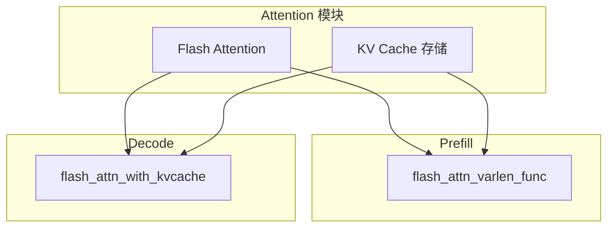
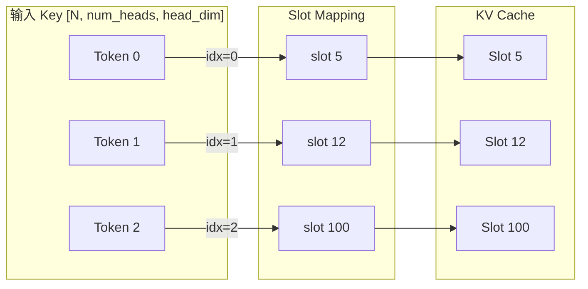
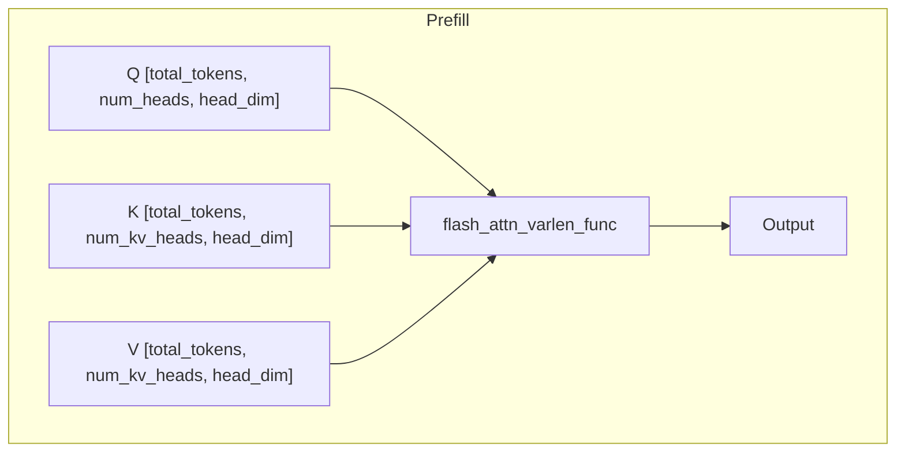
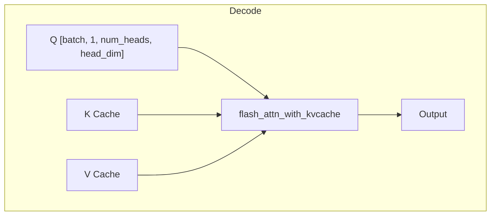
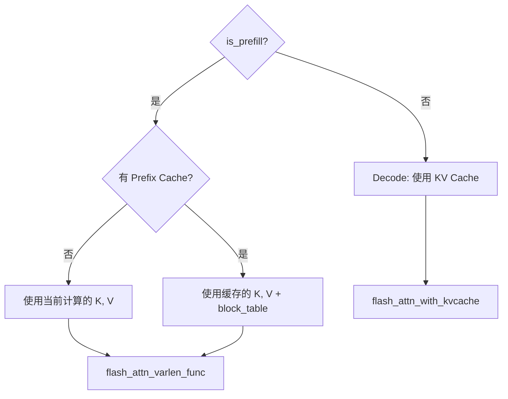

# 第十章：注意力机制

> 本章将逐行分析 `attention.py`，理解 Flash Attention 集成和 KV Cache 存储。

## 10.1 注意力机制概述

Nano-vLLM 的注意力实现有两个关键特点：



---

## 10.2 完整源码

```python
import torch
from torch import nn
import triton
import triton.language as tl

from flash_attn import flash_attn_varlen_func, flash_attn_with_kvcache
from nanovllm.utils.context import get_context


@triton.jit
def store_kvcache_kernel(
    key_ptr,
    key_stride,
    value_ptr,
    value_stride,
    k_cache_ptr,
    v_cache_ptr,
    slot_mapping_ptr,
    D: tl.constexpr,
):
    idx = tl.program_id(0)
    slot = tl.load(slot_mapping_ptr + idx)
    if slot == -1: return
    key_offsets = idx * key_stride + tl.arange(0, D)
    value_offsets = idx * value_stride + tl.arange(0, D)
    key = tl.load(key_ptr + key_offsets)
    value = tl.load(value_ptr + value_offsets)
    cache_offsets = slot * D + tl.arange(0, D)
    tl.store(k_cache_ptr + cache_offsets, key)
    tl.store(v_cache_ptr + cache_offsets, value)


def store_kvcache(key: torch.Tensor, value: torch.Tensor, k_cache: torch.Tensor, 
                  v_cache: torch.Tensor, slot_mapping: torch.Tensor):
    N, num_heads, head_dim = key.shape
    D = num_heads * head_dim
    assert key.stride(-1) == 1 and value.stride(-1) == 1
    assert key.stride(1) == head_dim and value.stride(1) == head_dim
    assert k_cache.stride(1) == D and v_cache.stride(1) == D
    assert slot_mapping.numel() == N
    store_kvcache_kernel[(N,)](key, key.stride(0), value, value.stride(0), 
                               k_cache, v_cache, slot_mapping, D)


class Attention(nn.Module):

    def __init__(
        self,
        num_heads,
        head_dim,
        scale,
        num_kv_heads,
    ):
        super().__init__()
        self.num_heads = num_heads
        self.head_dim = head_dim
        self.scale = scale
        self.num_kv_heads = num_kv_heads
        self.k_cache = self.v_cache = torch.tensor([])

    def forward(self, q: torch.Tensor, k: torch.Tensor, v: torch.Tensor):
        context = get_context()
        k_cache, v_cache = self.k_cache, self.v_cache
        if k_cache.numel() and v_cache.numel():
            store_kvcache(k, v, k_cache, v_cache, context.slot_mapping)
        if context.is_prefill:
            if context.block_tables is not None:    # prefix cache
                k, v = k_cache, v_cache
            o = flash_attn_varlen_func(q, k, v,
                                       max_seqlen_q=context.max_seqlen_q, 
                                       cu_seqlens_q=context.cu_seqlens_q,
                                       max_seqlen_k=context.max_seqlen_k, 
                                       cu_seqlens_k=context.cu_seqlens_k,
                                       softmax_scale=self.scale, causal=True, 
                                       block_table=context.block_tables)
        else:    # decode
            o = flash_attn_with_kvcache(q.unsqueeze(1), k_cache, v_cache,
                                        cache_seqlens=context.context_lens, 
                                        block_table=context.block_tables, 
                                        softmax_scale=self.scale, causal=True)
        return o
```

---

## 10.3 Triton Kernel：KV Cache 存储

```python
@triton.jit
def store_kvcache_kernel(
    key_ptr,
    key_stride,
    value_ptr,
    value_stride,
    k_cache_ptr,
    v_cache_ptr,
    slot_mapping_ptr,
    D: tl.constexpr,
):
    idx = tl.program_id(0)                           # 当前线程处理的 token 索引
    slot = tl.load(slot_mapping_ptr + idx)           # 读取目标 slot
    if slot == -1: return                            # 无效 slot，跳过
    
    key_offsets = idx * key_stride + tl.arange(0, D)
    value_offsets = idx * value_stride + tl.arange(0, D)
    key = tl.load(key_ptr + key_offsets)             # 加载 key
    value = tl.load(value_ptr + value_offsets)       # 加载 value
    
    cache_offsets = slot * D + tl.arange(0, D)
    tl.store(k_cache_ptr + cache_offsets, key)       # 存储到 KV Cache
    tl.store(v_cache_ptr + cache_offsets, value)
```

### 逐行解析

| 行号 | 代码 | 说明 |
|:---:|:---|:---|
| 1 | `@triton.jit` | Triton JIT 编译装饰器 |
| 3-8 | 参数 | 指针和步长，以及常量 D |
| 10 | `program_id(0)` | 获取线程 ID（每个 token 一个线程） |
| 11 | `tl.load(slot_mapping_ptr + idx)` | 读取此 token 应存储的 slot |
| 12 | `if slot == -1: return` | CUDA Graph 填充的无效值 |
| 14-17 | 加载 key/value | 计算偏移，加载数据 |
| 19-21 | 存储 | 写入 KV Cache |

> 💡 **设计思想**：使用 Triton 而非纯 PyTorch 实现 KV Cache 存储，因为分散写入（`slot_mapping` 指定位置）在 PyTorch 中需要循环或复杂的索引操作。Triton 可以通过并行化高效实现。

### 内存布局图



---

## 10.4 store_kvcache 包装函数

```python
def store_kvcache(key: torch.Tensor, value: torch.Tensor, k_cache: torch.Tensor, 
                  v_cache: torch.Tensor, slot_mapping: torch.Tensor):
    N, num_heads, head_dim = key.shape
    D = num_heads * head_dim
    
    # 断言检查内存布局
    assert key.stride(-1) == 1 and value.stride(-1) == 1      # 最后维度连续
    assert key.stride(1) == head_dim and value.stride(1) == head_dim
    assert k_cache.stride(1) == D and v_cache.stride(1) == D
    assert slot_mapping.numel() == N
    
    # 调用 Triton kernel
    store_kvcache_kernel[(N,)](key, key.stride(0), value, value.stride(0), 
                               k_cache, v_cache, slot_mapping, D)
```

### 参数说明

| 参数 | 形状 | 说明 |
|:---|:---|:---|
| `key` | `[N, num_heads, head_dim]` | 当前 token 的 Key |
| `value` | `[N, num_heads, head_dim]` | 当前 token 的 Value |
| `k_cache` | `[num_blocks, block_size, num_heads * head_dim]` | Key 缓存 |
| `v_cache` | `[num_blocks, block_size, num_heads * head_dim]` | Value 缓存 |
| `slot_mapping` | `[N]` | 每个 token 的目标 slot |

---

## 10.5 Attention 类

### 10.5.1 构造函数

```python
class Attention(nn.Module):

    def __init__(
        self,
        num_heads,
        head_dim,
        scale,
        num_kv_heads,
    ):
        super().__init__()
        self.num_heads = num_heads
        self.head_dim = head_dim
        self.scale = scale                              # 1 / sqrt(head_dim)
        self.num_kv_heads = num_kv_heads
        self.k_cache = self.v_cache = torch.tensor([])  # 由 ModelRunner 设置
```

### 10.5.2 前向传播

```python
def forward(self, q: torch.Tensor, k: torch.Tensor, v: torch.Tensor):
    context = get_context()
    k_cache, v_cache = self.k_cache, self.v_cache
    
    # 存储 KV Cache
    if k_cache.numel() and v_cache.numel():
        store_kvcache(k, v, k_cache, v_cache, context.slot_mapping)
    
    if context.is_prefill:
        if context.block_tables is not None:    # prefix cache
            k, v = k_cache, v_cache             # 使用缓存的 KV
        o = flash_attn_varlen_func(q, k, v,
                                   max_seqlen_q=context.max_seqlen_q, 
                                   cu_seqlens_q=context.cu_seqlens_q,
                                   max_seqlen_k=context.max_seqlen_k, 
                                   cu_seqlens_k=context.cu_seqlens_k,
                                   softmax_scale=self.scale, causal=True, 
                                   block_table=context.block_tables)
    else:    # decode
        o = flash_attn_with_kvcache(q.unsqueeze(1), k_cache, v_cache,
                                    cache_seqlens=context.context_lens, 
                                    block_table=context.block_tables, 
                                    softmax_scale=self.scale, causal=True)
    return o
```

---

## 10.6 Prefill vs Decode 对比

### 10.6.1 Prefill 阶段



**参数说明**：

| 参数 | 说明 |
|:---|:---|
| `cu_seqlens_q` | Q 的累积序列长度 `[0, 100, 200, 350]` |
| `cu_seqlens_k` | K 的累积序列长度 |
| `max_seqlen_q` | Q 的最大序列长度 |
| `max_seqlen_k` | K 的最大序列长度 |
| `block_table` | 用于 Prefix Caching |

### 10.6.2 Decode 阶段



**参数说明**：

| 参数 | 说明 |
|:---|:---|
| `cache_seqlens` | 每个序列的上下文长度 |
| `block_table` | 块表，指向 KV Cache 中的位置 |

### 10.6.3 对比表

| 特性 | Prefill | Decode |
|:---|:---|:---|
| Q 形状 | `[total_tokens, h, d]` | `[batch, 1, h, d]` |
| K/V 来源 | 当前计算 or Cache | Cache |
| Flash Attention 函数 | `varlen_func` | `with_kvcache` |
| 计算复杂度 | O(n²) | O(n) |

> 💡 **设计思想**：Prefill 和 Decode 使用不同的 Flash Attention 函数，体现了「分而治之」的优化策略。Prefill 要处理完整上下文，Decode 只需处理新 token 和缓存的 KV，两者计算模式完全不同。

---

## 10.7 Prefix Caching 处理

```python
if context.is_prefill:
    if context.block_tables is not None:    # prefix cache
        k, v = k_cache, v_cache             # 切换到缓存
```

### 处理逻辑



### Prefix Caching 效果

```
序列: "系统提示(缓存)" + "用户问题(新计算)"
      |---已缓存---|   |---需计算---|
      
cu_seqlens_k > cu_seqlens_q  表示有缓存
```

---

## 10.8 Flash Attention 接口

### 10.8.1 flash_attn_varlen_func

```python
o = flash_attn_varlen_func(
    q, k, v,
    cu_seqlens_q=context.cu_seqlens_q,  # 累积长度
    cu_seqlens_k=context.cu_seqlens_k,
    max_seqlen_q=context.max_seqlen_q,  # 最大长度
    max_seqlen_k=context.max_seqlen_k,
    softmax_scale=self.scale,           # 1/sqrt(d)
    causal=True,                        # 因果注意力
    block_table=context.block_tables    # 可选，Prefix Cache
)
```

### 10.8.2 flash_attn_with_kvcache

```python
o = flash_attn_with_kvcache(
    q.unsqueeze(1),                     # [batch, 1, h, d]
    k_cache, v_cache,                   # paged KV cache
    cache_seqlens=context.context_lens, # 上下文长度
    block_table=context.block_tables,   # 块表
    softmax_scale=self.scale,
    causal=True
)
```

---

## 10.9 内存访问优化

### Triton Kernel 优化点

1. **合并访问**：`tl.arange(0, D)` 生成连续偏移
2. **并行度**：每个 token 一个线程块
3. **跳过无效**：`slot == -1` 直接返回

### Flash Attention 优化

1. **Tiling**：分块计算，减少显存占用
2. **Online Softmax**：流式计算，无需存储中间结果
3. **Fused Kernel**：融合多个操作

> 💡 **设计思想**：直接引用 Flash Attention 库而非自己实现，体现了「站在巨人肩膊上」的思想。Flash Attention 是成熟的高性能库，复用它可以大幅减少工作量。

---

## 10.10 本章小结

本章我们学习了：

1. **Triton Kernel**：
   - KV Cache 存储的高效实现
   - slot_mapping 的作用

2. **Attention 类**：
   - 构造函数参数
   - KV Cache 绑定机制

3. **Prefill vs Decode**：
   - 不同的 Flash Attention 函数
   - 不同的输入格式

4. **Prefix Caching**：
   - block_table 的使用
   - cu_seqlens_k > cu_seqlens_q 的判断

5. **Flash Attention 接口**：
   - varlen_func 参数
   - with_kvcache 参数

---

**下一章** → [11 RoPE 位置编码](11_rotary_embedding.md)
