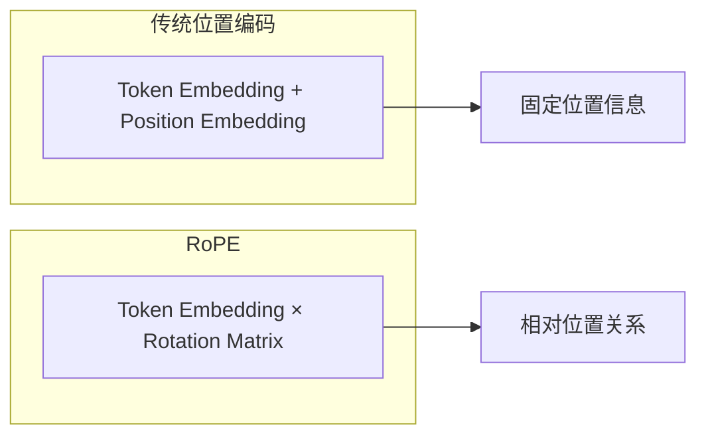
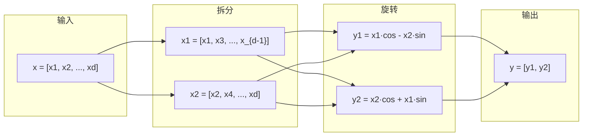
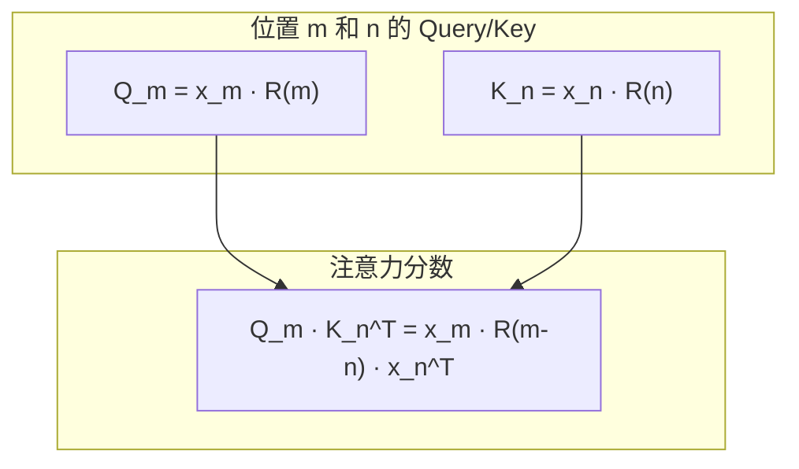
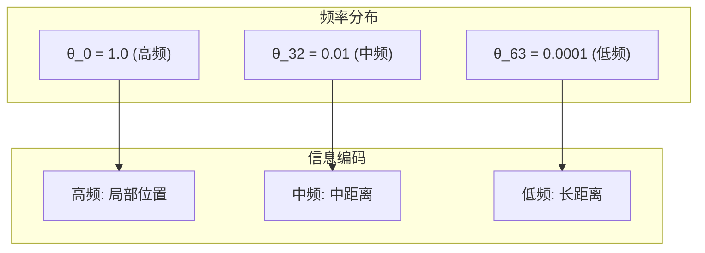

# 第十一章：RoPE 位置编码

> 本章将逐行分析 `rotary_embedding.py`，理解旋转位置编码的原理和实现。

## 11.1 RoPE 原理简介

旋转位置编码 (Rotary Position Embedding) 的核心思想：



**数学形式**：

$$
RoPE(x, m) = \begin{pmatrix} x_1 \\ x_2 \\ \vdots \\ x_d \end{pmatrix} \odot \begin{pmatrix} \cos(m\theta_1) \\ \cos(m\theta_1) \\ \vdots \\ \cos(m\theta_{d/2}) \end{pmatrix} + \begin{pmatrix} -x_2 \\ x_1 \\ \vdots \\ -x_d \end{pmatrix} \odot \begin{pmatrix} \sin(m\theta_1) \\ \sin(m\theta_1) \\ \vdots \\ \sin(m\theta_{d/2}) \end{pmatrix}
$$

---

## 11.2 完整源码

```python
from functools import lru_cache
import torch
from torch import nn


def apply_rotary_emb(
    x: torch.Tensor,
    cos: torch.Tensor,
    sin: torch.Tensor,
) -> torch.Tensor:
    x1, x2 = torch.chunk(x.float(), 2, dim=-1)
    y1 = x1 * cos - x2 * sin
    y2 = x2 * cos + x1 * sin
    return torch.cat((y1, y2), dim=-1).to(x.dtype)


class RotaryEmbedding(nn.Module):

    def __init__(
        self,
        head_size: int,
        rotary_dim: int,
        max_position_embeddings: int,
        base: float,
    ) -> None:
        super().__init__()
        self.head_size = head_size
        assert rotary_dim == head_size
        inv_freq = 1.0 / (base**(torch.arange(0, rotary_dim, 2, dtype=torch.float) / rotary_dim))
        t = torch.arange(max_position_embeddings, dtype=torch.float)
        freqs = torch.einsum("i,j -> ij", t, inv_freq)
        cos = freqs.cos()
        sin = freqs.sin()
        cache = torch.cat((cos, sin), dim=-1).unsqueeze_(1)
        self.register_buffer("cos_sin_cache", cache, persistent=False)

    @torch.compile
    def forward(
        self,
        positions: torch.Tensor,
        query: torch.Tensor,
        key: torch.Tensor,
    ) -> tuple[torch.Tensor, torch.Tensor]:
        cos_sin = self.cos_sin_cache[positions]
        cos, sin = cos_sin.chunk(2, dim=-1)
        query = apply_rotary_emb(query, cos, sin)
        key = apply_rotary_emb(key, cos, sin)
        return query, key


@lru_cache(1)
def get_rope(
    head_size: int,
    rotary_dim: int,
    max_position: int,
    base: float,
    rope_scaling: dict | None = None,
):
    assert rope_scaling is None
    rotary_emb = RotaryEmbedding(head_size, rotary_dim, max_position, base)
    return rotary_emb
```

---

## 11.3 apply_rotary_emb 函数

```python
def apply_rotary_emb(
    x: torch.Tensor,
    cos: torch.Tensor,
    sin: torch.Tensor,
) -> torch.Tensor:
    x1, x2 = torch.chunk(x.float(), 2, dim=-1)  # 拆分为两半
    y1 = x1 * cos - x2 * sin                    # 旋转公式
    y2 = x2 * cos + x1 * sin
    return torch.cat((y1, y2), dim=-1).to(x.dtype)
```

### 逐行解析

| 行号 | 代码 | 说明 |
|:---:|:---|:---|
| 1 | `x.float()` | 转为 float32 确保精度 |
| 1 | `torch.chunk(x, 2, dim=-1)` | 将 x 沿最后维度拆分为两半 |
| 2 | `x1 * cos - x2 * sin` | 旋转的实部 |
| 3 | `x2 * cos + x1 * sin` | 旋转的虚部 |
| 4 | `torch.cat(...).to(x.dtype)` | 拼接并转回原精度 |

> 💡 **设计思想**：使用 `float()` 然后 `to(x.dtype)` 确保计算精度，同时保持输出与输入类型一致。这种「提升精度计算，降精度存储」模式在混合精度训练中很常见。

### 数学推导

将 $(x_1, x_2)$ 看作复数 $x_1 + ix_2$，乘以 $e^{im\theta} = \cos(m\theta) + i\sin(m\theta)$：

$$
(x_1 + ix_2)(\cos\theta + i\sin\theta) = (x_1\cos\theta - x_2\sin\theta) + i(x_1\sin\theta + x_2\cos\theta)
$$

### 可视化



---

## 11.4 RotaryEmbedding 类

### 11.4.1 构造函数

```python
def __init__(
    self,
    head_size: int,
    rotary_dim: int,
    max_position_embeddings: int,
    base: float,
) -> None:
    super().__init__()
    self.head_size = head_size
    assert rotary_dim == head_size                  # 全部维度都旋转
    
    # 计算频率
    inv_freq = 1.0 / (base**(torch.arange(0, rotary_dim, 2, dtype=torch.float) / rotary_dim))
    
    # 计算位置 × 频率
    t = torch.arange(max_position_embeddings, dtype=torch.float)
    freqs = torch.einsum("i,j -> ij", t, inv_freq)
    
    # 预计算 cos 和 sin
    cos = freqs.cos()
    sin = freqs.sin()
    cache = torch.cat((cos, sin), dim=-1).unsqueeze_(1)
    self.register_buffer("cos_sin_cache", cache, persistent=False)
```

### 逐行解析

#### 频率计算

```python
inv_freq = 1.0 / (base**(torch.arange(0, rotary_dim, 2, dtype=torch.float) / rotary_dim))
```

**公式**：

$$
\theta_i = \frac{1}{base^{2i/d}}
$$

其中 `base=10000`（通常），`d=rotary_dim`。

**示例**（`rotary_dim=128`, `base=10000`）：

```python
i = [0, 2, 4, ..., 126]  # 64 个频率
inv_freq = 1 / (10000 ** (i / 128))
# inv_freq[0] = 1.0
# inv_freq[63] ≈ 0.0001
```

#### 位置 × 频率

```python
t = torch.arange(max_position_embeddings, dtype=torch.float)
freqs = torch.einsum("i,j -> ij", t, inv_freq)
```

**计算**：

$$
freqs[m, i] = m \cdot \theta_i
$$

其中 $m$ 是位置，$i$ 是频率索引。

**形状**：`[max_position, rotary_dim // 2]`

#### 预计算缓存

```python
cos = freqs.cos()
sin = freqs.sin()
cache = torch.cat((cos, sin), dim=-1).unsqueeze_(1)
self.register_buffer("cos_sin_cache", cache, persistent=False)
```

**cache 形状**：`[max_position, 1, rotary_dim]`

```
cache[position] = [cos_0, cos_1, ..., cos_{d/2-1}, sin_0, sin_1, ..., sin_{d/2-1}]
```

> 💡 **设计思想**：预计算所有可能位置的 cos/sin 值并缓存，推理时只需按位置索引。这是典型的「预计算」优化——用内存换时间，将计算从推理路径移到初始化阶段。

---

### 11.4.2 前向传播

```python
@torch.compile
def forward(
    self,
    positions: torch.Tensor,
    query: torch.Tensor,
    key: torch.Tensor,
) -> tuple[torch.Tensor, torch.Tensor]:
    cos_sin = self.cos_sin_cache[positions]     # 按位置索引
    cos, sin = cos_sin.chunk(2, dim=-1)         # 拆分 cos 和 sin
    query = apply_rotary_emb(query, cos, sin)   # 应用到 Q
    key = apply_rotary_emb(key, cos, sin)       # 应用到 K
    return query, key
```

### 逐行解析

| 行号 | 代码 | 说明 |
|:---:|:---|:---|
| 1 | `@torch.compile` | 使用 torch.compile 优化 |
| 4 | `positions` | 每个 token 的位置，形状 `[N]` |
| 7 | `cos_sin_cache[positions]` | 索引预计算的值 |
| 8 | `chunk(2, dim=-1)` | 分离 cos 和 sin |
| 9-10 | `apply_rotary_emb` | 应用旋转到 Q 和 K |

---

## 11.5 get_rope 工厂函数

```python
@lru_cache(1)
def get_rope(
    head_size: int,
    rotary_dim: int,
    max_position: int,
    base: float,
    rope_scaling: dict | None = None,
):
    assert rope_scaling is None      # 暂不支持 RoPE 缩放
    rotary_emb = RotaryEmbedding(head_size, rotary_dim, max_position, base)
    return rotary_emb
```

### lru_cache 作用

```python
@lru_cache(1)  # 缓存最后 1 次调用结果
```

确保整个模型共享同一个 RoPE 实例，避免重复创建。

> 💡 **设计思想**：工厂函数 + `lru_cache` 实现单例模式，确保所有 Attention 层共享同一个 RoPE 实例。这比每层创建自己的 buffer 更节省内存。

---

## 11.6 RoPE 的优势

### 11.6.1 相对位置信息



**关键**：注意力分数只依赖 **相对位置** $(m-n)$，而非绝对位置。

### 11.6.2 外推能力


RoPE 天然支持位置外推（需要配合 NTK-Aware Scaling 等技术）。

### 11.6.3 计算效率

| 特点 | 优势 |
|:---|:---|
| 预计算 cos/sin | 推理时只需索引 |
| 逐元素操作 | 高度并行化 |
| torch.compile | 融合内核优化 |

> 💡 **设计思想**：RoPE 的巧妙在于将位置信息编码为旋转，且旋转可以分解为逐元素的乘加操作。这比矩阵乘法更高效，且天然支持 GPU 并行化。

---

## 11.7 代码复用性

### 在 Qwen3Attention 中的使用

```python
# qwen3.py
self.rotary_emb = get_rope(
    self.head_dim,
    rotary_dim=self.head_dim,
    max_position=max_position,
    base=rope_theta,
    rope_scaling=rope_scaling,
)

# forward 中
q, k = self.rotary_emb(positions, q, k)
```

---

## 11.8 频率分布可视化

### 不同位置的 cos 值

```
位置 0:   [1.0, 1.0, 1.0, ..., 1.0]      (全为 1)
位置 1:   [0.99, 0.9999, ..., 0.9999]    (低频变化慢)
位置 100: [-0.17, 0.87, ..., 0.99]       (高频变化快)
```

### 频率衰减



---

## 11.9 本章小结

本章我们学习了：

1. **RoPE 原理**：
   - 旋转位置编码的数学形式
   - 复数乘法的实现

2. **apply_rotary_emb**：
   - 拆分、旋转、拼接操作

3. **RotaryEmbedding 类**：
   - 频率计算公式
   - cos/sin 预计算缓存
   - torch.compile 优化

4. **get_rope 工厂函数**：
   - lru_cache 确保单例

5. **RoPE 优势**：
   - 相对位置信息
   - 外推能力
   - 计算效率

---

**下一章** → [12 归一化与激活函数](12_normalization.md)
