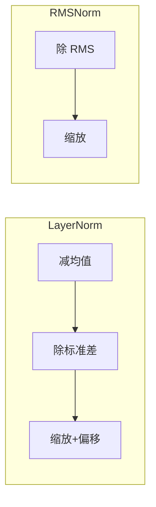
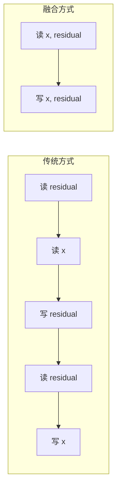
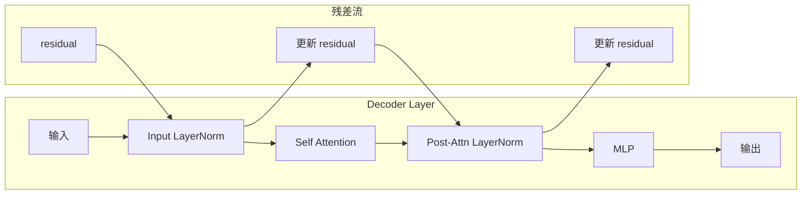
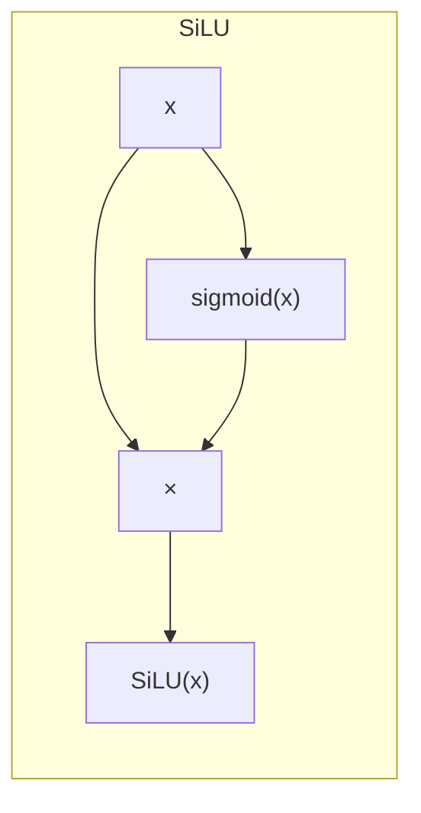

# 第十二章：归一化与激活函数

> 本章将逐行分析 `layernorm.py` 和 `activation.py`，理解 RMSNorm 和 SiLU 激活函数的实现。

## 12.1 RMSNorm 简介

RMSNorm (Root Mean Square Normalization) 是 LayerNorm 的简化版本：



**公式对比**：

| 归一化 | 公式 |
|:---|:---|
| LayerNorm | $\frac{x - \mu}{\sigma} \cdot \gamma + \beta$ |
| RMSNorm | $\frac{x}{\sqrt{\frac{1}{n}\sum x_i^2 + \epsilon}} \cdot \gamma$ |

---

## 12.2 RMSNorm 源码

```python
import torch
from torch import nn


class RMSNorm(nn.Module):

    def __init__(
        self,
        hidden_size: int,
        eps: float = 1e-6,
    ) -> None:
        super().__init__()
        self.eps = eps
        self.weight = nn.Parameter(torch.ones(hidden_size))

    @torch.compile
    def rms_forward(
        self,
        x: torch.Tensor,
    ) -> torch.Tensor:
        orig_dtype = x.dtype
        x = x.float()
        var = x.pow(2).mean(dim=-1, keepdim=True)
        x.mul_(torch.rsqrt(var + self.eps))
        x = x.to(orig_dtype).mul_(self.weight)
        return x

    @torch.compile
    def add_rms_forward(
        self,
        x: torch.Tensor,
        residual: torch.Tensor,
    ) -> tuple[torch.Tensor, torch.Tensor]:
        orig_dtype = x.dtype
        x = x.float().add_(residual.float())
        residual = x.to(orig_dtype)
        var = x.pow(2).mean(dim=-1, keepdim=True)
        x.mul_(torch.rsqrt(var + self.eps))
        x = x.to(orig_dtype).mul_(self.weight)
        return x, residual

    def forward(
        self,
        x: torch.Tensor,
        residual: torch.Tensor | None = None,
    ) -> torch.Tensor | tuple[torch.Tensor, torch.Tensor]:
        if residual is None:
            return self.rms_forward(x)
        else:
            return self.add_rms_forward(x, residual)
```

---

## 12.3 RMSNorm 构造函数

```python
def __init__(
    self,
    hidden_size: int,
    eps: float = 1e-6,
) -> None:
    super().__init__()
    self.eps = eps                                    # 防止除零
    self.weight = nn.Parameter(torch.ones(hidden_size))  # 缩放参数 γ
```

| 参数 | 说明 |
|:---|:---|
| `hidden_size` | 隐藏层维度 |
| `eps` | 数值稳定性常数 |
| `weight` | 可学习缩放参数，初始为全 1 |

> 💡 **设计思想**：RMSNorm 比 LayerNorm 去掉了均值计算和偏移参数，计算量减少约 30%，且实验表明它在 LLM 中效果相当。这是典型的「简化不简陋」设计。

---

## 12.4 rms_forward 方法

```python
@torch.compile
def rms_forward(
    self,
    x: torch.Tensor,
) -> torch.Tensor:
    orig_dtype = x.dtype                  # 保存原始精度
    x = x.float()                         # 转为 float32
    var = x.pow(2).mean(dim=-1, keepdim=True)   # 计算均方
    x.mul_(torch.rsqrt(var + self.eps))   # 原地除以 RMS
    x = x.to(orig_dtype).mul_(self.weight)     # 转回原精度，乘以权重
    return x
```

### 逐行解析

| 行号 | 代码 | 说明 |
|:---:|:---|:---|
| 1 | `@torch.compile` | 使用编译优化 |
| 4 | `orig_dtype = x.dtype` | 保存原始精度（如 bfloat16） |
| 5 | `x = x.float()` | 转为 float32 确保精度 |
| 6 | `x.pow(2).mean(...)` | 计算 $\frac{1}{n}\sum x_i^2$ |
| 7 | `torch.rsqrt(...)` | 计算 $\frac{1}{\sqrt{...}}$ |
| 7 | `mul_` | 原地乘法，节省内存 |
| 8 | `to(orig_dtype).mul_(self.weight)` | 转回原精度，应用缩放 |

### 数学公式

$$
RMSNorm(x) = \frac{x}{\sqrt{\frac{1}{n}\sum_{i=1}^n x_i^2 + \epsilon}} \cdot \gamma
$$

---

## 12.5 add_rms_forward 方法（融合残差）

```python
@torch.compile
def add_rms_forward(
    self,
    x: torch.Tensor,
    residual: torch.Tensor,
) -> tuple[torch.Tensor, torch.Tensor]:
    orig_dtype = x.dtype
    x = x.float().add_(residual.float())    # 残差加法
    residual = x.to(orig_dtype)              # 更新残差
    var = x.pow(2).mean(dim=-1, keepdim=True)
    x.mul_(torch.rsqrt(var + self.eps))
    x = x.to(orig_dtype).mul_(self.weight)
    return x, residual
```

### 融合操作

传统方式：

```python
# 两次读写
residual = residual + x
x = rms_norm(residual)
```

融合方式：

```python
# 一次读写
x = x + residual
residual = x           # 同时更新残差
x = rms_norm(x)
```

### 内存访问对比



**优化效果**：减少 50% 内存访问。

> 💡 **设计思想**：`add_rms_forward` 将残差加法和归一化融合为一个操作，避免了中间结果的存储和重复读取。这种「算子融合」是 GPU 优化的核心技术，能大幅减少内存带宽压力。

---

## 12.6 forward 方法

```python
def forward(
    self,
    x: torch.Tensor,
    residual: torch.Tensor | None = None,
) -> torch.Tensor | tuple[torch.Tensor, torch.Tensor]:
    if residual is None:
        return self.rms_forward(x)
    else:
        return self.add_rms_forward(x, residual)
```

根据是否有残差输入选择不同的处理路径。

---

## 12.7 在 Transformer 中的使用

### Qwen3DecoderLayer 中的模式

```python
# 第一次：没有残差（第一层）
hidden_states, residual = self.input_layernorm(hidden_states), hidden_states

# 后续：有残差
hidden_states, residual = self.input_layernorm(hidden_states, residual)
```

### 数据流



---

## 12.8 SiLU 激活函数

### 12.8.1 源码

```python
import torch
from torch import nn
import torch.nn.functional as F


class SiluAndMul(nn.Module):

    def __init__(self):
        super().__init__()

    @torch.compile
    def forward(self, x: torch.Tensor) -> torch.Tensor:
        x, y = x.chunk(2, -1)
        return F.silu(x) * y
```

### 12.8.2 逐行分析

```python
@torch.compile
def forward(self, x: torch.Tensor) -> torch.Tensor:
    x, y = x.chunk(2, -1)    # 沿最后维度拆分为两半
    return F.silu(x) * y      # SiLU(x) * y
```

### 12.8.3 SiLU 函数

$$
SiLU(x) = x \cdot \sigma(x) = \frac{x}{1 + e^{-x}}
$$



### 12.8.4 门控机制

在 Qwen3 MLP 中的使用：

```python
# gate_up_proj 输出 [gate, up]
gate_up = self.gate_up_proj(x)    # [batch, seq, 2 * intermediate_size]
x = self.act_fn(gate_up)          # SiLU(gate) * up
x = self.down_proj(x)
```

### 12.8.5 可视化


---

## 12.9 为什么使用 SwiGLU

### 传统 FFN

```python
FFN(x) = max(0, xW1 + b1)W2 + b2   # ReLU 激活
```

### SwiGLU (Swish + Gated Linear Unit)

```python
SwiGLU(x) = SiLU(xW_gate) ⊙ (xW_up)
```

**优势**：

| 特性 | ReLU | SwiGLU |
|:---|:---|:---|
| 平滑性 | 不平滑 | 平滑 |
| 梯度流 | 可能死亡 | 始终有梯度 |
| 表达能力 | 一般 | 更强（门控） |

> 💡 **设计思想**：SwiGLU 将激活和门控结合，让网络可以学习「哪些信息应该流过」。实验表明 SwiGLU 比传统 FFN 在相同参数量下效果更好，这就是为什么现代 LLM 都使用它。

---

## 12.10 torch.compile 优化

### 编译效果

```python
@torch.compile
def rms_forward(self, x):
    ...
```

**优化内容**：

1. **算子融合**：多个操作合并为一个 CUDA kernel
2. **内存优化**：减少中间张量分配
3. **计算图优化**：消除冗余计算

### 性能对比

| 操作 | 未编译 | 编译后 |
|:---|:---|:---|
| RMSNorm | 5 个 kernel | 1 个 kernel |
| 内存访问 | 多次读写 | 一次读写 |

> 💡 **设计思想**：`torch.compile` 让简单的 Python 代码能达到接近手写 CUDA 的性能，同时保持代码可读性。这是 Nano-vLLM 「1200 行代码」能达到高性能的关键原因之一。

---

## 12.11 本章小结

本章我们学习了：

1. **RMSNorm**：
   - 相比 LayerNorm 的简化
   - 数学公式和实现
   - 残差融合优化

2. **SiLuAndMul**：
   - SiLU 激活函数
   - 门控机制
   - 在 MLP 中的应用

3. **优化技术**：
   - torch.compile 算子融合
   - 原地操作节省内存
   - 残差融合减少访存

---

**下一章** → [13 词嵌入与输出头](13_embedding_head.md)
