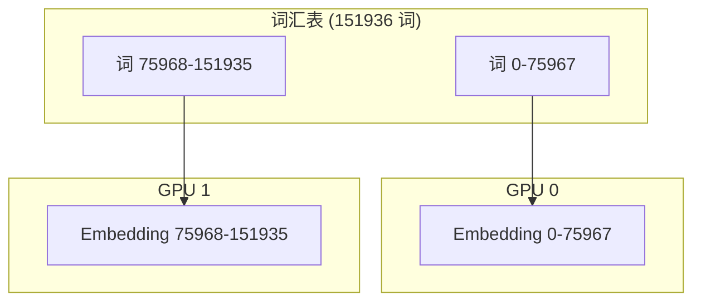
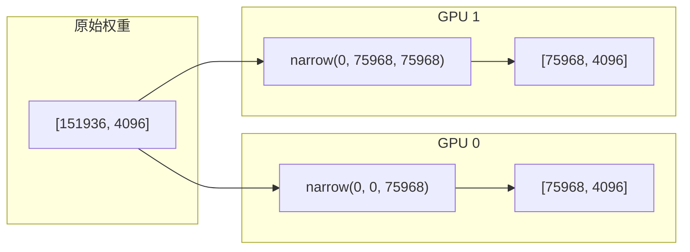
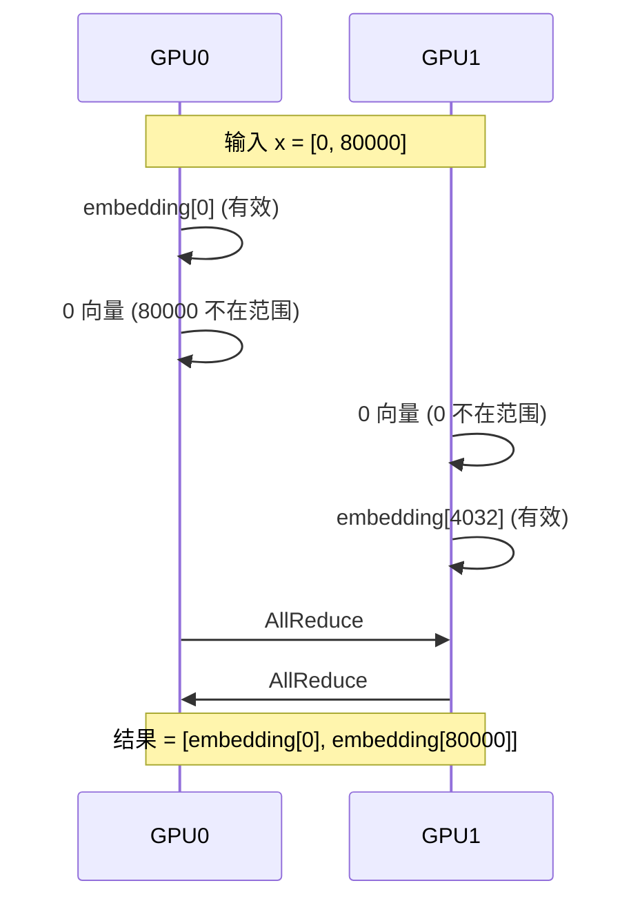
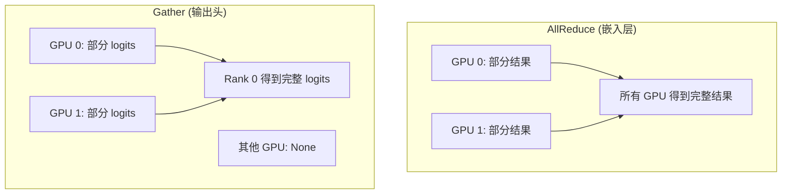

# 第十三章：词嵌入与输出头

> 本章将逐行分析 `embed_head.py`，理解并行词嵌入和语言模型输出头的实现。

## 13.1 并行词嵌入概述

词汇表并行将词汇表按 GPU 数量切分：



---

## 13.2 完整源码

```python
import torch
from torch import nn
import torch.nn.functional as F
import torch.distributed as dist

from nanovllm.utils.context import get_context


class VocabParallelEmbedding(nn.Module):

    def __init__(
        self,
        num_embeddings: int,
        embedding_dim: int,
    ):
        super().__init__()
        self.tp_rank = dist.get_rank()
        self.tp_size = dist.get_world_size()
        assert num_embeddings % self.tp_size == 0
        self.num_embeddings = num_embeddings
        self.num_embeddings_per_partition = self.num_embeddings // self.tp_size
        self.vocab_start_idx = self.num_embeddings_per_partition * self.tp_rank
        self.vocab_end_idx = self.vocab_start_idx + self.num_embeddings_per_partition
        self.weight = nn.Parameter(torch.empty(self.num_embeddings_per_partition, embedding_dim))
        self.weight.weight_loader = self.weight_loader

    def weight_loader(self, param: nn.Parameter, loaded_weight: torch.Tensor):
        param_data = param.data
        shard_size = param_data.size(0)
        start_idx = self.tp_rank * shard_size
        loaded_weight = loaded_weight.narrow(0, start_idx, shard_size)
        param_data.copy_(loaded_weight)

    def forward(self, x: torch.Tensor):
        if self.tp_size > 1:
            mask = (x >= self.vocab_start_idx) & (x < self.vocab_end_idx)
            x = mask * (x - self.vocab_start_idx)
        y = F.embedding(x, self.weight)
        if self.tp_size > 1:
            y = mask.unsqueeze(1) * y
            dist.all_reduce(y)
        return y


class ParallelLMHead(VocabParallelEmbedding):

    def __init__(
        self,
        num_embeddings: int,
        embedding_dim: int,
        bias: bool = False,
    ):
        assert not bias
        super().__init__(num_embeddings, embedding_dim)

    def forward(self, x: torch.Tensor):
        context = get_context()
        if context.is_prefill:
            last_indices = context.cu_seqlens_q[1:] - 1
            x = x[last_indices].contiguous()
        logits = F.linear(x, self.weight)
        if self.tp_size > 1:
            all_logits = [torch.empty_like(logits) for _ in range(self.tp_size)] if self.tp_rank == 0 else None
            dist.gather(logits, all_logits, 0)
            logits = torch.cat(all_logits, -1) if self.tp_rank == 0 else None
        return logits
```

---

## 13.3 VocabParallelEmbedding 构造函数

```python
def __init__(
    self,
    num_embeddings: int,
    embedding_dim: int,
):
    super().__init__()
    self.tp_rank = dist.get_rank()                    # 当前 GPU ID
    self.tp_size = dist.get_world_size()              # 总 GPU 数
    assert num_embeddings % self.tp_size == 0         # 确保可均分
    
    self.num_embeddings = num_embeddings              # 词汇表大小
    self.num_embeddings_per_partition = self.num_embeddings // self.tp_size
    self.vocab_start_idx = self.num_embeddings_per_partition * self.tp_rank
    self.vocab_end_idx = self.vocab_start_idx + self.num_embeddings_per_partition
    
    self.weight = nn.Parameter(torch.empty(self.num_embeddings_per_partition, embedding_dim))
    self.weight.weight_loader = self.weight_loader
```

### 词汇表分区

| GPU | start_idx | end_idx | 负责词汇 |
|:---:|:---:|:---:|:---|
| 0 | 0 | 75968 | 词 0-75967 |
| 1 | 75968 | 151936 | 词 75968-151935 |

### 内存节省

| 配置 | 单 GPU 内存 | 双 GPU 各自 |
|:---|:---|:---|
| 词汇表 151936, 维度 4096 | 2.3 GB | 1.15 GB |

> 💡 **设计思想**：词汇表并行是大词汇表模型的必要优化——151K 词汇表的嵌入层占用大量内存。分割后每个 GPU 只需存储部分词汇表，大幅减少显存压力。

---

## 13.4 weight_loader 方法

```python
def weight_loader(self, param: nn.Parameter, loaded_weight: torch.Tensor):
    param_data = param.data
    shard_size = param_data.size(0)                   # 本分区大小
    start_idx = self.tp_rank * shard_size             # 起始位置
    loaded_weight = loaded_weight.narrow(0, start_idx, shard_size)  # 切片
    param_data.copy_(loaded_weight)
```

**切片示意**：



---

## 13.5 VocabParallelEmbedding 前向传播

```python
def forward(self, x: torch.Tensor):
    if self.tp_size > 1:
        # 创建掩码：只处理本 GPU 负责的词
        mask = (x >= self.vocab_start_idx) & (x < self.vocab_end_idx)
        # 将词 ID 转换为本地索引
        x = mask * (x - self.vocab_start_idx)
    
    y = F.embedding(x, self.weight)
    
    if self.tp_size > 1:
        # 非本 GPU 负责的词，输出置零
        y = mask.unsqueeze(1) * y
        # AllReduce 合并结果
        dist.all_reduce(y)
    
    return y
```

### 逐行解析

| 行号 | 代码 | 说明 |
|:---:|:---|:---|
| 3 | `mask = ...` | 标记哪些词由本 GPU 处理 |
| 4 | `x = mask * (x - start)` | 转换为本地索引，不在范围内的变为 0 |
| 6 | `F.embedding(x, self.weight)` | 查表获取嵌入 |
| 8 | `mask.unsqueeze(1) * y` | 不在范围内的嵌入置零 |
| 9 | `all_reduce(y)` | 求和合并各 GPU 结果 |

> 💡 **设计思想**：使用「掩码 + 置零 + AllReduce」处理跨 GPU 查询，虽然看起来有冗余计算，但避免了复杂的路由逻辑。每个 GPU 计算所有 token，但只有负责范围内的非零，简化了实现。

### 执行示例

```
输入: x = [0, 80000, 50000, 100000]
词汇表: 151936, 双 GPU

GPU 0 (负责 0-75967):
  mask = [True, False, True, False]
  local_x = [0, 0, 50000, 0]
  y[0] = embedding[0], y[2] = embedding[50000]
  y[1] = y[3] = 0

GPU 1 (负责 75968-151935):
  mask = [False, True, False, True]
  local_x = [0, 4032, 0, 24032]  # 80000-75968=4032
  y[1] = embedding[4032], y[3] = embedding[24032]
  y[0] = y[2] = 0

AllReduce 后: 正确的嵌入向量
```

### 通信示意



---

## 13.6 ParallelLMHead 类

```python
class ParallelLMHead(VocabParallelEmbedding):

    def __init__(
        self,
        num_embeddings: int,
        embedding_dim: int,
        bias: bool = False,
    ):
        assert not bias
        super().__init__(num_embeddings, embedding_dim)
```

继承 VocabParallelEmbedding，共享权重加载逻辑。

---

## 13.7 ParallelLMHead 前向传播

```python
def forward(self, x: torch.Tensor):
    context = get_context()
    
    # Prefill 时只取每个序列的最后一个 token
    if context.is_prefill:
        last_indices = context.cu_seqlens_q[1:] - 1
        x = x[last_indices].contiguous()
    
    # 线性变换得到 logits
    logits = F.linear(x, self.weight)
    
    if self.tp_size > 1:
        # Gather 到 Rank 0
        all_logits = [torch.empty_like(logits) for _ in range(self.tp_size)] if self.tp_rank == 0 else None
        dist.gather(logits, all_logits, 0)
        logits = torch.cat(all_logits, -1) if self.tp_rank == 0 else None
    
    return logits
```

### 逐行解析

| 行号 | 代码 | 说明 |
|:---:|:---|:---|
| 4-6 | `last_indices` | Prefill 只需每个序列最后位置的 logits |
| 8 | `F.linear(x, self.weight)` | 计算 logits = x @ W^T |
| 10-13 | `dist.gather` | 收集各 GPU 的 logits 到 Rank 0 |
| 14 | `torch.cat` | 拼接成完整词汇表的 logits |

### 取最后 token

```
cu_seqlens_q = [0, 100, 200, 350]
last_indices = [99, 199, 349]  # 每个序列的最后位置

hidden_states: [350, hidden_dim]
    ↓ 取最后 token
extracted: [3, hidden_dim]  # 3 个序列
```

### Gather vs AllReduce



**为什么输出头用 Gather？**

- 只有 Rank 0 需要执行采样
- 节省通信量（不需要广播结果）

> 💡 **设计思想**：输入端用 AllReduce（所有 GPU 需要嵌入结果），输出端用 Gather（只有 Rank 0 采样）。这种「按需通信」的设计最大限度减少了跨 GPU 数据传输。

---

## 13.8 权重共享

在 Qwen3 模型中，嵌入层和输出头可以共享权重：

```python
# qwen3.py
if config.tie_word_embeddings:
    self.lm_head.weight.data = self.model.embed_tokens.weight.data
```

**优势**：

| 配置 | 参数量 | 内存 |
|:---|:---|:---|
| 独立权重 | 2 × 词汇表 × 维度 | ~4.6 GB |
| 共享权重 | 1 × 词汇表 × 维度 | ~2.3 GB |

> 💡 **设计思想**：权重共享是现代 LLM 的标准做法——嵌入层学习「词→向量」映射，输出头学习「向量→词」映射，两者逻辑上是对称的，共享权重在数学上合理且节省一半内存。

---

## 13.9 logits 形状变化

### Prefill 阶段

```
输入: hidden_states [total_tokens, hidden_dim]
取最后: [num_seqs, hidden_dim]
输出: logits [num_seqs, vocab_size]
```

### Decode 阶段

```
输入: hidden_states [batch, hidden_dim]
输出: logits [batch, vocab_size]
```

---

## 13.10 本章小结

本章我们学习了：

1. **VocabParallelEmbedding**：
   - 词汇表分区策略
   - 掩码机制处理跨 GPU 查询
   - AllReduce 合并结果

2. **ParallelLMHead**：
   - 继承嵌入层设计
   - Prefill 时取最后 token
   - Gather 收集 logits 到 Rank 0

3. **通信策略**：
   - 嵌入层：AllReduce（所有 GPU 需要结果）
   - 输出头：Gather（只有 Rank 0 采样）

4. **权重共享**：
   - 嵌入层和输出头可共享权重
   - 减少内存占用

---

**下一章** → [14 采样器](14_sampler.md)
