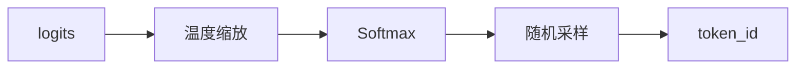
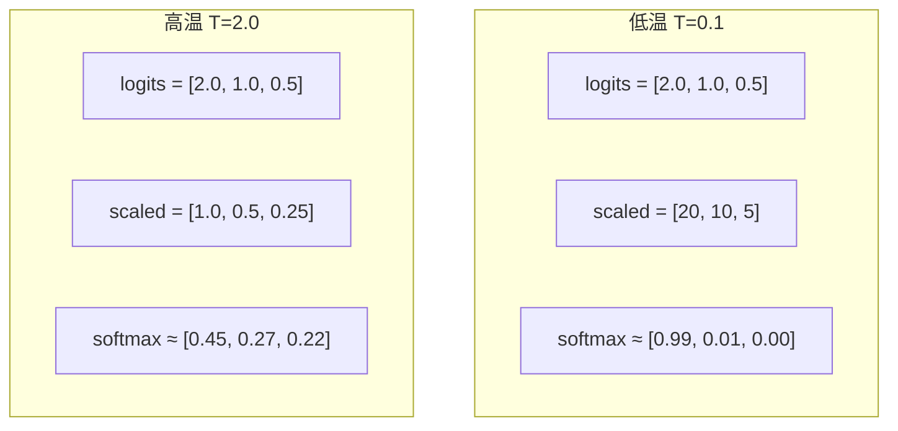
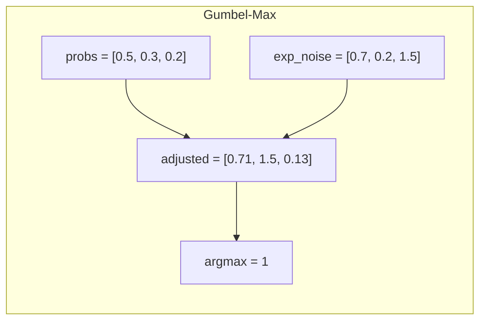

# 第十四章：采样器

> 本章将逐行分析 `sampler.py`，理解温度采样和 Gumbel-Max 技巧的实现。

## 14.1 采样器概述

采样器负责从模型输出的 logits 中选择下一个 token：



---

## 14.2 完整源码

```python
import torch
from torch import nn


class Sampler(nn.Module):

    def __init__(self):
        super().__init__()

    @torch.compile
    def forward(self, logits: torch.Tensor, temperatures: torch.Tensor):
        logits = logits.float().div_(temperatures.unsqueeze(dim=1))
        probs = torch.softmax(logits, dim=-1)
        sample_tokens = probs.div_(torch.empty_like(probs).exponential_(1).clamp_min_(1e-10)).argmax(dim=-1)
        return sample_tokens
```

---

## 14.3 逐行分析

### 14.3.1 类定义

```python
class Sampler(nn.Module):

    def __init__(self):
        super().__init__()
```

简洁的采样器类，无需可学习参数。

### 14.3.2 前向传播

```python
@torch.compile
def forward(self, logits: torch.Tensor, temperatures: torch.Tensor):
    logits = logits.float().div_(temperatures.unsqueeze(dim=1))
    probs = torch.softmax(logits, dim=-1)
    sample_tokens = probs.div_(torch.empty_like(probs).exponential_(1).clamp_min_(1e-10)).argmax(dim=-1)
    return sample_tokens
```

**参数说明**：

| 参数 | 形状 | 说明 |
|:---|:---|:---|
| `logits` | `[batch, vocab_size]` | 模型输出 |
| `temperatures` | `[batch]` | 每个序列的温度 |
| `sample_tokens` | `[batch]` | 采样得到的 token IDs |

---

## 14.4 温度缩放

```python
logits = logits.float().div_(temperatures.unsqueeze(dim=1))
```

### 数学公式

$$
logits' = \frac{logits}{T}
$$

### 温度效果



| 温度 | 分布特点 | 生成风格 |
|:---|:---|:---|
| T → 0 | 趋近 argmax | 确定性、保守 |
| T = 1 | 原始分布 | 平衡 |
| T > 1 | 更平坦 | 多样性、创意 |

---

## 14.5 Softmax 计算

```python
probs = torch.softmax(logits, dim=-1)
```

$$
p_i = \frac{e^{logits'_i}}{\sum_j e^{logits'_j}}
$$

---

## 14.6 Gumbel-Max 技巧

```python
sample_tokens = probs.div_(torch.empty_like(probs).exponential_(1).clamp_min_(1e-10)).argmax(dim=-1)
```

这行代码使用了 **Gumbel-Max 采样技巧**。

### 14.6.1 分解理解

```python
# 1. 生成指数分布随机数
gumbel_noise = torch.empty_like(probs).exponential_(1)

# 2. 防止除零
gumbel_noise = gumbel_noise.clamp_min_(1e-10)

# 3. 概率除以噪声
adjusted = probs / gumbel_noise

# 4. 取 argmax
sample_tokens = adjusted.argmax(dim=-1)
```

### 14.6.2 数学原理

**传统采样**：

```python
token = torch.multinomial(probs, 1)
```

需要计算累积分布函数 (CDF)，然后二分查找。

**Gumbel-Max**：

$$
\arg\max_i \left( \frac{p_i}{-\log U_i} \right) \sim Categorical(p)
$$

其中 $U_i \sim Uniform(0, 1)$，$-\log U_i \sim Exponential(1)$。

### 14.6.3 为什么更快？

| 方法 | 操作 | 复杂度 |
|:---|:---|:---|
| multinomial | CDF + 二分查找 | O(V log V) |
| Gumbel-Max | 除法 + argmax | O(V) |

**关键优势**：argmax 是高度并行化的操作。

> 💡 **设计思想**：Gumbel-Max 技巧将「随机采样」转化为「确定性 argmax」，而 argmax 在 GPU 上可以高度并行化。这是将算法问题转化为更适合硬件的形式。

### 14.6.4 可视化



---

## 14.7 数值稳定性

### clamp_min_ 的作用

```python
.clamp_min_(1e-10)
```

防止除零：指数分布可能产生极小值。

### float() 转换

```python
logits = logits.float()
```

确保精度：避免 bfloat16 下的数值溢出。

---

## 14.8 torch.compile 优化

```python
@torch.compile
def forward(self, logits: torch.Tensor, temperatures: torch.Tensor):
```

**融合的操作**：

1. 温度缩放
2. Softmax
3. 指数噪声生成
4. 除法
5. argmax

**性能提升**：

| 未编译 | 编译后 |
|:---|:---|
| 5 次内存读写 | 1 次内存读写 |
| 5 个 kernel | 1 个融合 kernel |

---

## 14.9 在系统中的使用

### ModelRunner 中的调用

```python
# model_runner.py
def run(self, seqs: list[Sequence], is_prefill: bool) -> list[int]:
    ...
    temperatures = self.prepare_sample(seqs) if self.rank == 0 else None
    logits = self.run_model(input_ids, positions, is_prefill)
    token_ids = self.sampler(logits, temperatures).tolist() if self.rank == 0 else None
    ...
```

**只有 Rank 0 采样**：

- logits 通过 Gather 集中到 Rank 0
- 采样结果通过共享内存传递

### prepare_sample 方法

```python
def prepare_sample(self, seqs: list[Sequence]):
    temperatures = []
    for seq in seqs:
        temperatures.append(seq.temperature)
    temperatures = torch.tensor(temperatures, dtype=torch.float32, pin_memory=True).cuda(non_blocking=True)
    return temperatures
```

---

## 14.10 采样策略对比

| 策略 | 实现 | 特点 |
|:---|:---|:---|
| 贪婪 | argmax | 确定性，可能重复 |
| 温度采样 | softmax + sample | 可控随机性 |
| Top-K | 只保留前 K | 避免低概率词 |
| Top-P (Nucleus) | 累积概率阈值 | 动态词汇量 |

**Nano-vLLM 选择**：纯温度采样，简洁高效。

---

## 14.11 代码简洁性

完整采样器只有 **16 行代码**：

```python
import torch
from torch import nn


class Sampler(nn.Module):

    def __init__(self):
        super().__init__()

    @torch.compile
    def forward(self, logits: torch.Tensor, temperatures: torch.Tensor):
        logits = logits.float().div_(temperatures.unsqueeze(dim=1))
        probs = torch.softmax(logits, dim=-1)
        sample_tokens = probs.div_(torch.empty_like(probs).exponential_(1).clamp_min_(1e-10)).argmax(dim=-1)
        return sample_tokens
```

体现了 Nano-vLLM "约 1200 行代码" 的设计理念。

> 💡 **设计思想**：16 行代码实现完整采样器，体现了「极简」设计哲学。通过策略选择（只支持温度采样）和巧妙算法（Gumbel-Max），以最小代码量实现高性能。

---

## 14.12 本章小结

本章我们学习了：

1. **采样器结构**：
   - 无参数的简洁设计
   - torch.compile 优化

2. **温度缩放**：
   - 控制分布的尖锐程度
   - 不同温度的生成风格

3. **Gumbel-Max 技巧**：
   - 数学原理
   - 相比 multinomial 的优势
   - 数值稳定性处理

4. **系统集成**：
   - 只在 Rank 0 执行
   - temperatures 准备流程

---

**下一章** → [15 Qwen3 模型实现](15_qwen3_model.md)
