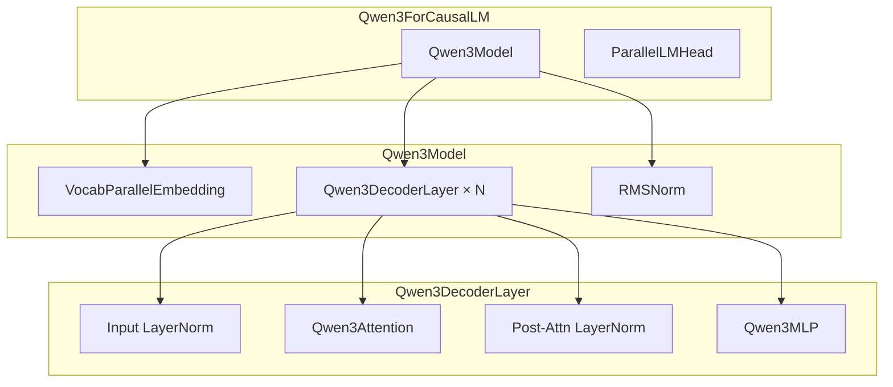
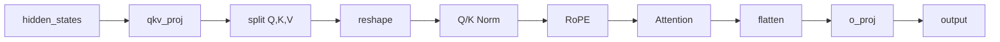
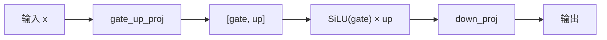
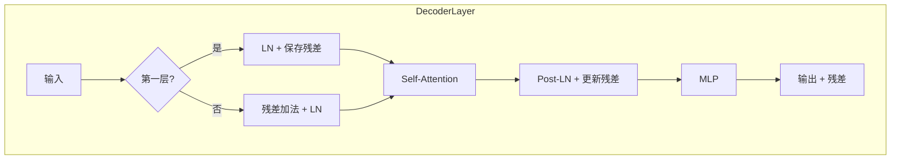
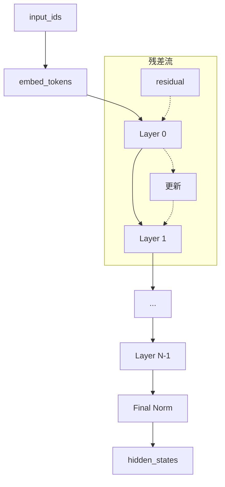

# 第十五章：Qwen3 模型实现

> 本章将逐行分析 `qwen3.py`，理解完整的 Transformer 模型如何组装各层组件。

## 15.1 模型架构概述



---

## 15.2 Qwen3Attention

### 15.2.1 源码

```python
class Qwen3Attention(nn.Module):

    def __init__(
        self,
        hidden_size: int,
        num_heads: int,
        num_kv_heads: int,
        max_position: int = 4096 * 32,
        head_dim: int | None = None,
        rms_norm_eps: float = 1e-06,
        qkv_bias: bool = False,
        rope_theta: float = 10000,
        rope_scaling: tuple | None = None,
    ) -> None:
        super().__init__()
        tp_size = dist.get_world_size()
        self.total_num_heads = num_heads
        assert self.total_num_heads % tp_size == 0
        self.num_heads = self.total_num_heads // tp_size
        self.total_num_kv_heads = num_kv_heads
        assert self.total_num_kv_heads % tp_size == 0
        self.num_kv_heads = self.total_num_kv_heads // tp_size
        self.head_dim = head_dim or hidden_size // self.total_num_heads
        self.q_size = self.num_heads * self.head_dim
        self.kv_size = self.num_kv_heads * self.head_dim
        self.scaling = self.head_dim ** -0.5
        self.qkv_bias = qkv_bias

        self.qkv_proj = QKVParallelLinear(
            hidden_size,
            self.head_dim,
            self.total_num_heads,
            self.total_num_kv_heads,
            bias=qkv_bias,
        )
        self.o_proj = RowParallelLinear(
            self.total_num_heads * self.head_dim,
            hidden_size,
            bias=False,
        )
        self.rotary_emb = get_rope(
            self.head_dim,
            rotary_dim=self.head_dim,
            max_position=max_position,
            base=rope_theta,
            rope_scaling=rope_scaling,
        )
        self.attn = Attention(
            self.num_heads,
            self.head_dim,
            self.scaling,
            self.num_kv_heads,
        )
        if not self.qkv_bias:
            self.q_norm = RMSNorm(self.head_dim, eps=rms_norm_eps)
            self.k_norm = RMSNorm(self.head_dim, eps=rms_norm_eps)
```

### 15.2.2 构造函数分析

**张量并行配置**：

```python
tp_size = dist.get_world_size()
self.num_heads = self.total_num_heads // tp_size      # 每 GPU 的 Q 头数
self.num_kv_heads = self.total_num_kv_heads // tp_size  # 每 GPU 的 KV 头数
```

**投影层**：

| 层 | 类型 | 说明 |
|:---|:---|:---|
| `qkv_proj` | QKVParallelLinear | 合并的 QKV 投影 |
| `o_proj` | RowParallelLinear | 输出投影 + AllReduce |

> 💡 **设计思想**：QKV 合并为一个线性层减少了内核启动开销。注意 `qkv_proj` 使用列并行无需通信，而 `o_proj` 使用行并行需要 AllReduce，整体每层只有一次通信。

**QKV 归一化**（Qwen3 特有）：

```python
if not self.qkv_bias:
    self.q_norm = RMSNorm(self.head_dim, eps=rms_norm_eps)
    self.k_norm = RMSNorm(self.head_dim, eps=rms_norm_eps)
```

### 15.2.3 前向传播

```python
def forward(
    self,
    positions: torch.Tensor,
    hidden_states: torch.Tensor,
) -> torch.Tensor:
    qkv = self.qkv_proj(hidden_states)
    q, k, v = qkv.split([self.q_size, self.kv_size, self.kv_size], dim=-1)
    q = q.view(-1, self.num_heads, self.head_dim)
    k = k.view(-1, self.num_kv_heads, self.head_dim)
    v = v.view(-1, self.num_kv_heads, self.head_dim)
    if not self.qkv_bias:
        q = self.q_norm(q)
        k = self.k_norm(k)
    q, k = self.rotary_emb(positions, q, k)
    o = self.attn(q, k, v)
    output = self.o_proj(o.flatten(1, -1))
    return output
```

**数据流**：



---

## 15.3 Qwen3MLP

```python
class Qwen3MLP(nn.Module):

    def __init__(
        self,
        hidden_size: int,
        intermediate_size: int,
        hidden_act: str,
    ) -> None:
        super().__init__()
        self.gate_up_proj = MergedColumnParallelLinear(
            hidden_size,
            [intermediate_size] * 2,
            bias=False,
        )
        self.down_proj = RowParallelLinear(
            intermediate_size,
            hidden_size,
            bias=False,
        )
        assert hidden_act == "silu"
        self.act_fn = SiluAndMul()

    def forward(self, x):
        gate_up = self.gate_up_proj(x)
        x = self.act_fn(gate_up)
        x = self.down_proj(x)
        return x
```

### MLP 结构



**参数量**：

| 层 | 形状 | 参数量 |
|:---|:---|:---|
| gate_up_proj | [hidden, 2×intermediate] | h × 2i |
| down_proj | [intermediate, hidden] | i × h |

> 💡 **设计思想**：SwiGLU 结构（`gate × SiLU(up)`）比传统 FFN 表达能力更强。将 gate 和 up 合并为一个线性层然后拆分，比两个独立的线性层更高效。

---

## 15.4 Qwen3DecoderLayer

```python
class Qwen3DecoderLayer(nn.Module):

    def __init__(
        self,
        config: Qwen3Config,
    ) -> None:
        super().__init__()
        self.self_attn = Qwen3Attention(
            hidden_size=config.hidden_size,
            num_heads=config.num_attention_heads,
            num_kv_heads=config.num_key_value_heads,
            max_position=config.max_position_embeddings,
            rms_norm_eps=config.rms_norm_eps,
            qkv_bias=getattr(config, 'attention_bias', True),
            head_dim=getattr(config, 'head_dim', None),
            rope_theta=getattr(config, "rope_theta", 1000000),
            rope_scaling=getattr(config, "rope_scaling", None),
        )
        self.mlp = Qwen3MLP(
            hidden_size=config.hidden_size,
            intermediate_size=config.intermediate_size,
            hidden_act=config.hidden_act,
        )
        self.input_layernorm = RMSNorm(config.hidden_size, eps=config.rms_norm_eps)
        self.post_attention_layernorm = RMSNorm(config.hidden_size, eps=config.rms_norm_eps)

    def forward(
        self,
        positions: torch.Tensor,
        hidden_states: torch.Tensor,
        residual: torch.Tensor | None,
    ) -> tuple[torch.Tensor, torch.Tensor]:
        if residual is None:
            hidden_states, residual = self.input_layernorm(hidden_states), hidden_states
        else:
            hidden_states, residual = self.input_layernorm(hidden_states, residual)
        hidden_states = self.self_attn(positions, hidden_states)
        hidden_states, residual = self.post_attention_layernorm(hidden_states, residual)
        hidden_states = self.mlp(hidden_states)
        return hidden_states, residual
```

### 残差连接流



---

## 15.5 Qwen3Model

```python
class Qwen3Model(nn.Module):

    def __init__(
        self,
        config: Qwen3Config,
    ) -> None:
        super().__init__()
        self.embed_tokens = VocabParallelEmbedding(config.vocab_size, config.hidden_size)
        self.layers = nn.ModuleList([Qwen3DecoderLayer(config) for _ in range(config.num_hidden_layers)])
        self.norm = RMSNorm(config.hidden_size, eps=config.rms_norm_eps)

    def forward(
        self,
        input_ids: torch.Tensor,
        positions: torch.Tensor,
    ) -> torch.Tensor:
        hidden_states = self.embed_tokens(input_ids)
        residual = None
        for layer in self.layers:
            hidden_states, residual = layer(positions, hidden_states, residual)
        hidden_states, _ = self.norm(hidden_states, residual)
        return hidden_states
```

### 前向传播流程



---

## 15.6 Qwen3ForCausalLM

```python
class Qwen3ForCausalLM(nn.Module):
    packed_modules_mapping = {
        "q_proj": ("qkv_proj", "q"),
        "k_proj": ("qkv_proj", "k"),
        "v_proj": ("qkv_proj", "v"),
        "gate_proj": ("gate_up_proj", 0),
        "up_proj": ("gate_up_proj", 1),
    }

    def __init__(
        self,
        config: Qwen3Config
    ) -> None:
        super().__init__()
        self.model = Qwen3Model(config)
        self.lm_head = ParallelLMHead(config.vocab_size, config.hidden_size)
        if config.tie_word_embeddings:
            self.lm_head.weight.data = self.model.embed_tokens.weight.data

    def forward(
        self,
        input_ids: torch.Tensor,
        positions: torch.Tensor,
    ) -> torch.Tensor:
        return self.model(input_ids, positions)

    def compute_logits(
        self,
        hidden_states: torch.Tensor,
    ) -> torch.Tensor:
        return self.lm_head(hidden_states)
```

### 15.6.1 packed_modules_mapping

```python
packed_modules_mapping = {
    "q_proj": ("qkv_proj", "q"),
    "k_proj": ("qkv_proj", "k"),
    "v_proj": ("qkv_proj", "v"),
    "gate_proj": ("gate_up_proj", 0),
    "up_proj": ("gate_up_proj", 1),
}
```

**作用**：权重映射，将 HuggingFace 格式转换为合并格式。

| 原始权重 | 目标权重 | shard_id |
|:---|:---|:---|
| `model.layers.0.self_attn.q_proj.weight` | `model.layers.0.self_attn.qkv_proj.weight` | "q" |
| `model.layers.0.mlp.gate_proj.weight` | `model.layers.0.mlp.gate_up_proj.weight` | 0 |

### 15.6.2 权重共享

```python
if config.tie_word_embeddings:
    self.lm_head.weight.data = self.model.embed_tokens.weight.data
```

嵌入层和输出头共享权重，减少参数量。

### 15.6.3 分离的 forward 和 compute_logits

```python
def forward(self, input_ids, positions):
    return self.model(input_ids, positions)

def compute_logits(self, hidden_states):
    return self.lm_head(hidden_states)
```

**原因**：CUDA Graph 只捕获 `forward`，采样在 `compute_logits` 后执行。

> 💡 **设计思想**：分离 `forward` 和 `compute_logits` 是为了 CUDA Graph 优化——Graph 只捕获模型前向传播，而 logits 计算在 Graph 外执行。这样可以灵活处理不同批次大小的输出。

---

## 15.7 完整架构图

```mermaid
graph TB
    subgraph "Qwen3ForCausalLM"
        subgraph "Qwen3Model"
            A[VocabParallelEmbedding]
            
            subgraph "Layers"
                subgraph "Layer 0"
                    B1[Input LayerNorm]
                    subgraph "Qwen3Attention"
                        C1[QKVParallelLinear]
                        D1[Q/K Norm]
                        E1[RoPE]
                        F1[Attention]
                        G1[RowParallelLinear]
                    end
                    H1[Post-Attn LayerNorm]
                    subgraph "Qwen3MLP"
                        I1[MergedColumnParallel]
                        J1[SiLU×Mul]
                        K1[RowParallel]
                    end
                end
                L["... (N layers)"]
            end
            
            M[Final RMSNorm]
        end
        
        N[ParallelLMHead]
    end
    
    A --> B1
    B1 --> C1 --> D1 --> E1 --> F1 --> G1
    G1 --> H1 --> I1 --> J1 --> K1
    K1 --> L --> M --> N
```



---

## 15.8 Qwen3 配置示例

```python
Qwen3Config(
    vocab_size=151936,
    hidden_size=4096,
    intermediate_size=11008,
    num_hidden_layers=28,
    num_attention_heads=32,
    num_key_value_heads=8,  # GQA
    hidden_act="silu",
    max_position_embeddings=4096,
    rms_norm_eps=1e-6,
    attention_bias=False,  # 使用 Q/K Norm
    tie_word_embeddings=True,
)
```

---

## 15.9 本章小结

本章我们学习了：

1. **Qwen3Attention**：
   - QKV 合并投影
   - Q/K 归一化（Qwen3 特有）
   - RoPE 位置编码

2. **Qwen3MLP**：
   - Gate-Up 合并投影
   - SiLU 门控激活

3. **Qwen3DecoderLayer**：
   - 残差连接流
   - Pre-LN 架构

4. **Qwen3Model**：
   - 嵌入 + 多层 Decoder + Final Norm

5. **Qwen3ForCausalLM**：
   - packed_modules_mapping
   - 权重共享
   - forward 与 compute_logits 分离

---

**下一章** → [16 工具模块](16_utils.md)
