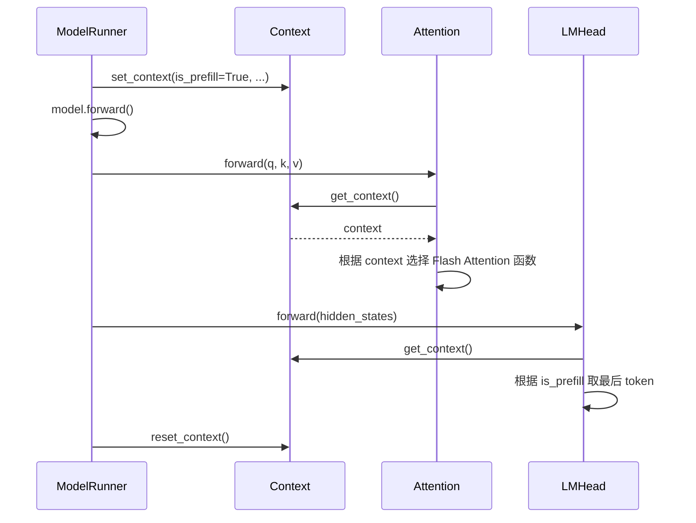
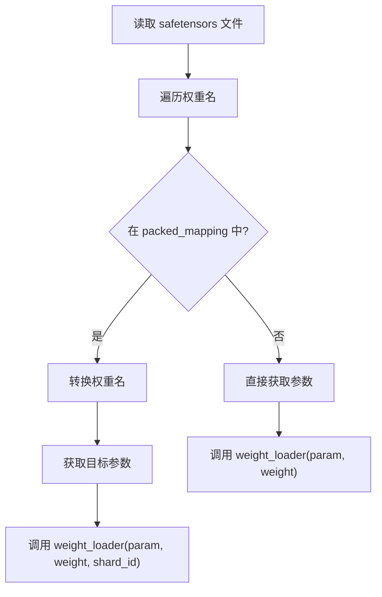
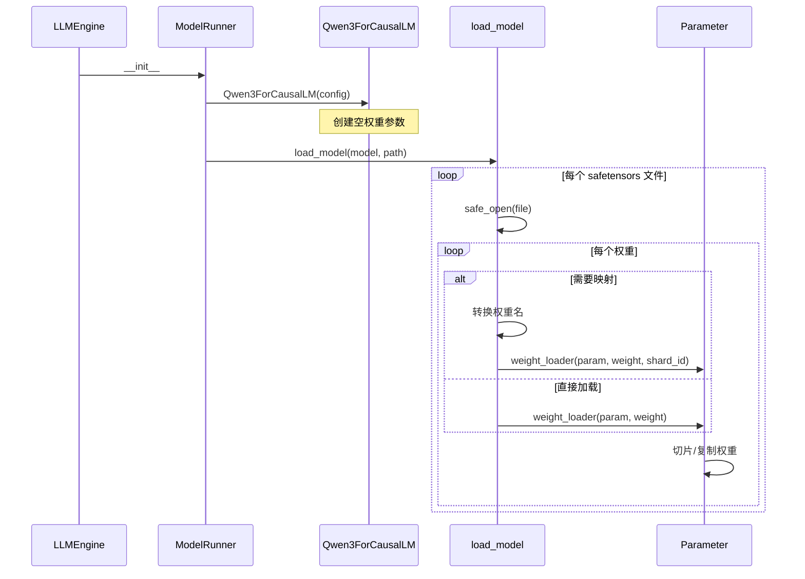

# 第十六章：工具模块

> 本章将逐行分析 `context.py` 和 `loader.py`，理解上下文管理和模型加载机制。

## 16.1 Context 上下文管理

### 16.1.1 完整源码

```python
from dataclasses import dataclass
import torch


@dataclass
class Context:
    is_prefill: bool = False
    cu_seqlens_q: torch.Tensor | None = None
    cu_seqlens_k: torch.Tensor | None = None
    max_seqlen_q: int = 0
    max_seqlen_k: int = 0
    slot_mapping: torch.Tensor | None = None
    context_lens: torch.Tensor | None = None
    block_tables: torch.Tensor | None = None

_CONTEXT = Context()

def get_context():
    return _CONTEXT

def set_context(is_prefill, cu_seqlens_q=None, cu_seqlens_k=None, max_seqlen_q=0, max_seqlen_k=0, slot_mapping=None, context_lens=None, block_tables=None):
    global _CONTEXT
    _CONTEXT = Context(is_prefill, cu_seqlens_q, cu_seqlens_k, max_seqlen_q, max_seqlen_k, slot_mapping, context_lens, block_tables)

def reset_context():
    global _CONTEXT
    _CONTEXT = Context()
```

### 16.1.2 Context 数据类

```python
@dataclass
class Context:
    is_prefill: bool = False                      # 是否是 Prefill 阶段
    cu_seqlens_q: torch.Tensor | None = None      # Q 累积序列长度
    cu_seqlens_k: torch.Tensor | None = None      # K 累积序列长度
    max_seqlen_q: int = 0                         # Q 最大序列长度
    max_seqlen_k: int = 0                         # K 最大序列长度
    slot_mapping: torch.Tensor | None = None      # KV Cache slot 映射
    context_lens: torch.Tensor | None = None      # 上下文长度（Decode）
    block_tables: torch.Tensor | None = None      # 块表
```

### 16.1.3 字段使用场景

| 字段 | Prefill | Decode |
|:---|:---|:---|
| `is_prefill` | True | False |
| `cu_seqlens_q` | ✓ | - |
| `cu_seqlens_k` | ✓ | - |
| `max_seqlen_q` | ✓ | - |
| `max_seqlen_k` | ✓ | - |
| `slot_mapping` | ✓ | ✓ |
| `context_lens` | - | ✓ |
| `block_tables` | prefix cache 时 ✓ | ✓ |

### 16.1.4 全局变量管理

```python
_CONTEXT = Context()                    # 全局上下文实例

def get_context():
    return _CONTEXT                     # 获取当前上下文

def set_context(...):
    global _CONTEXT
    _CONTEXT = Context(...)            # 设置新上下文

def reset_context():
    global _CONTEXT
    _CONTEXT = Context()               # 重置为默认值
```

### 16.1.5 使用流程



### 16.1.6 设计优势

**为什么使用全局上下文？**

1. **避免参数传递**：不需要在每层传递 context
2. **模块解耦**：Attention 和 LMHead 不需要知道上层调用
3. **简化接口**：模型 forward 保持简洁

---

## 16.2 模型加载器

### 16.2.1 完整源码

```python
import os
from glob import glob
import torch
from torch import nn
from safetensors import safe_open


def default_weight_loader(param: nn.Parameter, loaded_weight: torch.Tensor):
    param.data.copy_(loaded_weight)


def load_model(model: nn.Module, path: str):
    packed_modules_mapping = getattr(model, "packed_modules_mapping", {})
    for file in glob(os.path.join(path, "*.safetensors")):
        with safe_open(file, "pt", "cpu") as f:
            for weight_name in f.keys():
                for k in packed_modules_mapping:
                    if k in weight_name:
                        v, shard_id = packed_modules_mapping[k]
                        param_name = weight_name.replace(k, v)
                        param = model.get_parameter(param_name)
                        weight_loader = getattr(param, "weight_loader")
                        weight_loader(param, f.get_tensor(weight_name), shard_id)
                        break
                else:
                    param = model.get_parameter(weight_name)
                    weight_loader = getattr(param, "weight_loader", default_weight_loader)
                    weight_loader(param, f.get_tensor(weight_name))
```

### 16.2.2 default_weight_loader

```python
def default_weight_loader(param: nn.Parameter, loaded_weight: torch.Tensor):
    param.data.copy_(loaded_weight)
```

最简单的权重加载：直接复制。

### 16.2.3 load_model 函数

```python
def load_model(model: nn.Module, path: str):
    # 获取权重打包映射
    packed_modules_mapping = getattr(model, "packed_modules_mapping", {})
    
    # 遍历所有 safetensors 文件
    for file in glob(os.path.join(path, "*.safetensors")):
        with safe_open(file, "pt", "cpu") as f:
            for weight_name in f.keys():
                # 检查是否需要打包映射
                for k in packed_modules_mapping:
                    if k in weight_name:
                        v, shard_id = packed_modules_mapping[k]
                        param_name = weight_name.replace(k, v)
                        param = model.get_parameter(param_name)
                        weight_loader = getattr(param, "weight_loader")
                        weight_loader(param, f.get_tensor(weight_name), shard_id)
                        break
                else:  # 不需要映射
                    param = model.get_parameter(weight_name)
                    weight_loader = getattr(param, "weight_loader", default_weight_loader)
                    weight_loader(param, f.get_tensor(weight_name))
```

### 16.2.4 权重映射流程



### 16.2.5 映射示例

**HuggingFace 权重**：

```
model.layers.0.self_attn.q_proj.weight
model.layers.0.self_attn.k_proj.weight
model.layers.0.self_attn.v_proj.weight
```

**packed_modules_mapping**：

```python
{
    "q_proj": ("qkv_proj", "q"),
    "k_proj": ("qkv_proj", "k"),
    "v_proj": ("qkv_proj", "v"),
}
```

**转换后**：

```
model.layers.0.self_attn.qkv_proj.weight (shard_id="q")
model.layers.0.self_attn.qkv_proj.weight (shard_id="k")
model.layers.0.self_attn.qkv_proj.weight (shard_id="v")
```

### 16.2.6 safetensors 格式

```python
from safetensors import safe_open

with safe_open(file, "pt", "cpu") as f:
    for weight_name in f.keys():          # 获取所有权重名
        tensor = f.get_tensor(weight_name)  # 按需加载张量
```

**优势**：

| 特性 | pickle | safetensors |
|:---|:---|:---|
| 安全性 | 可执行代码 | 仅数据 |
| 内存 | 全部加载 | 按需加载 |
| 速度 | 较慢 | 快 |

---

## 16.3 加载流程图



---

## 16.4 张量并行加载

### 16.4.1 不同层的加载方式

| 层类型 | weight_loader | 操作 |
|:---|:---|:---|
| ColumnParallel | 切分 output 维度 | `narrow(0, start, size)` |
| RowParallel | 切分 input 维度 | `narrow(1, start, size)` |
| QKVParallel | 按 Q/K/V 分别切分 | 根据 shard_id |
| MergedColumn | 按子模块切分 | 根据 shard_id |
| Replicated | 直接复制 | `copy_()` |

### 16.4.2 示例：QKVParallelLinear 加载

```python
# GPU 0 (tp_rank=0)
weight_loader(param, q_proj_weight, "q")
# 加载 Q 头 0-3 到 param[0:512]

weight_loader(param, k_proj_weight, "k")
# 加载 K 头 0-1 到 param[512:640]

weight_loader(param, v_proj_weight, "v")
# 加载 V 头 0-1 到 param[640:768]
```

---

## 16.5 错误处理

### 16.5.1 参数不存在

```python
param = model.get_parameter(weight_name)
# 如果权重名不匹配，抛出 KeyError
```

### 16.5.2 权重形状不匹配

```python
param_data.copy_(loaded_weight)
# 如果形状不匹配，抛出 RuntimeError
```

---

## 16.6 本章小结

本章我们学习了：

1. **Context 模块**：
   - 8 个上下文字段
   - 全局变量管理
   - Prefill vs Decode 的不同使用

2. **模型加载器**：
   - safetensors 格式
   - packed_modules_mapping 权重映射
   - weight_loader 设计模式

3. **设计理念**：
   - 全局上下文避免参数传递
   - 映射表解耦权重格式
   - 按需加载节省内存

---

**下一章** → [17 性能优化技术](17_performance_optimization.md)
