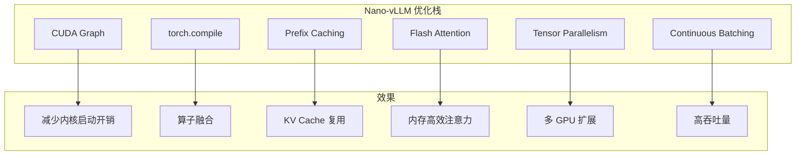
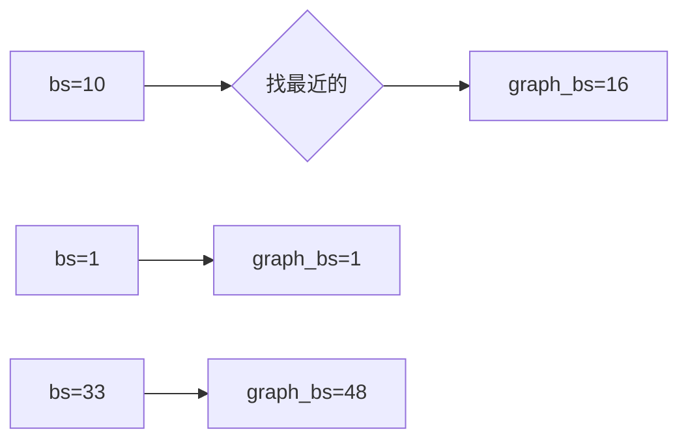
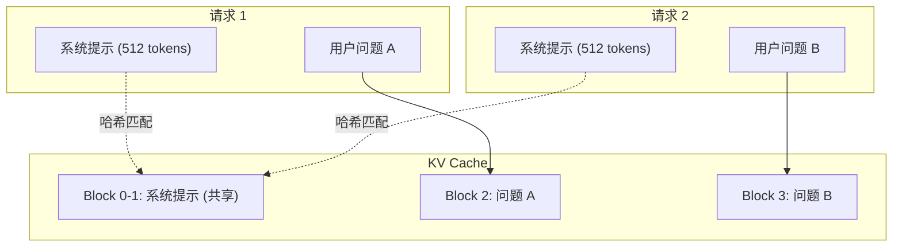
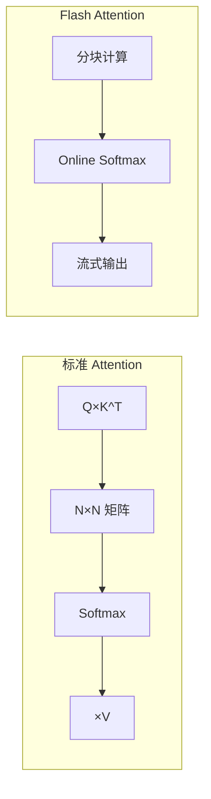
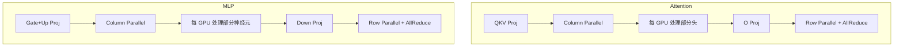
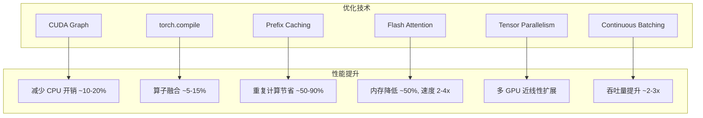

# 第十七章：性能优化技术

> 本章将深入分析 Nano-vLLM 的性能优化策略，包括 CUDA Graph、torch.compile 和 Prefix Caching。

## 17.1 优化技术概览



---

## 17.2 CUDA Graph

### 17.2.1 基本原理

**传统执行**：

```
CPU: [launch kernel 1] → [launch kernel 2] → [launch kernel 3] → ...
GPU:    [kernel 1]        [kernel 2]        [kernel 3]
        ↑_________CPU 启动开销__________↑
```

**CUDA Graph**：

```
CPU: [launch graph (一次)]
GPU: [kernel 1] → [kernel 2] → [kernel 3] → ...
     ↑_________GPU 内部调度，无 CPU 开销__________↑
```

### 17.2.2 Nano-vLLM 实现

```python
# model_runner.py
@torch.inference_mode()
def capture_cudagraph(self):
    ...
    for bs in reversed(self.graph_bs):
        graph = torch.cuda.CUDAGraph()
        
        # Warmup
        outputs[:bs] = self.model(input_ids[:bs], positions[:bs])
        
        # Capture
        with torch.cuda.graph(graph, self.graph_pool):
            outputs[:bs] = self.model(input_ids[:bs], positions[:bs])
        
        self.graphs[bs] = graph
```

### 17.2.3 批次大小策略

```python
self.graph_bs = [1, 2, 4, 8] + list(range(16, max_bs + 1, 16))
# [1, 2, 4, 8, 16, 32, 48, 64, ..., 512]
```

**选择逻辑**：

```python
# 选择 >= batch_size 的最小 Graph
graph = self.graphs[next(x for x in self.graph_bs if x >= bs)]
```



### 17.2.4 执行时填充

```python
def run_model(self, input_ids, positions, is_prefill):
    if is_prefill or self.enforce_eager or input_ids.size(0) > 512:
        return self.model.compute_logits(self.model(input_ids, positions))
    else:
        bs = input_ids.size(0)
        graph = self.graphs[next(x for x in self.graph_bs if x >= bs)]
        
        # 填充输入
        graph_vars["input_ids"][:bs] = input_ids
        graph_vars["positions"][:bs] = positions
        graph_vars["slot_mapping"].fill_(-1)
        graph_vars["slot_mapping"][:bs] = context.slot_mapping
        ...
        
        graph.replay()
        return self.model.compute_logits(graph_vars["outputs"][:bs])
```

### 17.2.5 Graph Pool 共享

```python
if self.graph_pool is None:
    self.graph_pool = graph.pool()
```

**优势**：所有 Graph 共享内存池，减少显存占用。

---

## 17.3 torch.compile

### 17.3.1 使用位置

```python
# layernorm.py
@torch.compile
def rms_forward(self, x):
    ...

@torch.compile
def add_rms_forward(self, x, residual):
    ...

# rotary_embedding.py
@torch.compile
def forward(self, positions, query, key):
    ...

# sampler.py
@torch.compile
def forward(self, logits, temperatures):
    ...

# activation.py
@torch.compile
def forward(self, x):
    ...
```

### 17.3.2 优化效果

**RMSNorm 融合示例**：

```python
# 未优化：5 个内核
x = x.float()           # kernel 1: 类型转换
var = x.pow(2)          # kernel 2: 平方
var = var.mean(...)     # kernel 3: 均值
x = x * rsqrt(var+eps)  # kernel 4: 归一化
x = x * weight          # kernel 5: 缩放

# torch.compile 优化：1 个融合内核
# 所有操作在一次内存访问中完成
```

### 17.3.3 编译模式

```python
@torch.compile  # 默认使用 mode="default"
```

| 模式 | 编译时间 | 优化程度 |
|:---|:---|:---|
| `reduce-overhead` | 短 | 低 |
| `default` | 中 | 中 |
| `max-autotune` | 长 | 高 |

---

## 17.4 Prefix Caching

### 17.4.1 原理



### 17.4.2 实现细节

**缓存命中判断**：

```python
# block_manager.py
def allocate(self, seq: Sequence):
    for i in range(seq.num_blocks):
        token_ids = seq.block(i)
        h = self.compute_hash(token_ids, h) if len(token_ids) == self.block_size else -1
        block_id = self.hash_to_block_id.get(h, -1)
        
        if block_id == -1 or self.blocks[block_id].token_ids != token_ids:
            cache_miss = True   # 未命中
        else:
            seq.num_cached_tokens += self.block_size  # 命中！
```

**跳过已缓存的计算**：

```python
# model_runner.py
def prepare_prefill(self, seqs):
    for seq in seqs:
        # 只处理未缓存的 token
        input_ids.extend(seq[seq.num_cached_tokens:])
        positions.extend(list(range(seq.num_cached_tokens, seqlen)))
```

### 17.4.3 性能收益

| 场景 | 无缓存 | 有缓存 | 节省 |
|:---|:---|:---|:---|
| 1024 token 系统提示 | 100ms | 0ms | 100% |
| 重复对话 | 全量计算 | 部分计算 | 50-90% |

---

## 17.5 Flash Attention

### 17.5.1 算法优势



**内存复杂度**：

| 方法 | 内存 | 速度 |
|:---|:---|:---|
| 标准 | O(N²) | 基准 |
| Flash Attention | O(N) | 2-4x 快 |

### 17.5.2 使用方式

```python
# Prefill
o = flash_attn_varlen_func(
    q, k, v,
    cu_seqlens_q=context.cu_seqlens_q,
    cu_seqlens_k=context.cu_seqlens_k,
    ...
)

# Decode (Paged Attention)
o = flash_attn_with_kvcache(
    q.unsqueeze(1), k_cache, v_cache,
    cache_seqlens=context.context_lens,
    block_table=context.block_tables,
    ...
)
```

---

## 17.6 Tensor Parallelism

### 17.6.1 分布策略



### 17.6.2 通信开销

每层只有 **2 次 AllReduce**：

1. Attention 输出
2. MLP 输出

```python
# RowParallelLinear.forward
y = F.linear(x, self.weight, self.bias if self.tp_rank == 0 else None)
if self.tp_size > 1:
    dist.all_reduce(y)  # 唯一的通信点
```

---

## 17.7 Continuous Batching

### 17.7.1 调度策略

```python
# scheduler.py
def schedule(self):
    # Prefill 优先
    while self.waiting and num_seqs < self.max_num_seqs:
        seq = self.waiting[0]
        if can_schedule(seq):
            schedule_seq(seq)
    
    if scheduled_seqs:
        return scheduled_seqs, True  # Prefill
    
    # Decode
    while self.running and num_seqs < self.max_num_seqs:
        ...
```

### 17.7.2 动态批处理效果

```mermaid
gantt
    title Continuous Batching
    dateFormat X
    axisFormat %s
    
    section GPU
    Batch 1 (Prefill)   :0, 2
    Batch 2 (Decode)    :2, 3
    Batch 3 (Mixed)     :3, 5
    Batch 4 (Decode)    :5, 6
```



**关键点**：新请求可以在任意时刻加入，已完成的请求立即释放资源。

---

## 17.8 基准测试分析

### 17.8.1 bench.py 源码

```python
def main():
    seed(0)
    num_seqs = 256
    max_input_len = 1024
    max_ouput_len = 1024

    path = os.path.expanduser("~/huggingface/Qwen3-0.6B/")
    llm = LLM(path, enforce_eager=False, max_model_len=4096)

    prompt_token_ids = [[randint(0, 10000) for _ in range(randint(100, max_input_len))] 
                        for _ in range(num_seqs)]
    sampling_params = [SamplingParams(temperature=0.6, ignore_eos=True, 
                       max_tokens=randint(100, max_ouput_len)) for _ in range(num_seqs)]

    llm.generate([["Benchmark: "]], SamplingParams())  # Warmup
    t = time.time()
    llm.generate(prompt_token_ids, sampling_params, use_tqdm=False)
    t = (time.time() - t)
    total_tokens = sum(sp.max_tokens for sp in sampling_params)
    throughput = total_tokens / t
    print(f"Total: {total_tokens}tok, Time: {t:.2f}s, Throughput: {throughput:.2f}tok/s")
```

### 17.8.2 测试结果

| 配置 | vLLM | Nano-vLLM |
|:---|:---|:---|
| 输出 tokens | 133,966 | 133,966 |
| 时间 | 98.37s | 93.41s |
| 吞吐量 | 1361.84 tok/s | **1434.13 tok/s** |

**Nano-vLLM 更快的原因**：

1. 更少的代码开销
2. 更直接的实现
3. 针对单一模型优化

---

## 17.9 优化效果汇总



---

## 17.10 本章小结

本章我们学习了：

1. **CUDA Graph**：
   - 批次大小策略
   - Graph 池共享
   - 执行时填充

2. **torch.compile**：
   - 适用场景
   - 内核融合效果

3. **Prefix Caching**：
   - 哈希匹配
   - 跳过已缓存计算

4. **Flash Attention**：
   - O(N) 内存复杂度
   - Paged Attention 集成

5. **Tensor Parallelism**：
   - 列并行 + 行并行
   - 最小通信开销

6. **Continuous Batching**：
   - 动态调度
   - 资源即时释放

---

**下一章** → [18 课程总结与扩展](18_summary.md)
