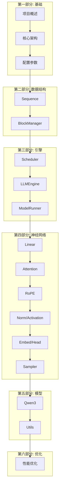
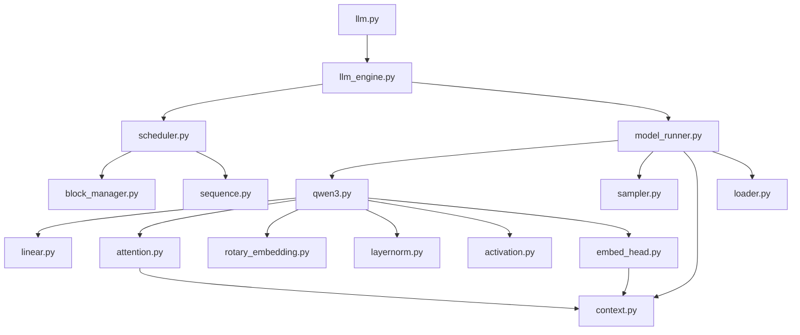
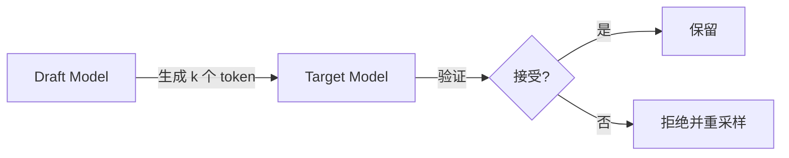

# 第十八章：课程总结与扩展

> 本章将回顾整个课程的核心内容，总结设计模式，并提供扩展学习建议。

## 18.1 课程回顾

### 18.1.1 知识脉络



### 18.1.2 各章要点

| 章节 | 核心内容 | 关键代码 |
|:---:|:---|:---|
| 01 | 项目结构、快速上手 | `LLM`, `SamplingParams` |
| 02 | Prefill/Decode、KV Cache | 架构图 |
| 03 | 配置验证、温度采样 | `Config`, `SamplingParams` |
| 04 | 序列状态机、Block Table | `Sequence`, `SequenceStatus` |
| 05 | Prefix Caching、哈希链 | `BlockManager`, `Block` |
| 06 | 调度算法、抢占机制 | `Scheduler.schedule()` |
| 07 | 多进程初始化、生成循环 | `LLMEngine.generate()` |
| 08 | CUDA Graph、分布式通信 | `ModelRunner.capture_cudagraph()` |
| 09 | 列并行、行并行、QKV 投影 | `*ParallelLinear` |
| 10 | Flash Attention、KV 存储 | `Attention`, Triton kernel |
| 11 | 旋转位置编码 | `RotaryEmbedding` |
| 12 | RMSNorm、SiLU 门控 | `RMSNorm`, `SiluAndMul` |
| 13 | 词汇表并行、Gather | `VocabParallelEmbedding` |
| 14 | Gumbel-Max 采样 | `Sampler` |
| 15 | 完整模型组装 | `Qwen3ForCausalLM` |
| 16 | 全局上下文、权重加载 | `Context`, `load_model` |
| 17 | CUDA Graph、Prefix Caching | 性能优化汇总 |

---

## 18.2 设计模式总结

### 18.2.1 Weight Loader 模式

```python
# 定义
class SomeLinear(nn.Module):
    def __init__(self, ...):
        self.weight = nn.Parameter(...)
        self.weight.weight_loader = self.weight_loader
    
    def weight_loader(self, param, loaded_weight, shard_id=None):
        # 自定义加载逻辑
        ...

# 使用
for name, param in model.named_parameters():
    loader = getattr(param, "weight_loader", default_loader)
    loader(param, weights[name])
```

**优势**：解耦权重格式与模型定义。

### 18.2.2 全局 Context 模式

```python
_CONTEXT = Context()

def get_context():
    return _CONTEXT

def set_context(...):
    global _CONTEXT
    _CONTEXT = Context(...)
```

**优势**：避免深层参数传递。

### 18.2.3 packed_modules_mapping

```python
class Model(nn.Module):
    packed_modules_mapping = {
        "q_proj": ("qkv_proj", "q"),
        "k_proj": ("qkv_proj", "k"),
        "v_proj": ("qkv_proj", "v"),
    }
```

**优势**：兼容 HuggingFace 权重格式。

### 18.2.4 工厂函数 + 缓存

```python
@lru_cache(1)
def get_rope(head_size, rotary_dim, max_position, base, rope_scaling=None):
    return RotaryEmbedding(...)
```

**优势**：确保单例，避免重复创建。

---

## 18.3 代码统计

### 18.3.1 文件行数

| 模块 | 文件 | 行数 |
|:---|:---|:---:|
| 入口 | `__init__.py`, `llm.py` | 9 |
| 配置 | `config.py`, `sampling_params.py` | 39 |
| 引擎 | `llm_engine.py` | 94 |
| 调度 | `scheduler.py`, `sequence.py`, `block_manager.py` | 269 |
| 运行 | `model_runner.py` | 252 |
| 层 | `linear.py`, `attention.py`, `rotary_embedding.py` | 292 |
| 层 | `layernorm.py`, `activation.py`, `embed_head.py`, `sampler.py` | 149 |
| 模型 | `qwen3.py` | 216 |
| 工具 | `context.py`, `loader.py` | 57 |
| **总计** | | **~1377** |

约 **1200 行核心代码**，实现了完整的 LLM 推理引擎！

### 18.3.2 模块依赖图



---

## 18.4 与 vLLM 的对比

| 特性 | vLLM | Nano-vLLM |
|:---|:---|:---|
| 代码量 | ~50,000 行 | ~1,200 行 |
| 支持模型 | 100+ | 1 (Qwen3) |
| 特殊 token | 完整支持 | 基础支持 |
| 流式输出 | ✓ | - |
| Speculative Decoding | ✓ | - |
| Prefix Caching | ✓ | ✓ |
| CUDA Graph | ✓ | ✓ |
| 张量并行 | ✓ | ✓ |
| 易读性 | 复杂 | 简洁 |

**Nano-vLLM 适合**：

- 学习 LLM 推理引擎原理
- 快速原型开发
- 特定模型优化

---

## 18.5 扩展方向

### 18.5.1 支持更多模型

```python
# 新增模型
class LlamaForCausalLM(nn.Module):
    packed_modules_mapping = {...}
    ...

# 模型注册表
MODEL_REGISTRY = {
    "qwen3": Qwen3ForCausalLM,
    "llama": LlamaForCausalLM,
}
```

### 18.5.2 添加流式输出

```python
def generate_stream(self, prompts, sampling_params):
    for prompt, sp in zip(prompts, sampling_params):
        self.add_request(prompt, sp)
    
    while not self.is_finished():
        output, _ = self.step()
        for seq_id, token_ids in output:
            yield seq_id, token_ids[-1]  # 生成最新 token
```

### 18.5.3 添加 Top-K/Top-P 采样

```python
@dataclass
class SamplingParams:
    temperature: float = 1.0
    top_k: int = -1       # 新增
    top_p: float = 1.0    # 新增
    max_tokens: int = 64
```

```python
def forward(self, logits, temperatures, top_k=None, top_p=None):
    logits = logits / temperatures.unsqueeze(1)
    
    if top_k is not None and top_k > 0:
        indices_to_remove = logits < torch.topk(logits, top_k)[0][..., -1:]
        logits[indices_to_remove] = float('-inf')
    
    if top_p is not None and top_p < 1.0:
        sorted_logits, sorted_indices = torch.sort(logits, descending=True)
        cumulative_probs = torch.cumsum(F.softmax(sorted_logits, dim=-1), dim=-1)
        filter_mask = cumulative_probs > top_p
        filter_mask[..., 1:] = filter_mask[..., :-1].clone()
        filter_mask[..., 0] = 0
        indices_to_remove = filter_mask.scatter(1, sorted_indices, filter_mask)
        logits[indices_to_remove] = float('-inf')
    
    probs = F.softmax(logits, dim=-1)
    return torch.multinomial(probs, 1).squeeze(-1)
```

### 18.5.4 添加 Speculative Decoding



---

## 18.6 学习资源

### 18.6.1 论文

| 主题 | 论文 |
|:---|:---|
| Flash Attention | [FlashAttention: Fast and Memory-Efficient Exact Attention](https://arxiv.org/abs/2205.14135) |
| vLLM | [Efficient Memory Management for Large Language Model Serving with PagedAttention](https://arxiv.org/abs/2309.06180) |
| RoPE | [RoFormer: Enhanced Transformer with Rotary Position Embedding](https://arxiv.org/abs/2104.09864) |
| Speculative Decoding | [Fast Inference from Transformers via Speculative Decoding](https://arxiv.org/abs/2211.17192) |

### 18.6.2 项目

| 项目 | 链接 |
|:---|:---|
| vLLM | [github.com/vllm-project/vllm](https://github.com/vllm-project/vllm) |
| TensorRT-LLM | [github.com/NVIDIA/TensorRT-LLM](https://github.com/NVIDIA/TensorRT-LLM) |
| llama.cpp | [github.com/ggerganov/llama.cpp](https://github.com/ggerganov/llama.cpp) |
| Flash Attention | [github.com/Dao-AILab/flash-attention](https://github.com/Dao-AILab/flash-attention) |

### 18.6.3 教程

- [PyTorch 分布式训练](https://pytorch.org/tutorials/intermediate/ddp_tutorial.html)
- [Triton 教程](https://triton-lang.org/main/getting-started/tutorials/)
- [HuggingFace Transformers](https://huggingface.co/docs/transformers/)

---

## 18.7 致谢

感谢 Nano-vLLM 项目作者 [GeeeekExplorer](https://github.com/GeeeekExplorer) 提供了如此简洁优雅的实现，让 LLM 推理引擎的学习变得触手可及。

---

## 18.8 课程完结

恭喜你完成了 **Nano-vLLM 源码分析课程**！

通过这 18 个章节的学习，你应该已经掌握了：

✅ LLM 推理引擎的核心架构  
✅ KV Cache 管理与 Prefix Caching  
✅ 调度算法与 Continuous Batching  
✅ 张量并行实现  
✅ CUDA Graph 优化  
✅ Flash Attention 集成  
✅ 完整的 Transformer 模型实现  

希望这些知识能帮助你在 LLM 推理领域继续探索！

---

**← 返回** [课程大纲](00_course_outline.md)
